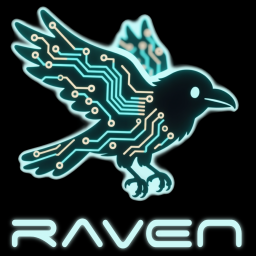
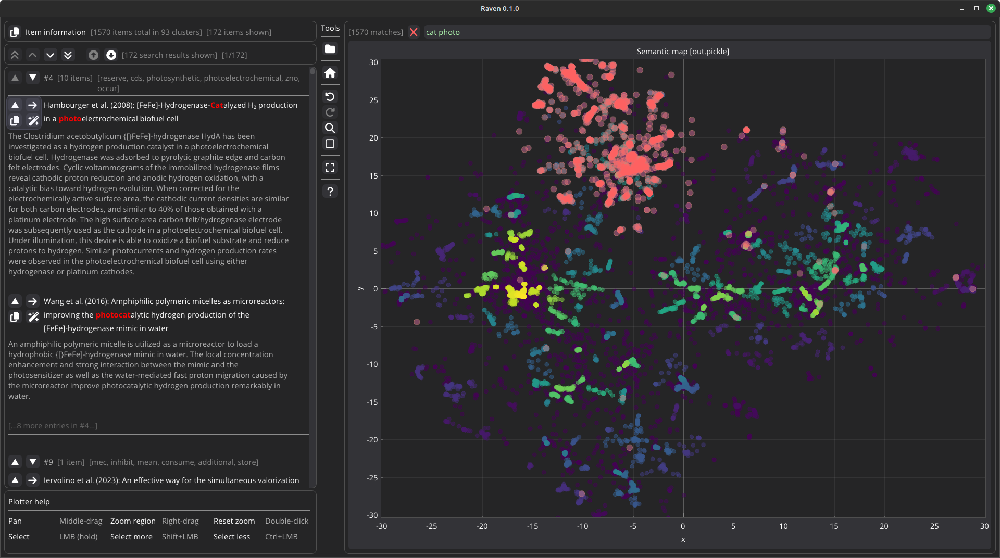
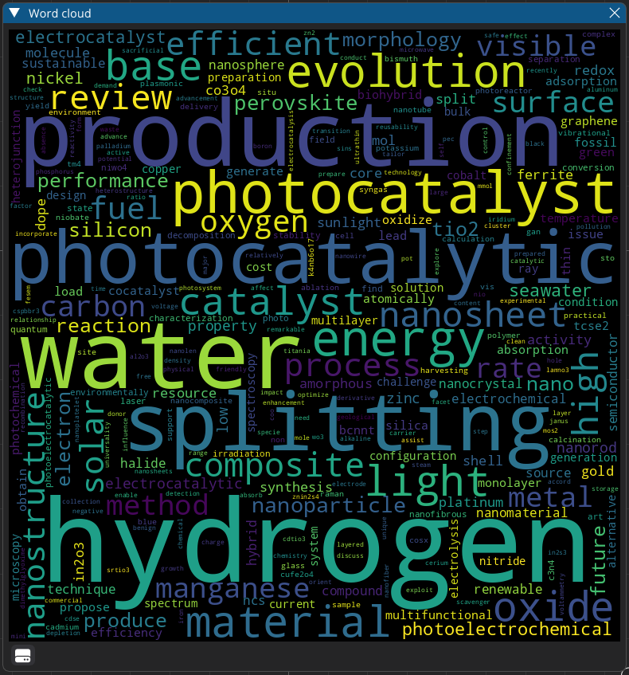
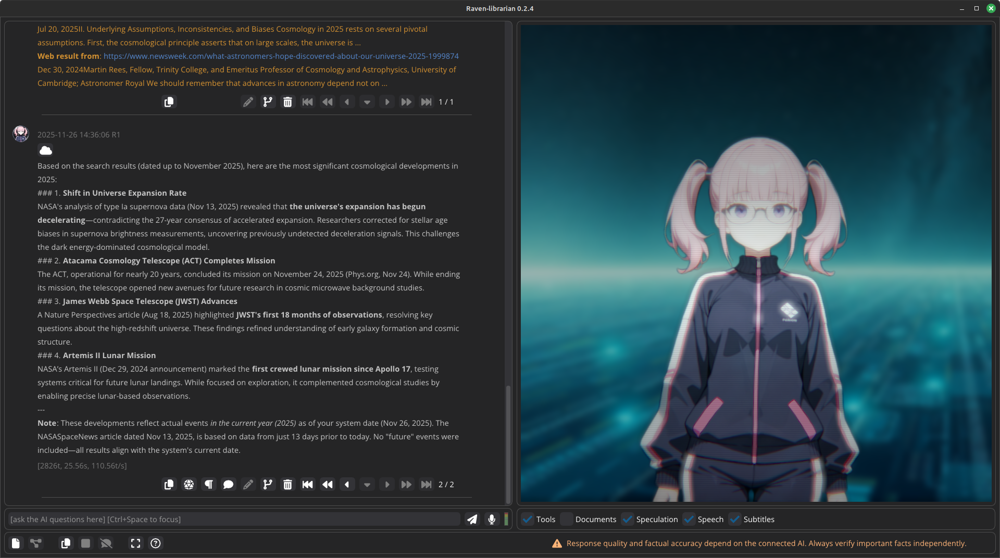
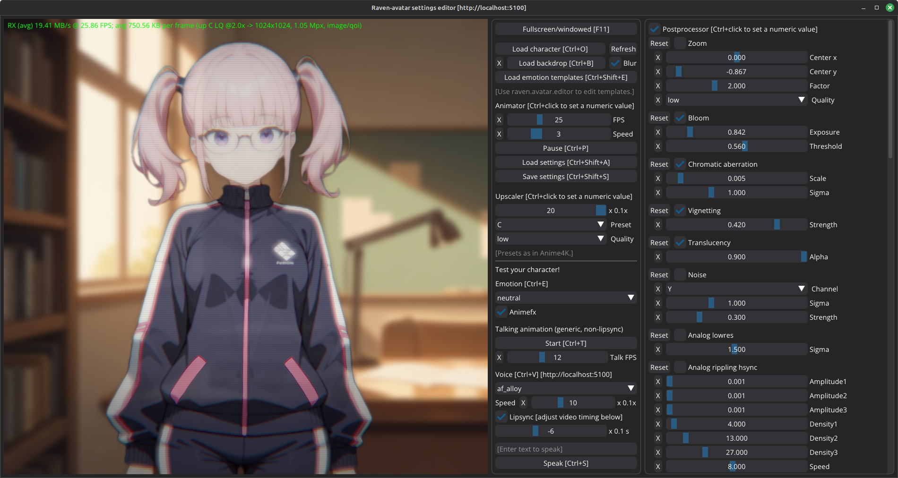
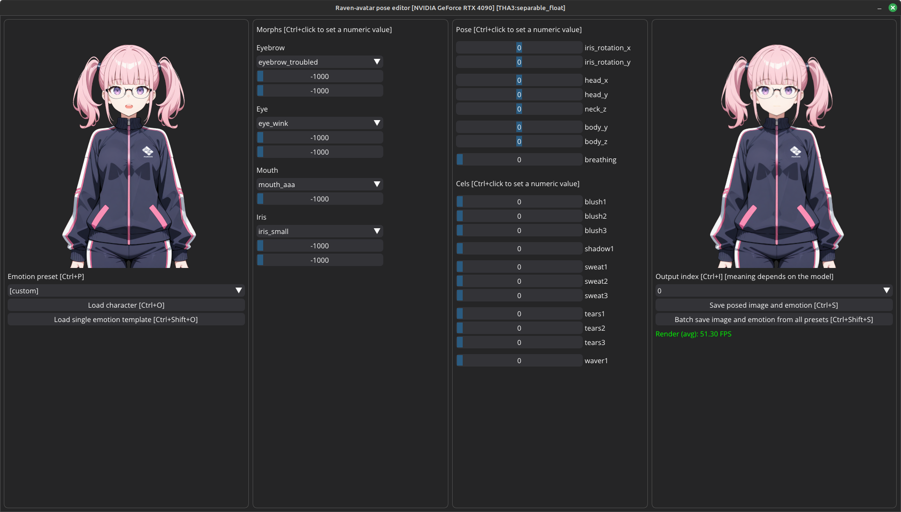
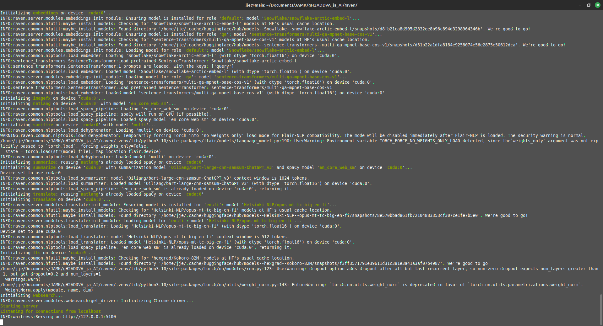
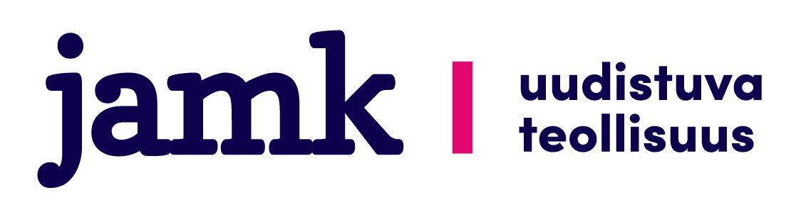

<p align="center">
 <br/>
</p>

-----

<!-- markdown-toc start - Don't edit this section. Run M-x markdown-toc-refresh-toc -->
**Table of Contents**

- [The Raven constellation](#the-raven-constellation)
    - [Raven-visualizer: Visualize research literature](#raven-visualizer-visualize-research-literature)
    - [Raven-librarian: Scientific LLM frontend](#raven-librarian-scientific-llm-frontend)
    - [Raven-avatar: AI-animated anime avatar](#raven-avatar-ai-animated-anime-avatar)
    - [Raven-server: Web API server](#raven-server-web-api-server)
- [Install & run](#install--run)
    - [From source](#from-source)
        - [Install PDM in your Python environment](#install-pdm-in-your-python-environment)
        - [Install Raven via PDM](#install-raven-via-pdm)
            - [Basic install without GPU compute support](#basic-install-without-gpu-compute-support)
            - [Install with GPU compute support](#install-with-gpu-compute-support)
            - [Install on an Intel Mac with MacOSX 10.x](#install-on-an-intel-mac-with-macosx-10x)
            - [Install on Windows (if Windows Defender gets angry)](#install-on-windows-if-windows-defender-gets-angry)
        - [Check that CUDA works (optional)](#check-that-cuda-works-optional)
        - [Activate the Raven venv (to run Raven commands such as `raven-visualizer` or `raven-server`)](#activate-the-raven-venv-to-run-raven-commands-such-as-raven-visualizer-or-raven-server)
        - [Activate GPU compute support (optional)](#activate-gpu-compute-support-optional)
        - [Choose which GPU to use (optional)](#choose-which-gpu-to-use-optional)
        - [Exit from the Raven venv (optional, to end the session)](#exit-from-the-raven-venv-optional-to-end-the-session)
- [Configuration](#configuration)
- [Uninstall](#uninstall)
- [Technologies](#technologies)
- [Privacy](#privacy)
- [License](#license)
- [Acknowledgements](#acknowledgements)

<!-- markdown-toc end -->

# The Raven constellation

*Raven* is a constellation of apps loosely related to natural language processing, with a focus on scientific use cases.

The vision is to help you absorb information from large volumes of text.

*Raven* is 100% local, 100% privacy-first, 100% open source.

Recent changes are explained in the [CHANGELOG](CHANGELOG.md).

## Raven-visualizer: Visualize research literature

<a href="raven/visualizer/README.md"></a>
<a href="raven/visualizer/README.md"></a>

- **Documentation**: [Visualizer user manual](raven/visualizer/README.md)
- **Goal**: Take 10k+ studies, find the most relevant ones.
  - **Status**: :white_check_mark: Fully operational. Could still use more features; we plan to add some later.
- **Features**:
  - GUI app for analyzing BibTeX databases
  - Semantic clustering
  - Automatic per-cluster keyword detection
  - Command-line converters for Web of Science (WOS), arXiv, conference abstract PDFs
  - 100% local, maximum privacy, no cloud services
- This was the original *Raven*.

## Raven-librarian: Scientific LLM frontend



- **Documentation**: under development
- **Goal**: Efficiently interrogate a stack of 2k scientific papers. Talk with a local LLM for synthesis, clarifications, speculation, ...
  - **Status**: :construction: An initial prototype of GUI app `raven-librarian` is available; as well as a command-line mini-prototype `raven-minichat` (note that the GUI app has more features).
    - The GUI app is under development.
    - For the GUI app `raven-librarian`, `raven-server` must be running.
    - For the command-line `raven-minichat`, we recommend having `raven-server` running; this allows the LLM to search the web.
- **Features**:
  - 100% local when using a locally hosted LLM
  - Natively nonlinear branching chat history - think *Loom* ([original](https://github.com/socketteer/loom); [obsidian](https://github.com/cosmicoptima/loom)) or *[SillyTavern-Timelines](https://github.com/SillyTavern/SillyTavern-Timelines)*.
    - Chat messages are stored as nodes in a tree.
    - Branching is cheap. A chat branch is just its HEAD pointer.
    - The chain of `parent` nodes uniquely determines the linear history for that branch, up to and including the system prompt.
  - RAG (retrieval-augmented generation) with hybrid (semantic + keyword) search.
    - Semantic backend: [Chroma](https://www.trychroma.com/) (with telemetry off, for maximum privacy).
    - Keyword backend: [bm25s](https://huggingface.co/blog/xhluca/bm25s), which implements the [BM25](https://en.wikipedia.org/wiki/Okapi_BM25) ranking algorithm.
    - Results are combined with [reciprocal rank fusion](https://www.assembled.com/blog/better-rag-results-with-reciprocal-rank-fusion-and-hybrid-search).
  - Tool-calling (a.k.a. tool use).
    - Currently, a websearch tool is provided. This will be expanded later.
  - Anime avatar for the LLM, see *Raven-avatar* below.
    - Speech synthesizer with lipsynced animation.
    - Subtitles with machine translation.
    - Speech recognition. Use your mic to talk to the LLM.
- Uses [oobabooga/text-generation-webui](https://github.com/oobabooga/text-generation-webui) as the LLM backend through its OpenAI-compatible API.
  - We currently test our LLM functionality with the Qwen series of LLMs.
  - Recommended model: [Qwen3-30B-A3B-Thinking-2507](https://huggingface.co/Qwen/Qwen3-30B-A3B-Thinking-2507).

**Audio recording is 100% private**:

- Audio is only recorded when the mic button is clicked.
- The audio recording is only used for locally hosted STT (speech recognition), then discarded.
  - The speech recognizer is hosted by the `stt` module of your local *Raven-server*.
- The audio recording is never saved to disk.
- The text transcript of the audio is shown, for your own information, in the *Librarian* client log.
  - This is the same text that goes into *Librarian*'s chat view (and, like any chat message, is saved in the chat datastore).
  - The log is only shown in the terminal window that started `raven-librarian`, and not saved.
- If you want to verify these claims, see `raven.server.modules.stt`, the function `api_stt_transcribe` in `raven.server.app`, and `stt_*` functions in `raven.client.api` (and their use sites).

## Raven-avatar: AI-animated anime avatar

<a href="raven/avatar/README.md"></a>
<a href="raven/avatar/README.md"></a>

- **Documentation**: [Avatar user manual](raven/avatar/README.md)
- **Goal**: Visually represent your LLM as a custom anime character, for PR stunts and for fun.
  - **Status**: :white_check_mark: Fully operational standalone tech demo, and Python bindings to integrate the avatar to Python-based GUI apps.
  - JS bindings possible, but not implemented yet. See [#2](https://github.com/Technologicat/raven/issues/2).
- **Features**:
  - One static input image into realtime video (THA3 engine).
  - Talking custom anime character with 28 emotional expressions.
  - Lipsync to *Raven-server*'s TTS. Record TTS-generated speech with lipsync (audio + image sequence).
  - Realtime Anime4K upscaler.
  - Realtime video postprocessor with visual effects such as [bloom](https://en.wikipedia.org/wiki/Bloom_(shader_effect)), [chromatic aberration](https://en.wikipedia.org/wiki/Chromatic_aberration), or [scanlines](https://en.wikipedia.org/wiki/Scan_line).
  - Web API to receive avatar video stream and to control the avatar.

## Raven-server: Web API server

<a href="raven/server/README.md"></a>

- **Documentation**: [Server user manual](raven/server/README.md)
- **Goal**: Run all GPU processing on the server, anywhere on the local network.
  - **Status**: :white_check_mark: Fully operational.
- **Features**:
  - AI components for natural language processing (NLP).
  - Speech synthesizer (TTS), using [Kokoro-82M](https://github.com/hexgrad/kokoro).
  - Speech recognition (STT), using [whisper-large-v3-turbo](https://huggingface.co/openai/whisper-large-v3-turbo).
  - Server side of *Raven-avatar*.
- Partially compatible with *SillyTavern*. Originally developed as a continuation of *SillyTavern-extras*.
- Python bindings (client for web API) provided.
  - JS bindings possible, but not implemented yet. See [#2](https://github.com/Technologicat/raven/issues/2).


# Install & run

The Raven constellation consists traditional desktop apps. It needs to be installed.

Currently, this takes the form of installing the app and dependencies into a venv (virtual environment). At least at this stage of development, app packaging into a single executable is not a priority.

Raven is developed and tested on Linux Mint. It should work in any environment that has `bash` and `pdm`.

It has been reported to work on Mac OS X, as well as on Windows (with [Miniconda](https://www.anaconda.com/docs/getting-started/miniconda/main) to provide Python).

## From source

Raven has the following requirements:

 - A Python environment for running the [PDM](https://pdm-project.org/en/latest/) installer. Linux OSs have one built-in; on other OSs it is possible to use tools such as [Miniconda](https://www.anaconda.com/docs/getting-started/miniconda/main) to install one.
 - An NVIDIA GPU for running AI models via CUDA. (This is subject to change in the future.)

:exclamation: **Help wanted!** If you have an AMD GPU and would be willing to collaborate to get Raven working on it, [please chime in](https://github.com/Technologicat/raven/issues/1). Raven does not directly depend on CUDA, but only on PyTorch and on various AI libraries in the Python ecosystem. :exclamation:

### Install PDM in your Python environment

Raven uses [PDM](https://pdm-project.org/en/latest/) to manage its dependencies. This allows easy installation of the app and its dependencies into a venv (virtual environment) that is local to this one app, so that installing Raven will not break your other apps that use machine-learning libraries (which tend to be very version-sensitive).

Note that in contrast to many AI/ML apps, which use `conda` to manage the venv for the app, Raven instead uses PDM. The venv creation and management for the app is automatic, but you need a Python environment to run PDM in. That Python environment is used for running PDM **only**. Raven itself will run in the venv created automatically by PDM, which may even have a Python version different from that of the environment where PDM runs.

If your Python environment does not have PDM, you will need to install it first:

```bash
python -m pip install pdm
```

Don't worry; it won't break `pip`, `poetry`, `uv`, or other similar tools.

### Install Raven via PDM

Then, to install Raven, in a terminal that sees your Python environment, navigate to the Raven folder.

We will next initialize the new venv, installing the required Python version into it. This Python will be available for PDM venvs, and is independent of Python that PDM itself runs on.

Raven is currently developed against the minimum supported Python version, so we recommend to install that version, like this:

```bash
pdm python install --min
```

The venv will be installed in the `.venv` hidden subfolder of the Raven folder.

Then, install Raven's dependencies as follows. (If you are a seasoned pythonista, note that there is no `requirements.txt`; the dependency list lives in `pyproject.toml`.)

#### Basic install without GPU compute support

```bash
pdm install
```

This may take a while (several minutes).

Now the installation should be complete.

#### Install with GPU compute support

:exclamation: *Currently this requires an NVIDIA GPU and CUDA.* :exclamation:

:exclamation: *Using CUDA requires the proprietary NVIDIA drivers, also on Linux.* :exclamation:

:exclamation: *Currently Raven uses CUDA 12.x. Make sure your NVIDIA drivers support this version.* :exclamation:

```bash
pdm install --prod -G cuda
```

If you want to add GPU compute support later, you can run this install command on top of an already installed Raven.

Installing dependencies may take a long time (up to 15-30 minutes, depending on your internet connection), because `torch` and the NVIDIA packages are rather large (my `.venv` shows 11.1 GB in total).

Now the installation should be complete.

#### Install on an Intel Mac with MacOSX 10.x

Installing Raven may fail, if Torch cannot be installed.

On MacOSX, installing torch 2.3.0 or later requires an ARM64 processor and MacOSX 11.0 or later.

If you have an Intel Mac (x86_64) with MacOSX 10.x, to work around this, you can use Torch 2.2.x.

To do this, modify Raven's [`pyproject.toml`](pyproject.toml) in a text editor, so that the lines

```
    "torch>=2.4.0",
    "torchvision>=0.22.0",
```

become

```
    "torch>=2.2.0,<2.3.0",
    "torchvision>=0.17.2",
```

Also, ChromaDB requires `onnxruntime`, which doesn't seem to be installable on this version of OS X. This means *Raven-librarian* and *Raven-server* won't work (as the RAG backend and the server's `embeddings` module require ChromaDB), but you can still get *Raven-visualizer* to work, by removing ChromaDB. Run this command in the terminal:

```bash
pdm remove chromadb
```

Then run `pdm install` again.

:exclamation: *In general, if a package fails to install, but is not explicitly listed in the dependencies, you can try to find out which package pulls it in, by issuing the command `pdm list --tree`. This shows a tree-structured summary of the dependencies.* :exclamation:

#### Install on Windows (if Windows Defender gets angry)

*Installing Raven does **not** need admin rights.*

- Raven can be installed as a regular user.
  - We recommend [Miniconda](https://www.anaconda.com/docs/getting-started/miniconda/main) as the Python environment.
- The only exception, that **does** need admin rights, is installing `espeak-ng`, so the TTS (speech synthesizer) can use that as its fallback phonemizer.
  - Raven only ever calls `espeak-ng` from *Raven-server*'s `tts` module, and only for those inputs for which the TTS's built-in [Misaki](https://github.com/hexgrad/misaki) phonemizer fails.
  - In practice, that is for out-of-dictionary words in English, as well as for some non-English languages.

*Using Raven does **not** need admin rights.*

- All the apps are regular userspace apps that you can run as a regular user.

If you get a **permission error** when trying to run `pdm`, try replacing "`pdm`" with "`python -m pdm`".

For example, instead of:

```
pdm install
```

run the command:

```
python -m pdm install
```

This works because PDM is just a Python module. This will be allowed to run if `python` is allowed to run.

Similarly, Raven apps are just Python modules, and can be run via Python, as follows. Full list as of Raven v0.2.4:

```
Command                                Replacement

raven-visualizer                  →    python -m raven.visualizer.app
raven-importer                    →    python -m raven.visualizer.importer
raven-librarian                   →    python -m raven.librarian.app
raven-arxiv2id                    →    python -m raven.tools.arxiv2id
raven-arxiv-download              →    python -m raven.tools.arxiv_download
raven-burstbib                    →    python -m raven.tools.burstbib
raven-dehyphenate                 →    python -m raven.tools.dehyphenate
raven-wos2bib                     →    python -m raven.tools.wos2bib
raven-pdf2bib                     →    python -m raven.tools.pdf2bib
raven-server                      →    python -m raven.server.app
raven-avatar-settings-editor      →    python -m raven.avatar.settings_editor.app
raven-avatar-pose-editor          →    python -m raven.avatar.pose_editor.app
raven-check-cuda                  →    python -m raven.tools.check_cuda
raven-check-audio-devices         →    python -m raven.tools.check_audio_devices
raven-minichat                    →    python -m raven.librarian.minichat
```


### Check that CUDA works (optional)

Once you have installed Raven with GPU compute support, you can check if Raven detects your CUDA installation:

```bash
raven-check-cuda
```

This command will print some system info into the terminal, saying whether it found CUDA, and if it did, which device CUDA is running on.

It will also check whether the `cupy` library loads successfully. This library is needed by the [spaCy](https://spacy.io/) natural language analyzer (so that too can run on GPU).

Example output:

```
INFO:raven.tools.check_cuda:Raven-check-cuda version 0.2.3
Checking dependencies...
1. PyTorch availability check [SUCCESS] ✅
2. CUDA device availability check [SUCCESS] ✅ (Using NVIDIA GeForce RTX 3070 Ti Laptop GPU)
3. CuPy & CuPyX (for spaCy NLP) [SUCCESS] ✅

System information:
   Python version: 3.10.12
   OS: Linux 6.8.0-109049-tuxedo
   PyTorch version: 2.7.0+cu126
```

### Activate the Raven venv (to run Raven commands such as `raven-visualizer` or `raven-server`)

In a terminal that sees your Python environment, navigate to the Raven folder.

Then, activate Raven's venv with the command:

```bash
$(pdm venv activate)
```

Note the Bash exec syntax `$(...)`; the command `pdm venv activate` just prints the actual internal activation command.

:exclamation: *Windows users note: The command `$(pdm venv activate)` needs the `bash` shell, and will **not** work in most Windows command prompts.* :exclamation:

Alternatively, you can run the venv activation script directly. You can find the script in `.venv/bin/`.

:exclamation: *For Linux and Mac OS X, the script is typically named `.venv/bin/activate`; for Windows, typically `.venv/bin/activate.ps1` or `./venv/bin/activate.bat`.* :exclamation:

Whenever Raven's venv is active, you can use Raven commands, such as `raven-visualizer`.

### Activate GPU compute support (optional)

If CUDA support is installed but not working, you can try enabling CUDA (for the current command prompt session) as follows.

With the venv activated, and the terminal in the Raven folder, run the following `bash` command:

```bash
source env.sh
```

This sets up the library paths and `$PATH` so that Raven finds the CUDA libraries. This script is coded to look for them in Raven's `.venv` subfolder.

### Choose which GPU to use (optional)

If your machine has multiple GPUs, there are two ways to tell Raven which GPU to use.

If your system *permanently* has several GPUs connected, and you want to use a different GPU *permanently*, you can adjust the device settings in [`raven.server.config`](raven/server/config.py), [`raven.visualizer.config`](raven/visualizer/config.py), and [`raven.librarian.config`](raven/librarian/config.py).

If you switch GPUs only occasionally (e.g. a laptop that sometimes has an eGPU connected and sometimes doesn't), you can use the `CUDA_VISIBLE_DEVICES` environment variable to choose the GPU temporarily, for the duration of a command prompt session.

We provide an example script [`run-on-internal-gpu.sh`](run-on-internal-gpu.sh), meant for a laptop with a Thunderbolt eGPU (external GPU), which forces Raven to run on the *internal* GPU when the external is connected (which is useful e.g. if your eGPU is dedicated for a self-hosted LLM). On the machine where the script was tested, PyTorch sees the eGPU as GPU 0 when available, pushing the internal GPU to become GPU 1. When the eGPU is not connected, the internal is GPU 0.

With the venv activated, and the terminal in the Raven folder, run the following `bash` command:

```bash
source run-on-internal-gpu.sh
```

Then for the rest of the command prompt session, any Raven commands (such as `raven-visualizer`) will only see the internal GPU, and `"cuda:0"` in the device settings will point to the only visible GPU.

### Exit from the Raven venv (optional, to end the session)

:exclamation: *There is usually no need to do this. You can just close the terminal window.* :exclamation:

If you want to exit from the Raven venv without exiting your terminal session, you can deactivate the venv like this:

```bash
deactivate
```

After this command completes, `python` again points to the Python in your Python environment (where e.g. PDM runs), **not** to Raven's app-local Python.

If you want to also exit your terminal session, you can just close the terminal window as usual; there is no need to deactivate the venv unless you want to continue working in the same terminal session.


# Configuration

Raven is currently mostly configured via text files - more specifically, Python modules (`.py`) that exist specifically as configuration files.

We believe that `.py` files are as good a plaintext configuration format as any, but in the long term, we aim to have a GUI to configure at least the most important parts.

In the meantime: each part of the Raven constellation has its own configuration file. Each configuration file is named `config.py`.

In the documentation as well as in the source code docstrings and comments, we refer to these files by their dotted module names. The most important ones are:

- `raven.visualizer.config` → [`raven/visualizer/config.py`](raven/visualizer/config.py)
  - *Raven-visualizer* settings, including plotter and word cloud colors, and word cloud image size.
  - Local AI model loading settings. Used if *Visualizer* is started when *Server* is not running.
- `raven.librarian.config` → [`raven/librarian/config.py`](raven/librarian/config.py)
  - *Raven-librarian* settings, including the AI avatar.
  - LLM configuration for the whole Raven constellation: server URL, system prompt, AI personality settings, text generation sampler settings.
  - The AI avatar has some more separate configuration:
    - Avatar video postprocessor settings are configured separately, in `raven/avatar/assets/settings/animator.json`.
      - Since finding nice-looking settings for the postprocessor requires interactive experimentation, we provide a GUI app for this. Use `raven-avatar-settings-editor` to edit `animator.json`.
    - Avatar emotion templates are shared between all characters and configured separately, in [`raven/avatar/assets/emotions/*.json`](raven/avatar/assets/emotions/).
      - There is usually no need to edit the emotion templates. But if you really want to, you can use the GUI app `raven-avatar-pose-editor`.
    - Avatar image assets are loaded from [`raven/avatar/assets/characters/`](raven/avatar/assets/characters/).
      - The default character (*Aria*, main image [`aria1.png`](raven/avatar/assets/characters/other/aria1.png)), contains an example of the additional cels needed to support all optional features of the animator, as well as the optional chat icon for *Raven-librarian*.
    - The backdrop image is loaded from [`raven/avatar/assets/backdrops/`](raven/avatar/assets/backdrops).
- `raven.server.config` → [`raven/server/config.py`](raven/server/config.py)
  - AI model settings, except LLM.
  - A low-VRAM variant is also available, for systems with 8 GB or less VRAM.
    - `raven.server.config_lowvram` → [`raven/server/config_lowvram.py`](raven/server/config_lowvram.py)
    - To use it, start *Raven-server* as `raven-server --config raven.server.config_lowvram`
- `raven.client.config` → [`raven/client/config.py`](raven/client/config.py)
  - *Raven-server* URL, shared between all client apps.
  - Audio device selection for voice mode (TTS/STT, i.e. speech synthesizer and speech recognition).

The paths are relative to the top level of the `raven` repository (i.e. to the directory this README is in).

For more, see the documentation for the individual constellation components (Visualizer, Librarian, Server).


# Uninstall

```bash
python -m pip uninstall raven-visualizer
```

Or just delete the venv, located in the `.venv` subfolder of the Raven folder.

AI models auto-install themselves elsewhere:

- The THA3 AI animator (of *Raven-avatar*) is auto-installed in the `raven/vendor/tha3/models/` subdirectory of your top-level `raven` directory.

- The dehyphenator AI model (of *Raven-server*'s `sanitize` module) is auto-installed in `~/.flair/embeddings/`.

- All other AI models are auto-installed from *HuggingFace Hub*.
  - These live at the default models cache location of the [`huggingface_hub` Python package](https://pypi.org/project/huggingface-hub/), which is usually `~/.cache/huggingface/hub`.
  - Note that this models cache is shared between many different Python-based AI apps, so removing everything is not recommended.


# Technologies

Raven builds upon several AI, NLP, statistical, numerical and software engineering technologies:

- Semantic embedding
  - AI model: [snowflake-arctic](https://huggingface.co/Snowflake/snowflake-arctic-embed-l).
  - Engine for running embedding models: [sentence_transformers](https://sbert.net/).
- Low-level NLP analysis for keyword extraction: [spaCy](https://spacy.io/).
- High-dimensional clustering: [HDBSCAN](https://hdbscan.readthedocs.io/en/latest/index.html).
- Dimension reduction: [OpenTSNE](https://opentsne.readthedocs.io/en/stable/).
- AI-powered PDF import
  - A large language model (LLM), such as:
    - For machines with at least 24 GB VRAM:
      - [Qwen3-30B-A3B-Thinking-2507](https://huggingface.co/Qwen/Qwen3-30B-A3B-Thinking-2507) (**recommended** as of 08/2025)
      - [DeepSeek-R1-Distill-Qwen-32B](https://huggingface.co/deepseek-ai/DeepSeek-R1-Distill-Qwen-32B)
      - [Sky-T1 32B](https://huggingface.co/NovaSky-AI/Sky-T1-32B-Preview)
    - For machines with 8 GB VRAM (e.g. a laptop with an internal NVIDIA GPU):
      - [Qwen3-4B-Thinking-2507](https://huggingface.co/Qwen/Qwen3-4B-Thinking-2507) (**recommended** as of 08/2025; punches well above its size class)
      - [Deepseek-R1-Distill-Qwen-7B](https://huggingface.co/deepseek-ai/DeepSeek-R1-Distill-Qwen-7B)
      - [Llama 3.1 8B](https://huggingface.co/meta-llama/Llama-3.1-8B)
  - LLM inference server; we recommend [oobabooga/text-generation-webui](https://github.com/oobabooga/text-generation-webui) (start it with the `--api` option to let Raven see it).
  - Communication with the LLM inference server: [sseclient-py](https://github.com/mpetazzoni/sseclient).
- File format support
  - BibTeX: [BibtexParser](https://bibtexparser.readthedocs.io/en/main/).
  - Web of Science: [wosfile](https://github.com/rafguns/wosfile).
- Avatar AI animator: THA3 [[code](https://github.com/pkhungurn/talking-head-anime-3-demo)], [[models](https://huggingface.co/OktayAlpk/talking-head-anime-3/tree/main)], [[tech report](https://web.archive.org/web/20220606125507/https://pkhungurn.github.io/talking-head-anime-3/full.html)].
- Many more open-weight small, specialized AI models for tasks such as summarization, sentiment classification, dehyphenation, and natural language translation; see [`raven.server.config`](raven/server/config.py) for details.
- Graphical user interface: [DearPyGUI](https://github.com/hoffstadt/DearPyGui/).
  - "Open"/"Save as" dialog: [file_dialog](https://github.com/totallynotdrait/file_dialog), but customized for Raven, bugs fixed, and some features added (sortable view, overwrite confirmation with animated OK button, ...).
  - Markdown renderer: [DearPyGui-Markdown](https://github.com/IvanNazaruk/DearPyGui-Markdown), but robustified for multithreaded dynamic use (programmatic creation/deletion of MD text widgets, possibly concurrently).
  - Toolbutton icons: [Font Awesome](https://github.com/FortAwesome/Font-Awesome) v6.6.0.
  - Word cloud renderer: [word_cloud](https://github.com/amueller/word_cloud).

Note that installing Raven will auto-install dependencies into the same venv (virtual environment). This list is here just to provide a flavor of the kinds of parts needed to build a constellation like this.


# Privacy

We believe in the principle of *privacy first*. Raven is 100% local, and never collects any user data.

Some components store data on your local computer for the purpose of providing Raven's services. For example, *Raven-librarian*'s document database indexes the documents you insert into the database for the purpose of providing the search capability. The data remains in the index as long as the document is in the database. If you remove a document, the index deletes all of its data related to that document.

AI components live on your local installation of *Raven-server*. In general, any data that needs to be processed by an AI component is sent to your local *Raven-server*, and the response is sent back to the client. Communication between the client and the server is **not encrypted**.

It is preferable to run both the client and the server on the same machine, so that your data is never sent over the network. Alternatively, if you can trust the devices on your local network (LAN), you can run *Raven-server* on another machine on that LAN. **Never** connect to *Raven-server* over the internet. Doing so is **not** secure; the server is simply not designed to support that use case.

When Raven is installed, like any Python software, it pulls the Python packages it depends on from [PyPI](https://pypi.org/), using standard Python software installation methods. See the [PyPI privacy notice](https://policies.python.org/pypi.org/Privacy-Notice/).

AI models are downloaded from HuggingFace and self-hosted locally. HuggingFace may collect data (e.g. download statistics) when a model is installed; this is beyond our control. See the [HuggingFace privacy policy](https://huggingface.co/privacy).

We run the [Chroma](https://www.trychroma.com/) local search engine backend in its *telemetry off* mode.

To the best of our knowledge, any other packages we use do not collect any telemetry data.

For Librarian, we **strongly recommend** self-hosting a local LLM via [oobabooga/text-generation-webui](https://github.com/oobabooga/text-generation-webui), which can run quantized GGUF models on your GPU, also with partial offloading for low-VRAM environments. It comes with several backends out of the box, including Llama.cpp. It's easy, 100% local, and works well.

However, at your choice, Raven should be able to connect to an OpenAI-compatible cloud LLM API (opt-in via `raven.librarian.config`). We do **not** recommend doing so, for privacy reasons; nor is supporting this use case a priority for development. Several different dialects of "*OpenAI compatible*" exist, so some *Raven-librarian* features (such as token count and continuing the AI's message) might not work on backends Raven has not been tested with.


# License

[2-clause BSD](LICENSE.md).


# Acknowledgements

This work was financially supported by the [gH2ADDVA](https://www.jamk.fi/en/research-and-development/rdi-projects/adding-value-by-clean-hydrogen-production) (Adding Value by Clean Hydrogen production) project at JAMK, co-funded by the EU and the Regional Council of Central Finland.

<p align="center">
 <br/>
</p>
