<p align="center">
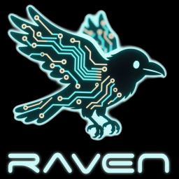 <br/>
</p>


[](https://codecov.io/gh/Technologicat/raven)


-----

<!-- markdown-toc start - Don't edit this section. Run M-x markdown-toc-refresh-toc -->
**Table of Contents**

- [The Raven constellation](#the-raven-constellation)
    - [Raven-visualizer: Visualize research literature](#raven-visualizer-visualize-research-literature)
    - [Raven-librarian: Multiversal LLM frontend](#raven-librarian-multiversal-llm-frontend)
    - [Raven-avatar: AI-animated anime avatar](#raven-avatar-ai-animated-anime-avatar)
    - [Raven-xdot-viewer: Interactive GraphViz graph viewer](#raven-xdot-viewer-interactive-graphviz-graph-viewer)
    - [Raven-cherrypick: Triage images quickly](#raven-cherrypick-triage-images-quickly)
    - [Raven-conference-timer: Countdown timer for talks](#raven-conference-timer-countdown-timer-for-talks)
    - [Raven-server: Web API server](#raven-server-web-api-server)
        - [Quickstart](#quickstart)
    - [Command-line tools](#command-line-tools)
- [Install & run](#install--run)
    - [From source](#from-source)
        - [Install PDM in your Python environment](#install-pdm-in-your-python-environment)
        - [Install Raven via PDM](#install-raven-via-pdm)
            - [Basic install without GPU compute support](#basic-install-without-gpu-compute-support)
            - [Install with GPU compute support](#install-with-gpu-compute-support)
            - [Install on an Intel Mac with MacOSX 10.x](#install-on-an-intel-mac-with-macosx-10x)
            - [Install on Windows (if Windows Defender gets angry)](#install-on-windows-if-windows-defender-gets-angry)
        - [Check that CUDA works (optional)](#check-that-cuda-works-optional)
        - [Activate the Raven venv (to run Raven commands such as `raven-visualizer` or `raven-server`)](#activate-the-raven-venv-to-run-raven-commands-such-as-raven-visualizer-or-raven-server)
        - [Stopgap: run Raven commands from any terminal (bash functions)](#stopgap-run-raven-commands-from-any-terminal-bash-functions)
        - [Activate GPU compute support (optional)](#activate-gpu-compute-support-optional)
        - [Choose which GPU to use (optional)](#choose-which-gpu-to-use-optional)
        - [Pin vsync to the right display on multi-monitor setups (NVIDIA + X11)](#pin-vsync-to-the-right-display-on-multi-monitor-setups-nvidia--x11)
        - [Exit from the Raven venv (optional, to end the session)](#exit-from-the-raven-venv-optional-to-end-the-session)
- [Configuration](#configuration)
- [Uninstall](#uninstall)
- [Technologies](#technologies)
- [Privacy](#privacy)
- [License](#license)
- [Acknowledgements](#acknowledgements)

<!-- markdown-toc end -->

# The Raven constellation

*Raven* is a constellation of apps loosely related to natural language processing, with a focus on scientific use cases.

The goal is to make a large body of text navigable: screen tens of thousands of sources down to the few hundred that bear on your work — still far more than anyone can read — and then find out what those say. This README describes what ships today; for what Raven is for and where it is going, see [VISION.md](VISION.md).

*Raven* is 100% local, 100% privacy-first, 100% open source.

The name does three jobs at once, which is why it stuck. Jyväskylä once ran *Korppi*, a course-management system built in-house at the university before a commercial product replaced it — "Jyväskylä develops ravens" is the local tradition, cheekily generalized from a single data point. Ravens also collect shiny things, which is precisely what the visualizer does, and that is where the name came from back in the visualizer-only days. And *Corvus* is an actual constellation, which landed retroactively once Raven became a constellation of apps rather than one tool.

**On PyPI, Raven is `raven-lab`; the import package stays `raven`.** The index name `raven` belongs to Sentry's legacy client, so the qualified form is the closest available — and *lab* is what this is: a repo of experimental research prototypes across AI, LLMs and HCI, currently applied to literature management. **Install Raven into a venv**, as ML/AI applications generally require; Sentry's client ships a top-level `raven/` too, and a venv is what keeps the two apart.

Recent changes are explained in the [CHANGELOG](CHANGELOG.md).

For my stance on AI contributions, see the [collaboration guidelines](https://github.com/Technologicat/substrate-independent/blob/main/collaboration.md).

## Raven-visualizer: Visualize research literature

<a href="raven/visualizer/README.md">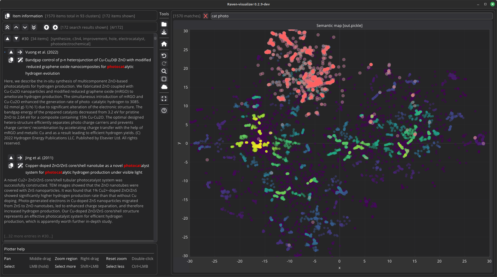</a>
<a href="raven/visualizer/README.md">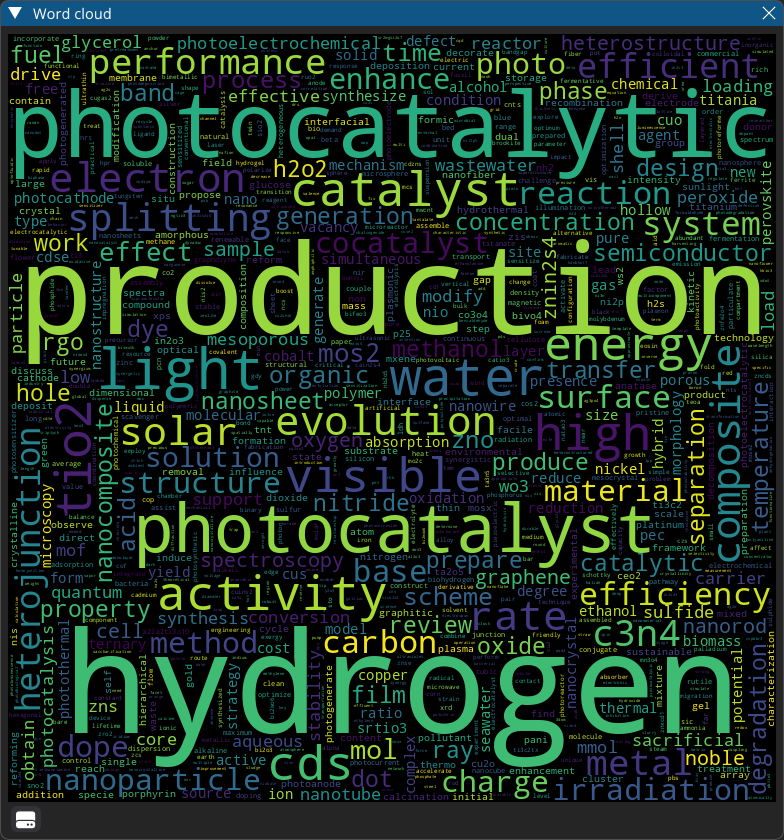</a>

- **Documentation**: [Visualizer user manual](raven/visualizer/README.md)
- **Goal**: Take 10k+ studies, find the most relevant ones.
  - **Status**: :white_check_mark: Fully operational. Could still use more features; we plan to add some later.
- **Features**:
  - GUI app for analyzing BibTeX databases
  - Semantic clustering
  - Automatic per-cluster keyword detection
  - Command-line converters for Web of Science (WOS), arXiv, conference abstract PDFs, CSV files
  - 100% local, maximum privacy, no cloud services
- This was the original *Raven*.

*Added in v0.2.5: CSV import.*

## Raven-librarian: Multiversal LLM frontend

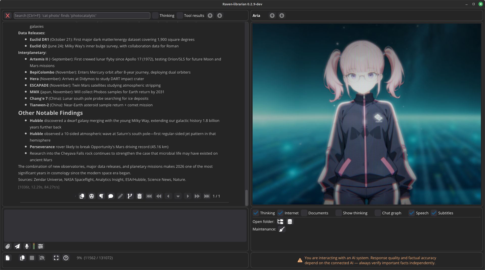

- **Documentation**: [Librarian user manual](raven/librarian/README.md) (under development)
- **Goal**: Pick up where *Visualizer*'s screening leaves off — a few hundred papers, still far more than anyone can read. Talk with a local LLM for synthesis, clarifications, speculation, ...
  - **Status**: :construction: The GUI app `raven-librarian` is usable day to day, and under active development. A command-line client `raven-minichat` shares the same backend (note that the GUI app has more features).
    - For the GUI app `raven-librarian`, `raven-server` must be running.
    - For the command-line `raven-minichat`, we recommend having `raven-server` running; this allows the LLM to search the web.
- **Features**:
  - 100% local when using a locally hosted LLM
  - Natively nonlinear branching chat history - think *Loom* ([original](https://github.com/socketteer/loom); [obsidian](https://github.com/cosmicoptima/loom)) or *[SillyTavern-Timelines](https://github.com/SillyTavern/SillyTavern-Timelines)*.
    - Chat messages are stored as nodes in a tree.
    - Branching is cheap. A chat branch is just its HEAD pointer.
    - The chain of `parent` nodes uniquely determines the linear history for that branch, up to and including the system prompt.
  - RAG (retrieval-augmented generation) with hybrid (semantic + keyword) search.
    - Semantic backend: [Chroma](https://www.trychroma.com/) (with telemetry off, for maximum privacy).
    - Keyword backend: [bm25s](https://huggingface.co/blog/xhluca/bm25s), which implements the [BM25](https://en.wikipedia.org/wiki/Okapi_BM25) ranking algorithm.
    - Results are combined with [reciprocal rank fusion](https://www.assembled.com/blog/better-rag-results-with-reciprocal-rank-fusion-and-hybrid-search).
  - Tool-calling (a.k.a. tool use). The AI is given five tools: `websearch` and `webfetch` for the live web, `search_documents` and `fetch_document` for your document database, and `list_consulted_documents` to see what this conversation has already read.
    - Web access is gated by a client-side domain allowlist, separately from the network-level checks *Raven-server* enforces.
    - A configurable ceiling limits how many rounds of tool calls one reply may take. It is a backstop against a runaway agent loop, not a normal limit.
  - Message attachments. Attach images (on a vision model) and documents (on any model) to your message; a long web page the AI fetches becomes an attachment too, so one fetch cannot bury the conversation it was meant to inform.
    - Documents are read as text, so a text-only model can use them.
    - Attachments are stored alongside the chat, content-addressed, and can be opened from the chat log.
  - Chat graph. The branching history is drawn as a tree you can navigate: reach any chat you have ever started, look at a branch before switching to it, and see where the one you are considering left the one you are on. See [Chat graph](raven/librarian/README.md#chat-graph) in the Librarian README.
  - Scriptable. `raven.librarian.agent` runs one assistant turn from your own Python — your corpus, the branching chat tree and the tool-calling all in play — and returns a record of what the turn did, including the prompt it actually sent. See [Scripting](raven/librarian/README.md#scripting) in the Librarian README.
  - Anime avatar for the LLM, see *Raven-avatar* below.
    - Speech synthesizer with lipsynced animation.
    - Subtitles with machine translation.
    - Speech recognition. Use your mic to talk to the LLM.
      - Voice mode is 100% privacy-first; audio is never recorded to disk, and never sent anywhere except your local *Raven-server* for transcription.
- Uses any OpenAI-compatible LLM backend. We develop against [LM Studio](https://lmstudio.ai/); [oobabooga/text-generation-webui](https://github.com/oobabooga/text-generation-webui) is also supported.
  - We test our LLM functionality with the Qwen series, with Gemma as the multilingual alternative. Links below are to the [Unsloth](https://huggingface.co/unsloth) GGUF quants, which is how we run them: their [dynamic quantization](https://unsloth.ai/docs/basics/dynamic-3.0-ggufs) measures which layers tolerate compression and which do not, and quantizes each accordingly, so you get less quantization error for the same file size than from a uniform quant.
  - Recommended, by how much VRAM you have for the LLM:
    - 24 GB — [Qwen3.6-35B-A3B](https://huggingface.co/unsloth/Qwen3.6-35B-A3B-GGUF). A mixture-of-experts model, and about 2.75x faster to generate than the dense [Qwen3.6-27B](https://huggingface.co/unsloth/Qwen3.6-27B-GGUF) beside it, which is worth reaching for when the MoE gets something wrong. [Qwen3.8-27B](https://huggingface.co/unsloth/Qwen3.8-27B-GGUF) is the newer generation at that size.
    - 16 GB — [Qwen3.5-9B](https://huggingface.co/unsloth/Qwen3.5-9B-GGUF).
    - 8 GB — [Qwen3.5-4B](https://huggingface.co/unsloth/Qwen3.5-4B-GGUF). Punches well above its size class; on our retrieval tests it scored perfectly.
  - Vision comes with the main line as of Qwen3.5, so no separate `-VL` build is needed to attach an image to a message.
  - [Gemma 4](https://huggingface.co/unsloth/gemma-4-E4B-it-GGUF) works too, and is the one to try when the conversation is not in English. It is available from [E4B](https://huggingface.co/unsloth/gemma-4-E4B-it-GGUF) up to [31B](https://huggingface.co/unsloth/gemma-4-31B-it-GGUF), including a [12B](https://huggingface.co/unsloth/gemma-4-12b-it-GGUF) that the Qwen line does not currently offer.

## Raven-avatar: AI-animated anime avatar

<a href="raven/avatar/README.md">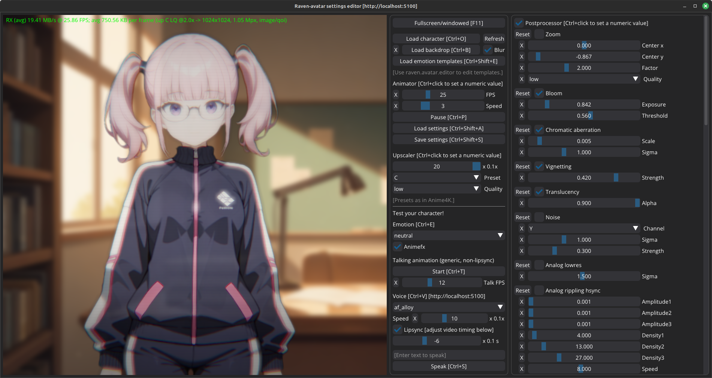</a>
<a href="raven/avatar/README.md">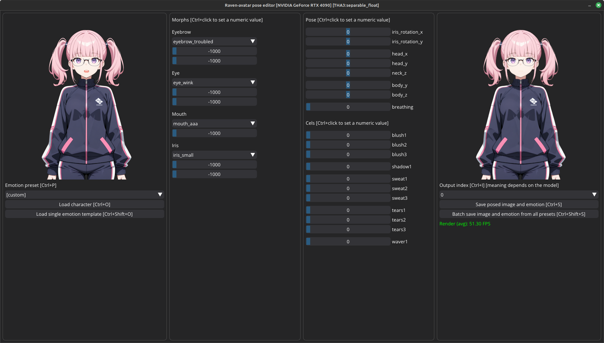</a>

- **Documentation**: [Avatar user manual](raven/avatar/README.md)
- **Goal**: Visually represent your LLM as a custom anime character, for PR stunts and for fun.
  - **Status**: :white_check_mark: Fully operational standalone tech demo, and Python bindings to integrate the avatar to Python-based GUI apps.
  - JS bindings possible, but not implemented yet. See [#2](https://github.com/Technologicat/raven/issues/2).
- **Features**:
  - One static input image into realtime video (THA3 engine).
  - Talking custom anime character with 28 emotional expressions.
  - Lipsync to *Raven-server*'s TTS. Record TTS-generated speech with lipsync (audio + image sequence).
  - Realtime Anime4K upscaler.
  - Realtime video postprocessor with visual effects such as [bloom](https://en.wikipedia.org/wiki/Bloom_(shader_effect)), [chromatic aberration](https://en.wikipedia.org/wiki/Chromatic_aberration), or [scanlines](https://en.wikipedia.org/wiki/Scan_line).
  - Web API to receive avatar video stream and to control the avatar.

## Raven-xdot-viewer: Interactive GraphViz graph viewer

*Added in v0.2.5.*

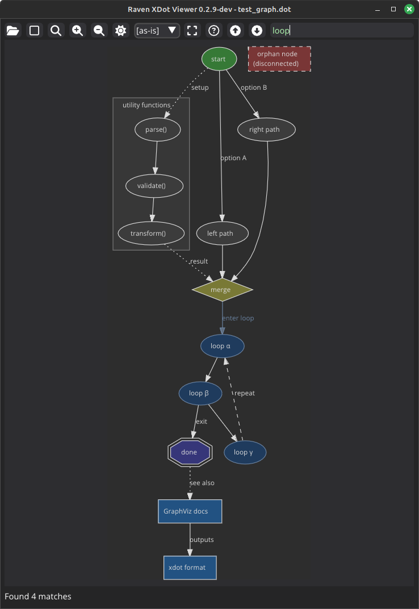

- **Documentation**: WIP
- **Goal**: View your `.dot` (`.gv`) and `.xdot` files in a GUI app with a focus on usability
  - **Status**: :white_check_mark: Fully operational prototype, usage: `raven-xdot-viewer myfile.xdot`
- **Features**:
  - Animated GUI, easy for pair work.
  - Layout engine switching.
    - If GraphViz is installed, the graph layout can be re-rendered with `dot`, `neato`, `fdp`, `sfdp`, `circo`, or `twopi`.
    - `.xdot` files can also be rendered as-is, using the existing layout information from the file.
  - Click on the end of an edge to follow it.
    - Click *on an edge* to jump between zoom-to-edge and its endpoint nodes.
  - Incremental fragment search for node/edge labels, like in *Visualizer*.
  - Supports fills, line styles, beziers, etc.
  - Supports the `tooltip` attribute, rendered as a tooltip (multiline plain text).
  - Supports the `URL` attribute on nodes. Right-clicking a node that has an URL (shown in the status bar) opens the URL in the default web browser.
  - Optional dark mode to reduce eye strain.
    - Node hue preserved, lightness flipped.
    - In dark mode, text color adapts based on perceived luminance (ITU-R BT.709) of the background.

## Raven-cherrypick: Triage images quickly

*Added in v0.2.6.*

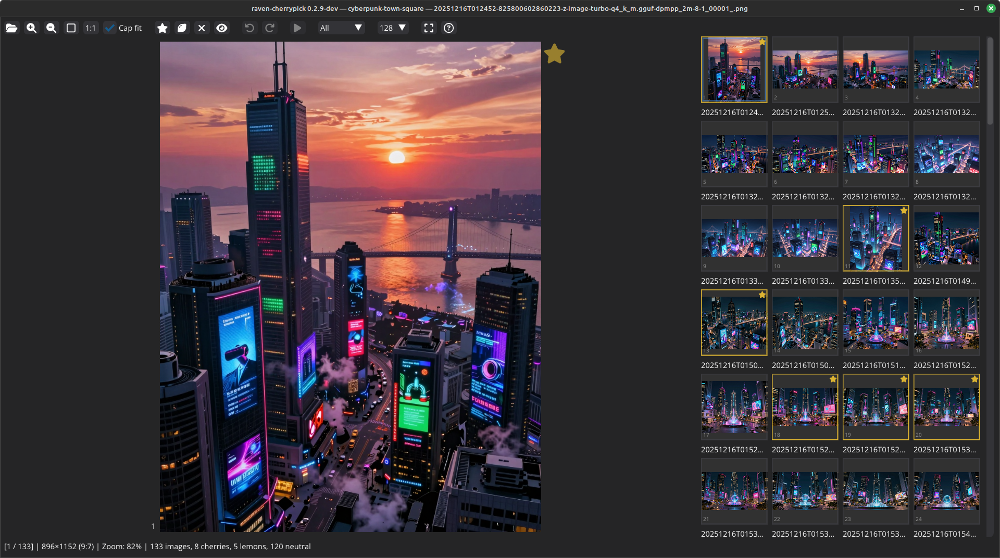

- **Documentation**: WIP
- **Goal**: Triage a folder of images into cherries (keepers), lemons (rejects), and neutral.
  - **Status**: :white_check_mark: Fully operational prototype, usage: `raven-cherrypick some/path/to/images/`
- **Features**:
  - GPU-accelerated, mipmapped Lanczos scaling for high quality.
    - *Optional*: install `libturbojpeg` (Debian/Ubuntu: `sudo apt install libturbojpeg`) for fast JPEG decoding. Falls back to PIL if not present.
  - No on-disk thumbnail cache, no metadata files.
    - Thumbnails are generated on the fly, into a RAM cache. (Noise shown in thumbnail until it has loaded.)
    - Image state is encoded by directory path: `base/cherries`, `base/lemons`, where `base` is the directory you are viewing.
  - The same virtual view combines the cherry/lemon/neutral directories.
    - Can optionally be filtered to show just cherries, lemons, or neutral.
  - Easy two-hand operation: arrows navigate; X=lemon, C=cherry, V=clear mark (drop back to neutral).
  - Zoom/pan preserved when switching between images with the same dimensions.
    - Makes it easy to compare a detail in variations of the same shot, by flicking back and forth.
    - Especially useful for mobile photos taken of someone's conference slides from 20m away, without optical zoom.
  - **Compare mode**: select 2–9 images and press Enter to cycle through them automatically.
    - Adjustable speed (0.5–15 FPS), pause/resume, zoom while cycling.
    - Numbered badges on grid tiles, large overlay number on the main view.
    - Press a digit key (1–9) to pick a winner and exit.
    - Press Ctrl+Shift+C (or Ctrl+Shift+click the "mark cherry" button) to commit the winner as cherry and the other compared images as lemon.


## Raven-conference-timer: Countdown timer for talks

*Added in v0.2.6.*

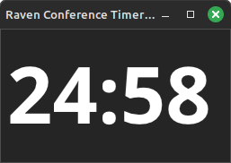

- **Documentation**: This is a very simple tool; this section is the full user manual.
- **Goal**: A simple, large-font countdown timer for conference presentations and similar.
  - **Status**: :white_check_mark: Fully operational, usage: `raven-conference-timer 15:00`
- **Features**:
  - Auto-sizes the window to fit the countdown text.
    - `--size N` sets the countdown font size in pixels (default 500; max 1000, DPG atlas limit).
  - Color changes at configurable thresholds: white → yellow → red → pulsating expired at a deeper red.
    - Thresholds configurable via `--yellow` and `--red` (default 5:00 and 2:00).
  - Both the main countdown time and the thresholds can use `mm:ss` (15:00) or bare minutes (15).
  - Hotkeys:
    - `Space` to pause/resume — the counter pulsates while paused.
    - `F11` to toggle fullscreen mode. No text resize - this just removes distractions by dedicating the screen to the timer and its blank background.
    - `F1` for help card.
    - `Esc` to exit.


## Raven-server: Web API server

<a href="raven/server/README.md">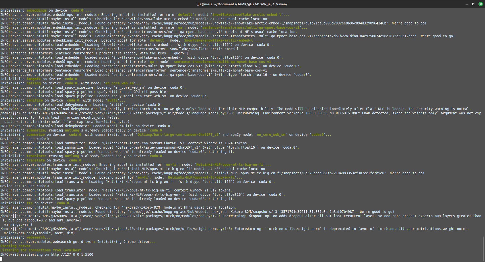</a>

- **Documentation**: [Server user manual](raven/server/README.md)
- **Goal**: Run all GPU processing on the server, anywhere on the local network.
  - **Status**: :white_check_mark: Fully operational.
- **Features**:
  - AI components for natural language processing (NLP).
  - Speech synthesizer (TTS), using [Kokoro-82M](https://github.com/hexgrad/kokoro).
  - Speech recognition (STT), using [whisper-large-v3-turbo](https://huggingface.co/openai/whisper-large-v3-turbo).
  - Server side of *Raven-avatar*.
- Partially compatible with *SillyTavern*. Originally developed as a continuation of *SillyTavern-extras*.
- Python bindings (client for web API) provided.
  - JS bindings possible, but not implemented yet. See [#2](https://github.com/Technologicat/raven/issues/2).

### Quickstart

To start the server, the basic command sequence is:

```bash
$(pdm venv activate)  # activate Raven venv
source env.sh  # set up paths for CUDA libraries
raven-server
```

Other scripts that can be sourced before starting `raven-server`:

```bash
source run-on-internal-gpu.sh  # set GPU that is visible to Torch as cuda:0
```

```bash
source no-hammer-hf.sh  # use the installed AI models without checking for new versions
```

Full sequence:

```bash
$(pdm venv activate)
source env.sh
source run-on-internal-gpu.sh
source no-hammer-hf.sh
raven-server
```


## Command-line tools

Beside the desktop apps, Raven installs a set of headless tools. They exist so that the parts of a workflow that do not need a window do not open one — a document collection can be indexed over SSH, and a bibliography can be assembled in a shell pipeline.

**Document database**

- **`raven-indexer`** builds or refreshes *Librarian*'s RAG index over a documents directory, then exits. Useful when you have just dropped several hundred files into the folder and would rather not watch the GUI chew through them, and necessary on a headless machine. `-d/--db-dir` writes the index somewhere other than the configured location, so several collections can be kept side by side. See [the Librarian README](raven/librarian/README.md#indexing-from-the-command-line-raven-indexer) for the options.

**Building a bibliography**

- **`raven-arxiv-search`** runs a boolean search against arXiv and writes the matching papers to a BibTeX file (`-o/--output`, defaulting to `<query_file>.bib`, or `results.bib` when the query is given with `-q`). Its output is already a bibliography, so it feeds `raven-arxiv-download --from-bib` directly — query to fulltext in two commands, with no identifiers to shuffle in between.
- **`raven-arxiv2id`** scans a directory for arXiv identifiers in PDF filenames, keeping the newest version of each paper. `--strip-versions` drops the version suffix, which is how a collection gets refreshed to the current revisions.
- **`raven-arxiv2bib`** turns identifiers into BibTeX, recording the version arXiv actually answered with.
- **`raven-arxiv-download`** fetches the fulltext PDFs, for identifiers given on the command line or read out of a `.bib` with `--from-bib`. `--save-bib` writes the BibTeX from metadata it already had to fetch anyway, so you pay arXiv's politeness delays once instead of twice — which is what you want coming from bare identifiers, rather than from a search that handed you the bibliography already.
- **`raven-burstbib`** splits a multi-entry `.bib` into one file per entry — which is what makes a bibliography usable as a document database, since otherwise the whole thing indexes as a single document.
- **`raven-wos2bib`**, **`raven-csv2bib`**, **`raven-pdf2bib`** convert Web of Science exports, CSV, and PDF metadata into BibTeX.
- **`raven-fixbib`** repairs what a database export does to a `.bib`: entries naming the same field two or three times, field values whose braces do not balance, HTML character entities left behind by a database that exported its web page rather than its record, and a publisher's rights notice sitting inside the `abstract`. A parser refuses a broken entry whole — title, authors and all — so a search export can lose a large share of itself to faults nothing reports. `-n` says what it would repair and writes nothing, `-l` names every record rather than counting them, and your file is overwritten only if you ask with `-i`.
- **`raven-deduplicate`** merges the copies a multi-database search leaves behind: the same paper once per database that indexes it, each in that database's dialect with a different subset of the fields filled in. Two keys decide, and neither is a guess — the DOI, and the title reduced until two databases' spellings of one title agree — unioned transitively, so a record sharing a DOI with one twin and a title with another brings all three together. The surviving copy is the most complete one, with every field it lacks filled in from a twin that has one, and every merge is written to an audit TSV.
- **`raven-siftbib`** removes the records you cannot screen. A search export carries records of wildly uneven completeness, and one holding nothing but a title is not off topic — nobody can tell what it is — it just has no text to form a view about, and carrying it into the screening count overstates what was actually read. You say what a usable record must have (`--require abstract`, `--min-chars abstract=600` for the truncated teaser a publisher exports in place of one, `--require year`, as many as you like), and everything removed goes to an audit TSV naming the record, its venue and which criterion it failed. Deterministic and offline: no model, no network, same answer every time. Whether a record is *about* your subject is a judgement and a different question; this one only asks whether there is anything to judge.

**From several databases into one bibliography**

Search Scopus, Web of Science, ProQuest, Springer and arXiv for the same question and you have five exports holding the same papers over and over. One command turns them into something citable:

```bash
raven-deduplicate scopus.bib wos.bib proquest.bib springer.bib arxiv.bib \
    -o deduped.bib --audit audit.tsv
```

Several files are read as one corpus, so there is nothing to concatenate first, and `raven-fixbib`'s repair is applied on the way in — a record the parser would refuse is still counted, so the number you get is honest without your having run the two tools in sequence. Reach for `raven-fixbib` itself when you want the repair in the *files*, which is a different thing from wanting it in the count.

Without `-o` the run reports what it would do and writes nothing; your inputs are never modified either way. `--audit` is the output a scoping review has to stand behind, and the one to keep: a row per merge naming what was kept, what was merged away, which key matched, and every value that differed from the one kept.

The audit is tab-separated, exactly as the `.tsv` says. Worth knowing when you open it in a spreadsheet: LibreOffice defaults to separating on tabs *and* spaces, so every title scatters across a dozen columns and the file looks corrupt. The separators are checkboxes in the import dialog that comes up as the file opens — clear *Space*, keep *Tab* — and they are easy to walk straight past.

Matching errs toward leaving duplicates rather than inventing them, because the two failures cost differently — a missed merge leaves a visible duplicate that a reviewer can act on, while a false merge deletes a paper from the review and nothing downstream can notice. `--judge` additionally asks an LLM about the near-misses no exact key joined; it needs an LLM backend, so it is off by default, and a verdict the records themselves contradict is dropped rather than acted on.

**Datasets and odds and ends**

- **`raven-importer`** runs *Visualizer*'s import pipeline (BibTeX → analyzed dataset) without the GUI.
- **`raven-dehyphenate`** undoes line-break hyphenation in text extracted from PDFs.
- **`raven-qoi2png`** converts QOI images to PNG.
- **`raven-check-cuda`** and **`raven-check-audio-devices`** report what the machine offers, which is usually the fastest way to settle an installation question.

The other end-to-end recipes that chain these — [turning a folder of arXiv PDFs into a searchable database](raven/librarian/README.md#turning-a-folder-of-arxiv-pdfs-into-a-searchable-database), and [refreshing that collection when papers get new versions](raven/librarian/README.md#refreshing-a-collection-when-papers-get-new-versions) — are in the Librarian README.


# Install & run

The Raven constellation consists traditional desktop apps. It needs to be installed.

Currently, this takes the form of installing the app and dependencies into a venv (virtual environment). At least at this stage of development, app packaging into a single executable is not a priority.

Raven is developed and tested on Linux Mint. It should work in any environment that has `bash` and `pdm`.

It has been reported to work on Mac OS X, as well as on Windows (with [Miniconda](https://www.anaconda.com/docs/getting-started/miniconda/main) to provide Python).

## From source

Raven has the following requirements:

 - A Python environment for running the [PDM](https://pdm-project.org/en/latest/) installer. Linux OSs have one built-in; on other OSs it is possible to use tools such as [Miniconda](https://www.anaconda.com/docs/getting-started/miniconda/main) to install one.
 - An NVIDIA GPU for running AI models via CUDA. (This is subject to change in the future.)

:exclamation: **Help wanted!** If you have an AMD GPU and would be willing to collaborate to get Raven working on it, [please chime in](https://github.com/Technologicat/raven/issues/1). Raven does not directly depend on CUDA, but only on PyTorch and on various AI libraries in the Python ecosystem. :exclamation:

### Install PDM in your Python environment

Raven uses [PDM](https://pdm-project.org/en/latest/) to manage its dependencies. This allows easy installation of the app and its dependencies into a venv (virtual environment) that is local to this one app, so that installing Raven will not break your other apps that use machine-learning libraries (which tend to be very version-sensitive).

Note that in contrast to many AI/ML apps, which use `conda` to manage the venv for the app, Raven instead uses PDM. The venv creation and management for the app is automatic, but you need a Python environment to run PDM in. That Python environment is used for running PDM **only**. Raven itself will run in the venv created automatically by PDM, which may even have a Python version different from that of the environment where PDM runs.

If your Python environment does not have PDM, you will need to install it first:

```bash
python -m pip install pdm
```

Don't worry; it won't break `pip`, `poetry`, `uv`, or other similar tools.

### Install Raven via PDM

Then, to install Raven, in a terminal that sees your Python environment, navigate to the Raven folder.

We will next initialize the new venv, installing the required Python version into it. This Python will be available for PDM venvs, and is independent of Python that PDM itself runs on.

Raven is currently developed against the minimum supported Python version, so we recommend to install that version, like this:

```bash
pdm python install --min
```

The venv will be installed in the `.venv` hidden subfolder of the Raven folder.

Then, install Raven's dependencies as follows. (If you are a seasoned pythonista, note that there is no `requirements.txt`; the dependency list lives in `pyproject.toml`.)

#### Basic install without GPU compute support

```bash
pdm install
```

This may take a while (several minutes).

Now the installation should be complete.

#### Install with GPU compute support

:exclamation: *Currently GPU compute support requires an NVIDIA GPU and CUDA.* :exclamation:

:exclamation: *Using CUDA requires the proprietary NVIDIA drivers, also on Linux.* :exclamation:

```bash
pdm install --prod -G cuda
```

If you want to add GPU compute support later, you can run this install command on top of an already installed Raven.

Installing dependencies may take a long time (up to 15-30 minutes, depending on your internet connection), because `torch` and the NVIDIA packages are rather large (my `.venv` shows 11.1 GB in total).

Now the installation should be complete.

##### CUDA version and the `torch` wheels

The `torch`, `torchvision` and `torchaudio` versions are pinned as a matched set, and installed as **CUDA 12.8** (`+cu128`) wheels from a dedicated PyTorch package index declared in [`pyproject.toml`](pyproject.toml) (the `pytorch-cu128` entry under `[[tool.pdm.source]]`). This is deliberate:

- CUDA 12.8 wheels run on **both** CUDA 12 and CUDA 13 driver stacks — an NVIDIA driver is backward-compatible, and the wheels bundle their own CUDA 12.8 runtime, so they work on any reasonably recent driver (Linux ~R570+). What `nvidia-smi` reports as *"CUDA Version"* is the maximum your **driver** supports, not an installed runtime; you don't need a matching system CUDA toolkit.
- Pinning to the index keeps the CUDA build stable across dependency re-locks. (Without it, a re-lock could silently pull a CUDA-13 `torchaudio` wheel from PyPI while `torch` stays on 12.8, and the mismatched runtime fails to load at import.)

To target a **different CUDA version**, change the `cuXYZ` in that source's URL (e.g. `cu126`, `cu129`) and re-run `pdm lock && pdm install`. Bump the three `torch*` versions in `[project] dependencies` together, deliberately, if you also want a newer PyTorch.

:exclamation: *The `pytorch-cu128` index has Linux and Windows wheels only — no macOS wheels.* On **macOS** (or any platform that index doesn't cover), remove that `[[tool.pdm.source]]` block from [`pyproject.toml`](pyproject.toml) before installing, so `torch` resolves from PyPI instead. :exclamation:

#### Install on an Intel Mac with MacOSX 10.x

Installing Raven may fail, if Torch cannot be installed.

On MacOSX, installing torch 2.3.0 or later requires an ARM64 processor and MacOSX 11.0 or later.

If you have an Intel Mac (x86_64) with MacOSX 10.x, to work around this, you can use Torch 2.2.x.

To do this, modify Raven's [`pyproject.toml`](pyproject.toml) in a text editor, so that the lines

```
    "torch==2.11.0",
    "torchvision==0.26.0",
    "torchaudio==2.11.0",
```

become

```
    "torch>=2.2.0,<2.3.0",
    "torchvision>=0.17.2",
    "torchaudio>=2.2.0,<2.3.0",
```

Also remove the `pytorch-cu128` `[[tool.pdm.source]]` block from [`pyproject.toml`](pyproject.toml) (as noted in the CUDA section above) — that index has Linux/Windows wheels only, so on macOS `torch` must resolve from PyPI instead.

Also, ChromaDB requires `onnxruntime`, which doesn't seem to be installable on this version of OS X. This means *Raven-librarian* and *Raven-server* won't work (as the RAG backend and the server's `embeddings` module require ChromaDB), but you can still get *Raven-visualizer* to work, by removing ChromaDB. Run this command in the terminal:

```bash
pdm remove chromadb
```

Then run `pdm install` again.

:exclamation: *In general, if a package fails to install, but is not explicitly listed in the dependencies, you can try to find out which package pulls it in, by issuing the command `pdm list --tree`. This shows a tree-structured summary of the dependencies.* :exclamation:

#### Install on Windows (if Windows Defender gets angry)

*Installing Raven does **not** need admin rights.*

- Raven can be installed as a regular user.
  - We recommend [Miniconda](https://www.anaconda.com/docs/getting-started/miniconda/main) as the Python environment.
- The only exception, that **does** need admin rights, is installing `espeak-ng`, so the TTS (speech synthesizer) can use that as its fallback phonemizer.
  - Raven only ever calls `espeak-ng` from *Raven-server*'s `tts` module, and only for those inputs for which the TTS's built-in [Misaki](https://github.com/hexgrad/misaki) phonemizer fails.
  - In practice, that is for out-of-dictionary words in English, as well as for some non-English languages.

*Using Raven does **not** need admin rights.*

- All the apps are regular userspace apps that you can run as a regular user.

If you get a **permission error** when trying to run `pdm`, try replacing "`pdm`" with "`python -m pdm`".

For example, instead of:

```
pdm install
```

run the command:

```
python -m pdm install
```

This works because PDM is just a Python module. This will be allowed to run if `python` is allowed to run.

Similarly, Raven apps are just Python modules, and can be run via Python, as follows. Full list as of Raven v0.2.9:

```
Command                                Replacement

raven-visualizer                  →    python -m raven.visualizer.app
raven-importer                    →    python -m raven.visualizer.importer_cli
raven-librarian                   →    python -m raven.librarian.app
raven-xdot-viewer                 →    python -m raven.xdot_viewer.app
raven-cherrypick                  →    python -m raven.cherrypick.app
raven-conference-timer            →    python -m raven.conference_timer.app
raven-arxiv2id                    →    python -m raven.papers.identifiers
raven-arxiv2bib                   →    python -m raven.papers.arxiv2bib
raven-arxiv-download              →    python -m raven.papers.download
raven-arxiv-search                →    python -m raven.papers.search
raven-burstbib                    →    python -m raven.papers.burstbib
raven-fixbib                      →    python -m raven.papers.fixbib
raven-deduplicate                 →    python -m raven.papers.deduplicate
raven-siftbib                     →    python -m raven.papers.siftbib
raven-dehyphenate                 →    python -m raven.tools.dehyphenate
raven-qoi2png                     →    python -m raven.tools.qoi2png
raven-csv2bib                     →    python -m raven.papers.csv2bib
raven-wos2bib                     →    python -m raven.papers.wos2bib
raven-pdf2bib                     →    python -m raven.papers.pdf2bib
raven-server                      →    python -m raven.server.app
raven-avatar-settings-editor      →    python -m raven.avatar.settings_editor.app
raven-avatar-pose-editor          →    python -m raven.avatar.pose_editor.app
raven-check-cuda                  →    python -m raven.tools.check_cuda
raven-check-audio-devices         →    python -m raven.tools.check_audio_devices
raven-minichat                    →    python -m raven.librarian.minichat
raven-indexer                     →    python -m raven.librarian.indexer
```


### Check that CUDA works (optional)

Once you have installed Raven with GPU compute support, you can check if Raven detects your CUDA installation:

```bash
raven-check-cuda
```

This command will print some system info into the terminal, saying whether it found CUDA, and if it did, which device CUDA is running on.

It will also check whether the `cupy` library loads successfully. This library is needed by the [spaCy](https://spacy.io/) natural language analyzer (so that too can run on GPU).

Example output:

```
INFO:raven.tools.check_cuda:Raven-check-cuda version 0.2.3
Checking dependencies...
1. PyTorch availability check [SUCCESS] ✅
2. CUDA device availability check [SUCCESS] ✅ (Using NVIDIA GeForce RTX 3070 Ti Laptop GPU)
3. CuPy & CuPyX (for spaCy NLP) [SUCCESS] ✅

System information:
   Python version: 3.10.12
   OS: Linux 6.8.0-109049-tuxedo
   PyTorch version: 2.7.0+cu126
```

### Activate the Raven venv (to run Raven commands such as `raven-visualizer` or `raven-server`)

In a terminal that sees your Python environment, navigate to the Raven folder.

Then, activate Raven's venv with the command:

```bash
$(pdm venv activate)
```

Note the Bash exec syntax `$(...)`; the command `pdm venv activate` just prints the actual internal activation command.

:exclamation: *Windows users note: The command `$(pdm venv activate)` needs the `bash` shell, and will **not** work in most Windows command prompts.* :exclamation:

Alternatively, you can run the venv activation script directly. You can find the script in `.venv/bin/`.

:exclamation: *For Linux and Mac OS X, the script is typically named `.venv/bin/activate`; for Windows, typically `.venv/bin/activate.ps1` or `./venv/bin/activate.bat`.* :exclamation:

Whenever Raven's venv is active, you can use Raven commands, such as `raven-visualizer`.

### Stopgap: run Raven commands from any terminal (bash functions)

By default, Raven commands such as `raven-visualizer` only work when the Raven venv is active in the current shell, and some commands (such as `raven-server`) additionally need `env.sh` and other helper scripts sourced. Until a more permanent solution exists, you can define `bash` functions in your `~/.bashrc` that handle activation transparently, so the commands work right in a fresh terminal.

First, point a variable at your Raven checkout (adjust the path to match your setup):

```bash
export RAVEN_DIR="$HOME/Documents/raven"
```

Then, the pattern for any single Raven command:

```bash
raven-cherrypick() {
    (
        cd "$RAVEN_DIR" &&
        eval "$(pdm venv activate)" &&
        source env.sh &&
        cd - > /dev/null &&
        command raven-cherrypick "$@"
    )
}
```

The subshell (`( ... )`) keeps the activation local to the function call, so it doesn't leak into your interactive shell. `cd - > /dev/null` returns to the original directory before invoking the command, which matters for commands that take paths as arguments (e.g. `raven-cherrypick some/path/`). `command` skips the function lookup so the wrapper doesn't recurse.

For `raven-server`, also source `run-on-internal-gpu.sh` and `no-hammer-hf.sh` if you want the GPU pinning and HuggingFace offline-mode behaviour from the [Quickstart](#quickstart):

```bash
raven-server() {
    (
        cd "$RAVEN_DIR" &&
        eval "$(pdm venv activate)" &&
        source env.sh &&
        source run-on-internal-gpu.sh &&
        source no-hammer-hf.sh &&
        cd - > /dev/null &&
        command raven-server "$@"
    )
}
```

### Activate GPU compute support (optional)

If CUDA support is installed but not working, you can try enabling CUDA (for the current command prompt session) as follows.

With the venv activated, and the terminal in the Raven folder, run the following `bash` command:

```bash
source env.sh
```

This sets up the library paths and `$PATH` so that Raven finds the CUDA libraries. This script is coded to look for them in Raven's `.venv` subfolder.

### Choose which GPU to use (optional)

If your machine has multiple GPUs, there are two ways to tell Raven which GPU to use.

If your system *permanently* has several GPUs connected, and you want to use a different GPU *permanently*, you can adjust the device settings in [`raven.server.config`](raven/server/config.py), [`raven.visualizer.config`](raven/visualizer/config.py), and [`raven.librarian.config`](raven/librarian/config.py).

If you switch GPUs only occasionally (e.g. a laptop that sometimes has an eGPU connected and sometimes doesn't), you can use the `CUDA_VISIBLE_DEVICES` environment variable to choose the GPU temporarily, for the duration of a command prompt session.

We provide an example script [`run-on-internal-gpu.sh`](run-on-internal-gpu.sh), meant for a laptop with a Thunderbolt eGPU (external GPU), which forces Raven to run on the *internal* GPU when the external is connected (which is useful e.g. if your eGPU is dedicated for a self-hosted LLM). On the machine where the script was tested, PyTorch sees the eGPU as GPU 0 when available, pushing the internal GPU to become GPU 1. When the eGPU is not connected, the internal is GPU 0.

With the venv activated, and the terminal in the Raven folder, run the following `bash` command:

```bash
source run-on-internal-gpu.sh
```

Then for the rest of the command prompt session, any Raven commands (such as `raven-visualizer`) will only see the internal GPU, and `"cuda:0"` in the device settings will point to the only visible GPU.

### Pin vsync to the right display on multi-monitor setups (NVIDIA + X11)

If you use multiple displays at different refresh rates (e.g. a 60 Hz external monitor alongside a 144 Hz laptop panel), Raven's GUI apps may run at the wrong refresh rate even though vsync is enabled. The symptom: `raven-librarian` (or any other Raven app) reports e.g. 144 FPS (in its `Ctrl+Shift+M` metrics debug window) while its window is actually on a 60 Hz display, wasting large amounts of CPU and GPU.

This is a quirk of the NVIDIA proprietary driver under X11: it picks **one** display to vsync to (by default the X11 primary), regardless of which display the window is actually on. Wayland handles per-output refresh rates correctly.

To pin vsync to the right display on X11, set `__GL_SYNC_DISPLAY_DEVICE` to the output name (as reported by `xrandr --query`) before launching the app:

```bash
__GL_SYNC_DISPLAY_DEVICE=DP-1 raven-librarian
```

Alternatively, make the desired display your X11 primary:

```bash
xrandr --output DP-1 --primary
```

The 4K external desktop monitor is a common case where this matters; on a single-display setup, no action needed.

### Exit from the Raven venv (optional, to end the session)

:exclamation: *There is usually no need to do this. You can just close the terminal window.* :exclamation:

If you want to exit from the Raven venv without exiting your terminal session, you can deactivate the venv like this:

```bash
deactivate
```

After this command completes, `python` again points to the Python in your Python environment (where e.g. PDM runs), **not** to Raven's app-local Python.

If you want to also exit your terminal session, you can just close the terminal window as usual; there is no need to deactivate the venv unless you want to continue working in the same terminal session.


# Configuration

Raven is currently mostly configured via text files - more specifically, Python modules (`.py`) that exist specifically as configuration files.

We believe that `.py` files are as good a plaintext configuration format as any, but in the long term, we aim to have a GUI to configure at least the most important parts.

In the meantime: each part of the Raven constellation has its own configuration file. Each configuration file is named `config.py`.

In the documentation as well as in the source code docstrings and comments, we refer to these files by their dotted module names. The most important ones are:

- `raven.visualizer.config` → [`raven/visualizer/config.py`](raven/visualizer/config.py)
  - *Raven-visualizer* settings, including plotter and word cloud colors, and word cloud image size.
  - Local AI model loading settings. Used if *Visualizer* is started when *Server* is not running.
- `raven.librarian.config` → [`raven/librarian/config.py`](raven/librarian/config.py)
  - *Raven-librarian* settings, including the AI avatar.
  - LLM configuration for the whole Raven constellation: server URL, system prompt, AI personality settings, text generation sampler settings.
  - The AI avatar has some more separate configuration:
    - Avatar video postprocessor settings are configured separately, in `raven/avatar/assets/settings/animator.json`.
      - Since finding nice-looking settings for the postprocessor requires interactive experimentation, we provide a GUI app for this. Use `raven-avatar-settings-editor` to edit `animator.json`.
    - Avatar emotion templates are shared between all characters and configured separately, in [`raven/avatar/assets/emotions/*.json`](raven/avatar/assets/emotions/).
      - There is usually no need to edit the emotion templates. But if you really want to, you can use the GUI app `raven-avatar-pose-editor`.
    - Avatar image assets are loaded from [`raven/avatar/assets/characters/`](raven/avatar/assets/characters/).
      - The default character (*Aria*, main image [`aria1.png`](raven/avatar/assets/characters/other/aria1.png)), contains an example of the additional cels needed to support all optional features of the animator, as well as the optional chat icon for *Raven-librarian*.
    - The backdrop image is loaded from [`raven/avatar/assets/backdrops/`](raven/avatar/assets/backdrops).
- `raven.server.config` → [`raven/server/config.py`](raven/server/config.py)
  - AI model settings, except LLM.
  - A low-VRAM variant is also available, for systems with 8 GB or less VRAM.
    - `raven.server.config_lowvram` → [`raven/server/config_lowvram.py`](raven/server/config_lowvram.py)
    - To use it, start *Raven-server* as `raven-server --config raven.server.config_lowvram`
- `raven.client.config` → [`raven/client/config.py`](raven/client/config.py)
  - *Raven-server* URL, shared between all client apps.
  - Audio device selection for voice mode (TTS/STT, i.e. speech synthesizer and speech recognition).

The paths are relative to the top level of the `raven` repository (i.e. to the directory this README is in).

For more, see the documentation for the individual constellation components (Visualizer, Librarian, Server).


# Uninstall

```bash
python -m pip uninstall raven-visualizer
```

Or just delete the venv, located in the `.venv` subfolder of the Raven folder.

AI models auto-install themselves elsewhere:

- The THA3 AI animator (of *Raven-avatar*) is auto-installed in the `raven/vendor/tha3/models/` subdirectory of your top-level `raven` directory.

- The dehyphenator AI model (of *Raven-server*'s `sanitize` module) is auto-installed in `~/.flair/embeddings/`.

- All other AI models are auto-installed from *HuggingFace Hub*.
  - These live at the default models cache location of the [`huggingface_hub` Python package](https://pypi.org/project/huggingface-hub/), which is usually `~/.cache/huggingface/hub`.
  - Note that this models cache is shared between many different Python-based AI apps, so removing everything is not recommended.


# Technologies

Raven builds upon several AI, NLP, statistical, numerical and software engineering technologies:

- Semantic embedding
  - AI model: [snowflake-arctic](https://huggingface.co/Snowflake/snowflake-arctic-embed-l).
  - Engine for running embedding models: [sentence_transformers](https://sbert.net/).
- Low-level NLP analysis for keyword extraction: [spaCy](https://spacy.io/).
- High-dimensional clustering: [HDBSCAN](https://hdbscan.readthedocs.io/en/latest/index.html).
- Dimension reduction: [OpenTSNE](https://opentsne.readthedocs.io/en/stable/).
- AI-powered PDF import
  - A large language model (LLM). Links are to the [Unsloth](https://huggingface.co/unsloth) GGUF quants, for their [dynamic quantization](https://unsloth.ai/docs/basics/dynamic-3.0-ggufs); sizes are what the LLM itself needs, so leave room for the avatar and any server modules you run beside it.
    - At least 24 GB VRAM: [Qwen3.6-35B-A3B](https://huggingface.co/unsloth/Qwen3.6-35B-A3B-GGUF) (**recommended**; mixture-of-experts, and much the faster of the two), [Qwen3.6-27B](https://huggingface.co/unsloth/Qwen3.6-27B-GGUF) (dense, for what the MoE gets wrong), or [Qwen3.8-27B](https://huggingface.co/unsloth/Qwen3.8-27B-GGUF).
    - 16 GB VRAM: [Qwen3.5-9B](https://huggingface.co/unsloth/Qwen3.5-9B-GGUF).
    - 8 GB VRAM (e.g. a laptop with an internal NVIDIA GPU): [Qwen3.5-4B](https://huggingface.co/unsloth/Qwen3.5-4B-GGUF) (punches well above its size class).
    - Not in English? [Gemma 4](https://huggingface.co/unsloth/gemma-4-E4B-it-GGUF), which comes in sizes from E4B to 31B.
  - LLM inference server; we develop against [LM Studio](https://lmstudio.ai/), and also support [oobabooga/text-generation-webui](https://github.com/oobabooga/text-generation-webui) (start that one with the `--api` option to let Raven see it).
  - Communication with the LLM inference server: [sseclient-py](https://github.com/mpetazzoni/sseclient).
- File format support
  - BibTeX: [BibtexParser](https://bibtexparser.readthedocs.io/en/main/).
  - Web of Science: [wosfile](https://github.com/rafguns/wosfile).
- Avatar AI animator: THA3 [[code](https://github.com/pkhungurn/talking-head-anime-3-demo)], [[models](https://huggingface.co/OktayAlpk/talking-head-anime-3/tree/main)], [[tech report](https://web.archive.org/web/20220606125507/https://pkhungurn.github.io/talking-head-anime-3/full.html)].
- Many more open-weight small, specialized AI models for tasks such as sentiment classification, dehyphenation, and natural language translation; see [`raven.server.config`](raven/server/config.py) for details.
- Graphical user interface: [DearPyGUI](https://github.com/hoffstadt/DearPyGui/).
  - "Open"/"Save as" dialog: [file_dialog](https://github.com/totallynotdrait/file_dialog), but customized for Raven, bugs fixed, and much added on top — full keyboard operation, a thumbnail grid view, find-as-you-type, sortable view, overwrite confirmation with animated OK button, and more. By now most of that tree is ours.
  - Markdown renderer: [DearPyGui-Markdown](https://github.com/IvanNazaruk/DearPyGui-Markdown), but robustified for multithreaded dynamic use (programmatic creation/deletion of MD text widgets, possibly concurrently).
  - Toolbutton icons: [Font Awesome](https://github.com/FortAwesome/Font-Awesome) v6.6.0.
  - Word cloud renderer: [word_cloud](https://github.com/amueller/word_cloud).

Note that installing Raven will auto-install dependencies into the same venv (virtual environment). This list is here just to provide a flavor of the kinds of parts needed to build a constellation like this.


# Privacy

We believe in the principle of *privacy first*. Raven is 100% local, and never collects any user data.

Some components store data on your local computer for the purpose of providing Raven's services. For example, *Raven-librarian*'s document database indexes the documents you insert into the database for the purpose of providing the search capability. The data remains in the index as long as the document is in the database. If you remove a document, the index deletes all of its data related to that document.

AI components live on your local installation of *Raven-server*. In general, any data that needs to be processed by an AI component is sent to your local *Raven-server*, and the response is sent back to the client. Communication between the client and the server is **not encrypted**.

It is preferable to run both the client and the server on the same machine, so that your data is never sent over the network. Alternatively, if you can trust the devices on your local network (LAN), you can run *Raven-server* on another machine on that LAN. **Never** connect to *Raven-server* over the internet. Doing so is **not** secure; the server is simply not designed to support that use case.

When Raven is installed, like any Python software, it pulls the Python packages it depends on from [PyPI](https://pypi.org/), using standard Python software installation methods. See the [PyPI privacy notice](https://policies.python.org/pypi.org/Privacy-Notice/).

AI models are downloaded from HuggingFace and self-hosted locally. HuggingFace may collect data (e.g. download statistics) when a model is installed; this is beyond our control. See the [HuggingFace privacy policy](https://huggingface.co/privacy).

We run the [Chroma](https://www.trychroma.com/) local search engine backend in its *telemetry off* mode.

To the best of our knowledge, any other packages we use do not collect any telemetry data.

For Librarian, we **strongly recommend** self-hosting a local LLM via [oobabooga/text-generation-webui](https://github.com/oobabooga/text-generation-webui), which can run quantized GGUF models on your GPU, also with partial offloading for low-VRAM environments. It comes with several backends out of the box, including Llama.cpp. It's easy, 100% local, and works well.

However, at your choice, Raven should be able to connect to an OpenAI-compatible cloud LLM API (opt-in via `raven.librarian.config`). We do **not** recommend doing so, for privacy reasons; nor is supporting this use case a priority for development. Several different dialects of "*OpenAI compatible*" exist, so some *Raven-librarian* features (such as token count and continuing the AI's message) might not work on backends Raven has not been tested with.


# License

[2-clause BSD](LICENSE.md).


# Acknowledgements

This work was financially supported by the [gH2ADDVA](https://www.jamk.fi/en/research-and-development/rdi-projects/adding-value-by-clean-hydrogen-production) (Adding Value by Clean Hydrogen production) project at JAMK, co-funded by the EU and the Regional Council of Central Finland.

<p align="center">
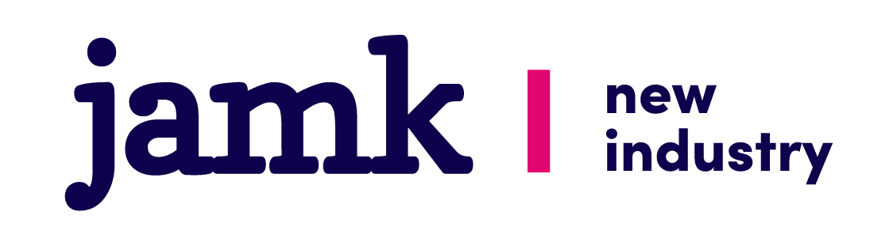 <br/>
<!-- 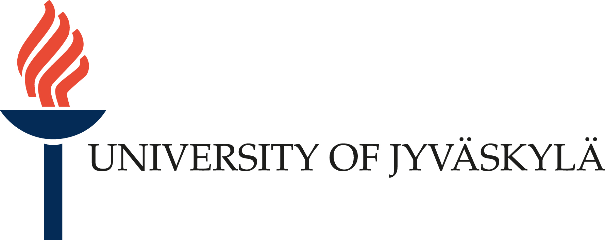 <br/> -->
 <br/>
 <br/>
</p>
