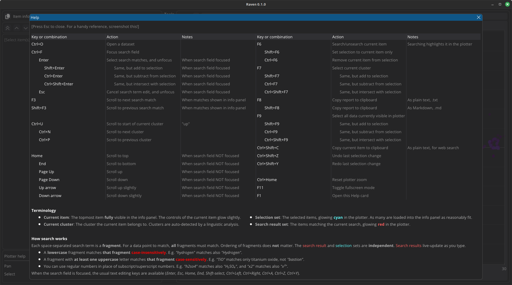

<p align="center">
 <br/>
</p>

-----

<p align="center">
 <br/>
<i>12 000 studies on a semantic map. Items matching your search terms are highlighted as you type.</i>
</p>

# Introduction

**Raven** is an easy-to-use research literature visualization tool, powered by AI and [NLP](https://en.wikipedia.org/wiki/Natural_language_processing). It is intended to help a scholar or subject matter expert to stay up to date as well as to learn new topics, by helping to narrow down which texts from a large dataset form the most important background for a given topic or problem.

- **Graphical user interface** (GUI). Easy to use.
- **Fully local**. Your data never leaves your workstation/laptop.
- **Usability-focused**. Modern animated GUI with immediate visual feedback on user actions. Most functions accessible from keyboard.
- **Semantic clustering**. Discover **vertically**: See how a field of science splits into topic groups. Explore similar papers.
- **Fragment search**. Discover **horizontally**: E.g. find studies (across all topics) where some particular method has been used.
- **Info panel**. Read the abstracts (if available) of the studies you discover, right there in the GUI.
- **Open source**. 2-clause BSD license.

*Fragment search* means that e.g. *"cat photo"* matches *"photocatalytic"*. This is the same kind of search provided by the Firefox address bar, or by the `helm-swoop` function in Emacs. Currently the search looks only in the title field of the data; this may change in the future.

**Raven is NOT a search engine.** Rather, for its input, it uses research literature metadata (title, authors, year, abstract) for thousands of papers, as returned by a search engine, and plots that data in an interactive semantic visualization.

**:exclamation: Raven is currently in beta. :exclamation:**

The basic functionality is complete, the codebase should be in a semi-maintainable state, and most bugs have been squashed. If you find a bug that is not listed in [TODO.md](TODO.md), please open an issue.

We still plan to add important features later, such as filtering by time range to help discover trends, and abstractive AI summaries of a user-selected subset of data (based on the author-provided abstracts).

We believe that at the end of 2024, AI- and NLP-powered literature filtering tools are very much in the zeitgeist, and that demand for them is only rising. Thus, we release the version we have right now as a useful tool in its own right, but also as an appetizer for future developments to come.

<p align="center">
 <br/>
<i>The help card. Most functions are accessible from the keyboard.</i>
</p>

<!-- markdown-toc start - Don't edit this section. Run M-x markdown-toc-refresh-toc -->
**Table of Contents**

- [Introduction](#introduction)
- [Import](#import)
    - [BibTeX](#bibtex)
        - [In the GUI](#in-the-gui)
            - [Save imported dataset as](#save-imported-dataset-as)
            - [Select input BibTeX files](#select-input-bibtex-files)
            - [Start the import](#start-the-import)
        - [From the command line](#from-the-command-line)
        - [Good to know](#good-to-know)
    - [Other formats](#other-formats)
        - [arXiv](#arxiv)
        - [WOS (Web of Science)](#wos-web-of-science)
        - [PDF (human-readable abstracts)](#pdf-human-readable-abstracts)
            - [How it works](#how-it-works)
            - [LLM requirements](#llm-requirements)
- [Visualize](#visualize)
    - [Load a dataset file in the GUI](#load-a-dataset-file-in-the-gui)
    - [Load a dataset file from the command line, when starting the app](#load-a-dataset-file-from-the-command-line-when-starting-the-app)
    - [Create a word cloud](#create-a-word-cloud)
        - [Save the word cloud as PNG](#save-the-word-cloud-as-png)
- [Install & uninstall](#install--uninstall)
    - [From PyPI](#from-pypi)
    - [From source](#from-source)
        - [Uninstall](#uninstall)
- [Limitations](#limitations)
- [Technologies](#technologies)
- [Other similar tools](#other-similar-tools)
- [License](#license)
- [Acknowledgements](#acknowledgements)

<!-- markdown-toc end -->

# Import

Raven uses the following workflow:

```
+-------+             +--------+                 +---------+
|  any  | --import--> | BibTeX | --preprocess--> | dataset | --> interactive visualization
+-------+             +--------+                 +---------+
```

where the `import` step is optional; BibTeX, widely used in the engineering sciences, is considered the native input format of Raven.

The input does not strictly have to be research literature. Anything that can be defined to have `title`, `authors`, and `year` fields, and optionally an `abstract` field (where *abstract* is any kind of human-readable short text summary), can be used as input. That said, the titles are used for linguistic analysis, so having precise titles (as is common in scientific papers) is likely to produce a more accurate semantic map.

Note that even BibTeX data needs to be preprocessed before it can be visualized.

The preprocessing step typically takes some time, so it is performed either offline (in the sense of a batch job) or in the background. All computationally expensive procedures, such as semantic embedding, clustering, keyword analysis, and training the dimension reduction for the dataset, are performed during preprocessing. Some of these, particularly the semantic embedding, support GPU acceleration.

The data is clustered automatically, and each cluster of data has its keywords automatically determined by an automated linguistic analysis. It is not possible to edit the clusters or keywords. If something is detected incorrectly, it is more in the spirit of Raven to improve the algorithms rather than hand-edit each dataset. Raven is intended to operate in an environment that has too much data, and where the data updates too quickly, for any kind of manual editing to be feasible at all.

The preprocessing step produces a **dataset file**, which can then be opened and explored in the GUI.


## BibTeX

BibTeX is considered the native input format of Raven.

### In the GUI

To preprocess one or more BibTeX databases into a dataset file, click on the *Import BibTeX files* button or press Ctrl+I. Doing so opens the following **BibTeX import window**:

<p align="center">
 <br/>
<i>The preprocessor. This functionality converts BibTeX files into a dataset.</i>
</p>

Note this window is **not** modal, so you can continue working with the app while the window is open, and pressing Esc will not close it.

Pressing Ctrl+I again closes the window.

#### Save imported dataset as

Click on the hard disk icon in the *BibTeX import window*, or press Ctrl+S while the *BibTeX import window* is open. A **save-as dialog** opens:

<p align="center">
 <br/>
<i>The save-as dialog for selecting a filename for the dataset to be created.</i>
</p>

Double-clicking a directory in the list goes into that directory. Double-clicking the ".." directory goes one level up.

The buttons at the top of the dialog refresh the view of the current directory, and jump back to the default directory, respectively.

The list can be sorted by clicking on the column headers. The date shown is the mtime (modification time).

The save-as filename field can be focused by pressing Ctrl+F. The field doubles as a search filter, so you can see what existing files in the current directory have names similar to the one you are saving.

The file extension (`.pickle`) is added automatically to the filename you specify. In future versions of Raven, the file extension will likely change, once we move to a more portable data format.

You can also pre-populate the filename by clicking a file in the list. This can be useful if you want to overwrite a file, or if you are saving a series of related files (`dataset1.pickle`, `dataset2.pickle`, ...).

If a file would be overwritten, the OK button flashes red, and the dialog asks to press it again (before the flash ends) to confirm.

Pressing Enter is the same as clicking the OK button. To overwrite a file, press Enter again (before the flash ends).

Pressing Esc cancels the save-as dialog.

**:exclamation: Navigating directories in the save-as dialog currently requires using the mouse. This is a known issue. :exclamation:**

#### Select input BibTeX files

To select input files, click the folder icon, or press Ctrl+O while the *BibTeX import window* is open. A **file picker dialog** opens:

<p align="center">
 <br/>
<i>The file picker for input BibTeX files.</i>
</p>

The file picker works similarly to the save-as dialog, but with a *Search files* field replacing the save-as filename field.

You can focus the *Search files* field by pressing Ctrl+F. The search filters the view live, as you type. All files matching the current search can be accepted by pressing Enter.

So for example, in the situation shown in the screenshot, to open `savedrecs-3.bib`, you can press Ctrl+F, type "-3" (so that only this one file matches the search filter), and press Enter.

On the other hand, if you want to accept *all* files whose name contains `savedrecs`, you can press Ctrl+F, type "savedrecs", and press Enter.

You can also hold down Ctrl and click files in the list to select multiple input files.

Accept the selection (whether one or more files) by clicking OK, or by pressing Enter. Accepting multiple files will import them all into the same dataset.

If you need just one input file, you can also double-click the file in the list to accept that one file.

Pressing Esc cancels the file picker.

**:exclamation: With the exception of the search functionality, the file picker currently requires using the mouse. This is a known issue. :exclamation:**

#### Start the import

To start the import, click the play icon in the *BibTeX import window*, or press Ctrl+Enter while the *BibTeX import window* is open. A progress bar will appear. While the import is running, a brief status message at the bottom of the *BibTeX import window* will indicate what the importer is currently doing. More detailed status is printed into the terminal window from which you started Raven.

The import process runs in the background, so you can continue working while your new dataset is being imported.

**:exclamation: Some tools used internally by the importer have no way to report on their ongoing progress. It is normal for the progress bar to seem stuck for several minutes, particularly while the importer is training or applying the dimension reduction. :exclamation:**

**:exclamation: The BibTeX import process may take a very long time, from several minutes to hours, depending on how much data you have. :exclamation:**

### From the command line

If you prefer to run your BibTeX imports without opening the GUI (on a headless server, perhaps?), Raven provides a command-line frontend for this task.

To preprocess one or more BibTeX databases into a dataset file named `mydata.pickle`:

```bash
conda activate raven
python -m raven.preprocess mydata.pickle file1.bib file2.bib ...
```

Instead of `python -m raven.preprocess`, you can also just use the command `raven-preprocess` (installed when you install the software):

```bash
conda activate raven
raven-preprocess mydata.pickle file1.bib file2.bib ...
```

Status messages are printed into the terminal window.

**:exclamation: The BibTeX import process may take a very long time, from several minutes to hours, depending on how much data you have. :exclamation:**

### Good to know

The BibTeX preprocessor caches its intermediate data per input file, so you can include e.g. `file1.bib` into multiple different dataset files, and the expensive computations specific to `file1.bib` will only happen once, unless `file1.bib` itself changes. The caching mechanism checks the timestamps; when e.g. `file1.bib` is processed, computations are re-done if `file1.bib` has changed after the cache was last updated.

Currently, the dimension reduction that produces the 2D semantic map is trained using up to 10k data items, picked at random if the input data contains more.

Currently, it is not possible to add new data into an existing visualization dataset (to overlay new data on an existing, already trained dimension reduction). This is currently a major usability drawback, particularly for the use case of following ongoing research trends, so this will likely change in the future.


## Other formats

First import your data into BibTeX format, then preprocess the BibTeX data into a dataset as explained above.

We plan to add more importers in the future.


### arXiv

Useful especially for AI/CS topics.

The external [arxiv2bib](https://github.com/nathangrigg/arxiv2bib) tool produces a BibTeX bibliography, when given a list of arXiv document IDs. It will pull the relevant data from arXiv.

If you have a directory full of PDFs downloaded from arXiv, with the identifier somewhere in the filename, see `python -m raven.arxiv2id -h`. This tool, included with Raven, can extract the arXiv identifiers from the filenames, in a format suitable for handing over to `arxiv2bib`. Only unique identifiers will be returned.

Example:

```bash
conda activate raven
python -m raven.arxiv2id >arxiv_ids.txt  # run this in a directory that has arXiv PDF files
arxiv2bib <arxiv_ids.txt >arxiv_papers.bib
```

This gives you a BibTeX bibliography (`arxiv_papers.bib`) that be imported into Raven.

**NOTE**: If you have hundreds or more of arXiv papers in the same directory, `arxiv2bib` may fail with an HTTP 414 error (URI too long). In that case, splitting the input into smaller filesets helps.


### WOS (Web of Science)

Useful for the engineering sciences.

To import WOS into BibTeX, Raven provides a custom command-line tool. To use it:

```bash
conda activate raven
python -m raven.wos2bib input1.txt ... inputn.txt 1>output.bib 2>log.txt
```

where the input `.txt` files are WOS files exported from Web of Science.

In the example, the output is written to `output.bib`, and any log messages (such as warnings for broken input data) are written to `log.txt`.


### PDF (human-readable abstracts)

Abstract submissions to scientific conferences sometimes arrive as free-form, human-readable PDF files.

For this use case, we include a custom AI-based command-line tool.

**:exclamation: This functionality is currently in beta. :exclamation:**

- The text content of the PDF is analyzed via an LLM (large language model).
- The PDF must have its text content readable by `pdftotext` (from `poppler-utils`).
- Each PDF should contain one abstract. Multiple abstracts are fed in as separate PDF files.
- The importer does not enforce a length limit, but its intended use case is a typical conference abstract, 1-2 pages in length.
- The abstract should have a human-recognizable title, authors, and main text. Exact formatting does not matter.
- If the abstract contains a line beginning with "*keywords:*" or "*key words:*", the importer will attempt to also extract keywords.

To import PDF into BibTeX:

```bash
conda activate raven
python -m raven.pdf2bib http://127.0.0.1:5000 -i some_input_directory -o done 1>output.bib 2>log.txt
```

The "*http://...*" argument is the URL of an LLM serving an OpenAI-compatible API (streaming mode).

The command imports all PDF files in `some_input_directory` (which can be a relative or absolute path), automatically descending into subdirectories. The files are processed one directory at a time, in Unicode lexicographical order by filename. Output is written to `output.bib`, and log messages to `log.txt`.

The `-o done` moves each PDF file into directory named `done` after the file has been processed. This allows canceling the job and easily continuing it later, which is useful if there are lots of input files; the LLM analysis can be slow. An input PDF file is moved if and only if it was successfully processed, **after** printing the generated BibTeX entry.

The directory specified by `-o` is ignored while descending into subdirectories of the input directory, so it is possible to use e.g. `-o some_input_directory/done`.

To continue a partial import (with some files already having been moved into `done`, and some remaining):

```bash
conda activate raven
python -m raven.pdf2bib http://127.0.0.1:5000 -i some_input_directory -o done 1>>output.bib 2>>log.txt
```

That is, just use the append mode (`>>` instead of `>`) for redirecting the output into files.

#### How it works

The PDF importer analyzes the human-readable text content of the PDF via an LLM. If the text contains a section title *"References"*, anything after that point is discarded before processing. This is done to prevent cross-contamination, which would otherwise be an issue especially when extracting the title and the author list.

To improve reliability, the fields are processed one at a time. Some prompt engineering has gone both into the system prompt as well as each individual data-extracting prompt. The prompts have been engineered manually; we have not yet looked at automatic prompt optimization.

The extracted data is double-checked by some heuristics for fields for which this is reasonably possible. Any suspicious-looking LLM responses are flagged with a warning. It is **very strongly recommended** to manually double-check any entries that were flagged by comparing the generated BibTeX entry to the human-readable content of the original PDF file, because any flagged entries are **very likely** to be incorrect in one or more ways.

Note that people do actually sometimes submit PDF abstracts with no author list, or even no title. The importer attempts to catch such cases, but is not always successful at doing so.

As is well known, LLMs may make things up, may respond incorrectly, or may occasionally fail to follow instructions correctly. Hence this functionality is in beta.

#### LLM requirements

The PDF importer has been tested on a local Llama 3.1 8B instance running on [Oobabooga](https://github.com/oobabooga/text-generation-webui). This model fits into a laptop's 8 GB VRAM at 4 bits, e.g. in a Q4_K_M quantized format, while leaving enough VRAM for 24576 (24k) tokens of context.

Based on our own testing, accuracy with this LLM is ~80%, or in other words, on average, 8 out of 10 abstracts import without warnings (and also look correct by manual inspection).

As of February 2025, support for thinking LLMs has been added. This is done by automatically stripping `<think>...</think>` sections from the LLM output. We are currently testing this on a Q4_K_M quant of [DeepSeek-R1-Distill-Qwen-32B](https://huggingface.co/deepseek-ai/DeepSeek-R1-Distill-Qwen-32B), with 65536 (64k) tokens of context, running the model on an eGPU with 24GB of VRAM.

Support for LLM authentication (API key) has not been implemented yet, so whichever LLM is used, currently it must be local (on the same network, no API key). Also, the importer expects the LLM to accept a custom system prompt (unlike cloud LLMs, whose system prompts are hidden and uneditable). Supporting cloud LLMs is not a high priority, but PRs are welcome.


# Visualize

First, if the `raven-visualizer` app is not yet running, start it:

```bash
conda activate raven  # see Installation below
python -m raven.app
```

Instead of `python -m raven.app`, you can also just use the command `raven-visualizer` (installed when you install the software):

```bash
conda activate raven  # see Installation below
raven-visualizer
```

For details on how to use the app, see the built-in Help card. To show the help, click the "?" button in the toolbar, or press F1.

## Load a dataset file in the GUI

To load your dataset file, you can then click on the *Open dataset* button in the toolbar, or press Ctrl+O, thus bringing up this dialog:

<p align="center">
 <br/>
<i>Opening an imported dataset for visualization.</i>
</p>

The *Open dataset* dialog is a file picker, which works similarly to the file picker in the *BibTeX import window*.

The only difference is that here multi-select mode is not available, because only one dataset can be opened at a time. Thus, Ctrl+click is not available.

If you use the search feature (Ctrl+F) to open a file by typing a part of its name, and the search has exactly one match in the current directory (i.e. when only one file is shown in the list, not counting the ".."), that file can then be opened by pressing Enter.

**:exclamation: With the exception of the search functionality, the file picker currently requires using the mouse. This is a known issue. :exclamation:**

## Load a dataset file from the command line, when starting the app

Like many GUI apps, Raven also accepts a dataset file from the command line, when the app starts:

```bash
python -m raven.app mydata.pickle
```

or

```bash
raven-visualizer mydata.pickle
```


## Create a word cloud

Raven can make a word cloud from the auto-detected per-entry keywords of the individual studies in the current selection. The size of each word in the picture represents its relative number of occurrences within the selection:

<p align="center">
 <br/>
<i>Word cloud window.</i>
</p>

The word cloud window hotkey (F10) toggles the window. Note this window is **not** modal, so you can continue working with the app while the window is open, and pressing Esc will not close it.

If the word cloud window is open, it updates automatically whenever the selection changes. Just like in the info panel, the old content remains in the window until the new rendering finishes.

When the word cloud window is opened, Raven checks whether the selection has changed since the last word cloud was rendered. If there are no changes, the latest already rendered word cloud is re-shown.

The rendering algorithm allocates regions and colors randomly, so even re-rendering with the same data (e.g. in another session later), you will get a different-looking result each time.

The word cloud renderer is Python-based, so it can be rather slow for large selections containing very many data points. The render runs in the background, so you can continue working (as long as you don't change the selection) while the word cloud is being rendered.

### Save the word cloud as PNG

Click the "hard disk" button, or press Ctrl+S while the *word cloud window* is open. A *save-as dialog* opens, offering to save the word cloud image as PNG.

This dialog works similarly to the dataset save-as dialog in the *BibTeX import window*.

The file extension (`.png`) is added automatically to the filename you specify.


# Install & uninstall

Raven is a traditional desktop app. It needs to be installed.

Currently, this takes the form of installing a `conda` environment, and then installing the app via PyPI. At least at this stage of development, app packaging into a single executable is not a priority.

Raven has been developed and tested on Linux Mint. It should work in any environment that has `bash` and `conda` ([miniconda](https://docs.anaconda.com/miniconda/) recommended), including Windows and Mac OS X.

## From PyPI

**Coming soon**

## From source

```bash
conda create -n "raven" python=3.10
conda activate raven
pip install -r requirements.txt
pip install .
```

### Uninstall

```bash
pip uninstall raven-visualizer
```

Or just delete the `raven` venv.

# Limitations

- Scalability? Beta version tested up to 12k entries, but datasets can be 100k entries in size.
- Hardware requirements, especially GPU. Tested on a laptop with an NVIDIA RTX 3070 Ti mobile, 8 GB VRAM.
- Clustering in high-dimensional spaces is an open problem in data science. Semantic vectors have upwards of 1k dimensions. This causes many entries to be placed into a catch-all "*Misc*" cluster.
- Hyperparameters of the clustering algorithm in the preprocessor may be dataset-dependent, but are not yet configurable. This will change in the future.
- Dataset files are currently **not** portable across different Python versions.
- We attempt to provide keyboard access to GUI features whenever reasonably possible, but there are currently some features where this is not reasonably possible; notably the plotter, and navigation within the *Open dataset* dialog window.
- Configuration is currently hardcoded. See `config.py`. We believe that `.py` files are as good a plaintext configuration format as any, but in the long term, we aim to have a GUI to configure at least the most important parts.


# Technologies

Raven builds upon several AI, NLP, statistical, numerical and software engineering technologies:

- Semantic embedding
  - AI model: [snowflake-arctic](https://huggingface.co/Snowflake/snowflake-arctic-embed-l).
  - Engine for running embedding models: [sentence_transformers](https://sbert.net/).
- Keyword extraction: [spaCy](https://spacy.io/).
- High-dimensional clustering: [HDBSCAN](https://hdbscan.readthedocs.io/en/latest/index.html).
- Dimension reduction: [OpenTSNE](https://opentsne.readthedocs.io/en/stable/).
- AI-powered PDF import
  - AI model: a large language model (LLM), such as [Llama 3.1 8B](https://huggingface.co/meta-llama/Llama-3.1-8B), [Sky-T1 32B](https://huggingface.co/NovaSky-AI/Sky-T1-32B-Preview), or [DeepSeek-R1-Distill-Qwen-32B](https://huggingface.co/deepseek-ai/DeepSeek-R1-Distill-Qwen-32B).
  - Engine for running LLMs: an LLM server such as [Oobabooga](https://github.com/oobabooga/text-generation-webui).
  - Communication with the LLM server: [sseclient-py](https://github.com/mpetazzoni/sseclient).
- File format support
  - BibTeX: [BibtexParser](https://bibtexparser.readthedocs.io/en/main/).
  - Web of Science: [wosfile](https://github.com/rafguns/wosfile).
- Graphical user interface: [DearPyGUI](https://github.com/hoffstadt/DearPyGui/).
  - "Open"/"Save as" dialog: [file_dialog](https://github.com/totallynotdrait/file_dialog), but customized for Raven, and some features added.
  - Markdown renderer: [DearPyGui-Markdown](https://github.com/IvanNazaruk/DearPyGui-Markdown).
  - Toolbutton icons: [Font Awesome](https://github.com/FortAwesome/Font-Awesome) v6.6.0.
  - Word cloud renderer: [word_cloud](https://github.com/amueller/word_cloud).

Note that installing Raven will auto-install dependencies into the same `conda` environment. This list is here just to provide a flavor of the kinds of parts needed to build a tool like this.


# Other similar tools

To our knowledge, [LitStudy](https://nlesc.github.io/litstudy/) is the closest existing tool, but it is a Jupyter notebook, not a desktop app, and its analysis methods seem slightly different to what we use. Also, having existed since 2022, it does have many more importers than we do at the moment.


# License

[2-clause BSD](LICENSE.md).


# Acknowledgements

This work was financially supported by the [gH2ADDVA](https://www.jamk.fi/en/research-and-development/rdi-projects/adding-value-by-clean-hydrogen-production) (Adding Value by Clean Hydrogen production) project at JAMK, co-funded by the EU and the Regional Council of Central Finland.
