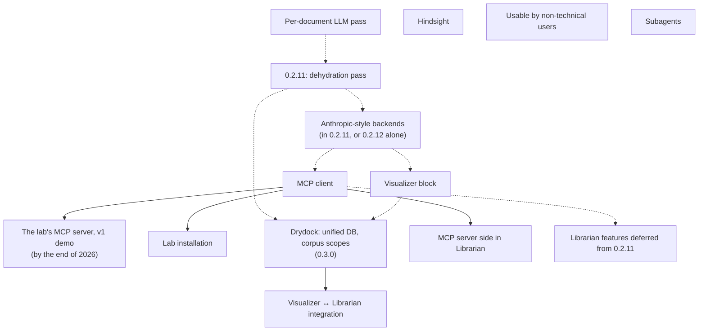

# Roadmap

*The large pieces of work as a directed graph, not a queue. An edge A → B means A is done first, then B. Nodes
with no path between them are alternatives whose order is not decided yet, and need not be until one of them
is about to start. Prioritizing then means getting the structure right now, and linearizing one step at a
time (maintainer, 2026-10-09).*

*A solid edge is a gate: B cannot start, or would be wasted, without A. A dashed edge is a preference: the
order we intend, which can be revisited. Item-level detail lives in `TODO.md`, `TODO_DEFERRED.md` and the
briefs; `briefs/roadmap-overview-2026-10.md` is the dated inventory of all of it. This page names the
pieces and the order between them.*

`HS`, `USE` and `SUB` have no edges yet: their place is open.

## The nodes

- **Per-document LLM pass** (`briefs/per-document-llm-pass-brief.md`). **First**: the maintainer's part of
  the AOKK study blocks on it, and that blocks the other researchers on the team. Tentatively from 2026-10-19.
- **0.2.11, the dehydration pass.** A clean starting state before the next builds. Small items are welcome
  here on their own merit: closing many of them shortens the list quickly, and that is attention rent
  removed. Decided 2026-10-09 (maintainer):
  - **In**: what was deferred in the run-up to Yrityspäivä — versioning the chat datastore file, the
    backdrop onto `fit_cover`, the thumbnail grid's textures, the Librarian `gui` subpackage, the DPG glyph
    race; the distribution rename to `raven-lab` and the wheel audit, as small items; the Markdown renderer's
    done-signal; modernizing the system prompt (small); **the optional greeting**, whose PR impact is large
    — a canned greeting reads as 2023 — and whose cost is S–M now that its largest blocker went on
    2026-08-12; **the prompt viewer**, if it comes out M at most, being a power multiplier for debugging.
  - **Deferred**: `chat_controller` without the ML stack; most of the Librarian features gated on 0.2.11
    (attach from URL, sibling memory, batch indexing, prompt templating, the chat search on attachment
    filenames, context compaction, inline citations); the Markdown renderer's block rendering and LaTeX, an
    overhaul of days. **All of these come after the MCP client** (maintainer, 2026-10-09), and are unplaced
    beyond that. Later still: datastore browsing, colourblind-safe flashes, the streaming scrollbar,
    image-conversion consolidation, datastore scaling.
- **Anthropic-style backends.** Brand neutrality on the backend axis too. Guessed at a few days: L, where the
  drydock is XL. In 0.2.11 if it fits reasonably, otherwise a 0.2.12 holding nothing else.
- **Visualizer block.** Author search, time ranges for trend visualization, clustering improvements (brief
  11 item 5), DOI per item. Some of it has waited about a year. **Before the drydock**, so that users have a
  useful version while the insides are overhauled.
  - **Not the Nomic switch**, which goes in during the drydock: image support is a new feature rather than an
    improvement to an existing one. It needs GUI design first — how image matches show in the annotation
    tooltip and in the info panel (brief 11 item 1).
- **MCP client** (`briefs/librarian-extension/04_librarian-mcp-client-brief.md`). Both transports, stdio
  (CLI) and HTTP, working before the lab's server specifically is worth worrying about.
  - **Test targets**: the MCP servers already configured for LM Studio, which Qwen has been tested with —
    open-meteo first, being fully nondestructive, then filesystem, shell and playwright. Configuration is in
    the maintainer's machine setup notes, in dotclaude.
  - **Per-tool enable toggles**, in `mcp.json` if LM Studio tolerates custom fields there, otherwise in a
    sidecar.
  - **No longer gated on Hindsight**: Hindsight was only the first planned test target.
  - **Open**: whether weather stays with open-meteo or becomes a built-in tool.
- **The lab's MCP server.** Its v1 requirements were specced on campus on 2026-10-07; it returns text or
  JSON. Needs a fully functional demo, v1 at least, by the end of 2026, which is why the MCP client comes
  soon after the per-document pass. Its endpoints are looked at once the client works.
- **Lab installation.** Also gated on the avatar-only mode and the sci-fi file objects, and dates the
  `cu130` move (`briefs/design/lab-assistant-hci-sketch.md`).
- **Hindsight** (`briefs/librarian-extension/06_hindsight-standup-brief.md`). Wanted soon for play, and for
  the virtual-colleague track. Unplaced.
- **Drydock** (`briefs/13_corpus-scopes-and-unified-db-brief.md`), 0.3.0. Weeks at least. **Started once it
  blocks meaningful progress**, after 0.2.11 and the Visualizer block. Whether it or Hindsight comes first
  is open; both have value.
- **Visualizer ↔ Librarian integration.** "Let's discuss these studies", "highlight in the Visualizer what
  you found". Needs the unified DB, hence the drydock.
- **Usable by non-technical users** (`TODO.md`, "Usable by non-technical users"). Visitors at Yrityspäivä
  wanted to try Raven and were not technical types (maintainer). Server autostart, settings dialogs, and a
  simpler installation — more important for practical value than the PyPI upload. Unplaced.
- **Subagents.** `librarian.agent` offered to the AI as a tool, its sessions viewable by opening a datastore
  other than the default (`TODO_DEFERRED.md`, "Librarian: open a chat datastore other than the configured
  default"). Two levels are likely enough — the main session plus workers, the tool not offered to a
  subagent — rather than a recursion limit. Part of the research group's multiagent goals.
- **MCP server side in Librarian.** The lab system's experiment-planning agent could consult Librarian's
  document database, and could draft reports that Librarian fetches over MCP. Multiagent too; not specced.
