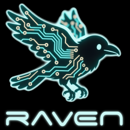

<p align="center">
 <br/>
</p>

-----

<p align="center">
 <br/>
<i>The upgraded engine in Raven-avatar provides <b>animefx</b>, such as these notice lines, which appear briefly when she becomes surprised.</i>
</p>

<!-- markdown-toc start - Don't edit this section. Run M-x markdown-toc-refresh-toc -->
**Table of Contents**

- [Introduction](#introduction)
- [GUI apps](#gui-apps)
- [Why anime?](#why-anime)
- [Codebase structure](#codebase-structure)
- [Quick tips for character creation](#quick-tips-for-character-creation)
    - [Cel blending and animefx](#cel-blending-and-animefx)
- [Troubleshooting](#troubleshooting)
    - [Low framerate](#low-framerate)
    - [Low VRAM - what to do?](#low-vram---what-to-do)
    - [Missing THA3 model at startup](#missing-tha3-model-at-startup)
- [Limitations](#limitations)
- [License](#license)
- [Acknowledgements](#acknowledgements)

<!-- markdown-toc end -->

# Introduction

*Raven-avatar* renders a live, custom anime avatar to represent your LLM, for PR stunts and for fun. It is powered by a realtime AI animator running on the GPU.

- **Easily customizable**. Convert *one static image* of an anime-style character into an animated talking head.
- **Cel blending**. Additional cels can be provided to support effects such as blushing.
- **Lipsynced speech**. The character can lipsync to the speech synthesizer of the `tts` module in Raven-server.
- **Animefx**. Optional anime-style cel effects, e.g. notice lines, sweatdrops, anger veins, ...
- **Upscaling**. Animation is 512×512, but can be Anime4K-upscaled to e.g. 1024×1024.
- **Postprocessing**. Visual effects such as [bloom](https://en.wikipedia.org/wiki/Bloom_(shader_effect)), [chromatic aberration](https://en.wikipedia.org/wiki/Chromatic_aberration), [scanlines](https://en.wikipedia.org/wiki/Scan_line), ...
- **Web API**: Integrate the avatar into your own apps. We provide Python bindings (see [`raven.client.api`](../client/api.py)).

**Historical note**

*Raven-avatar* began as a fork of the *Talkinghead* module of the now-discontinued *SillyTavern-extras*.

The AI posing engine is the same, namely *Talking Head Anime 3* (THA3).

Much of the animation controller code comes from the final version of *Talkinghead*, with the performance improvements, the framerate corrector, and the new idle animation.

*Raven-avatar* introduces many new features: lipsync, cel blending, animefx, the realtime video upscaler, and the postprocessor settings GUI app are all new. Also the web API has been redesigned to support several avatar sessions simultaneously (if your GPU can handle it).

Lipsync was always possible with THA3, but *Talkinghead* never used the feature, because doing so for an AI character requires a speech synthesizer that can generate timestamped phoneme data. We now have that, in the form of [Kokoro-82M](https://github.com/hexgrad/kokoro).

# GUI apps

*Raven-avatar* itself provides the following GUI apps:

- `raven-avatar-settings-editor`: Test your characters and edit postprocessor settings.
  - New, original to *Raven-avatar*.
  - :exclamation: Make sure that `raven-server` is running first before you start `raven-avatar-settings-editor`. :exclamation:

- `raven-avatar-pose-editor`: Edit the emotion templates.
  - Based on the THA3 pose editor in the final version of *Talkinghead* (which itself was based on the THA3 offline demo app), but ported to DearPyGUI and extended.
  - Standalone, i.e. does not need `raven-server`.
  - Run with `--help` to see command-line options.

Note that by default, the avatar loads its emotion templates from [`raven/avatar/assets/emotions/`](../avatar/assets/emotions/). If you want to change these default templates, you can save your modified emotion in this folder (overwriting the old one).

In case you need to go back to factory default emotion templates, the pose editor has a factory reset command-line option, which can do this. (This cannot be undone.)

**Future plans** (08/2025)

The avatar will visually represent the AI character in the GUI of `raven-librarian`, our upcoming scientific LLM frontend. The AI character's emotional state will be automatically determined from a piece of text (or thought) most recently written by the LLM, via the `classification` module of *Raven-server*. This is the same approach that was used by *Talkinghead*.

It would be interesting to introduce *Raven-avatar* to replace the discontinued *Talkinghead* in *SillyTavern*, but at the moment, there are no development resources to write a JS client for the avatar. Much of the porting should be straightforward. However, there are some technical points such as handling the video streaming format, and porting the lipsync code (in [`raven.client.tts`](../client/tts.py)) to JS. For details, see [SillyTavern#4034](https://github.com/SillyTavern/SillyTavern/issues/4034).


<p align="center">
 <br/>
<i>Raven-avatar-settings-editor is a character tester and a video postprocessor configurator.</i>
</p>

<p align="center">
 <br/>
<i>Raven-avatar-pose-editor can edit the emotion templates. Extended from the THA3 pose editor.</i>
</p>

# Why anime?

This visual style was chosen for three main reasons:

- Efficient use of development resources. Being abstracted farther from reality, anime style is not as susceptible to the uncanny valley effect as photorealism is. Hence acceptable quality can be reached with relatively small development resources, making the technology ideal for small teams.
- Historical reasons. *SillyTavern-extras* used the THA3 animator, and I happened to have worked on it, so I could port the code quickly.
- Aesthetics. The style looks nice.


# Codebase structure

Where to find the relevant files:

- The server side implementation: [`raven.server.modules.avatar`](../server/modules/avatar.py)
- The server side web API endpoints: [`raven.server.app`](../server/app.py) (**start here** when developing your own **JavaScript** apps)
- Python bindings for the web API: [`raven.client.api`](../client/api.py) (**start here** when developing your own **Python** apps)
- The GUI apps: [`raven.avatar.pose_editor.app`](../avatar/pose_editor/app.py), [`raven.avatar.settings_editor.app`](../avatar/settings_editor/app.py)
- Assets: [`raven/avatar/assets/`](../avatar/assets/)

Assets include character images (512x512 PNG RGBA), extra cels (512x512 PNG RGBA), backdrop images (any resolution and format), emotion templates (JSON), and animator settings (JSON).

Backdrops are applied at the client side in [`raven.avatar.settings_editor.app`](../avatar/settings_editor/app.py). If you want to do that in your own client, currently you'll have to implement something similar, i.e. render and optionally postprocess a background texture, then blit the video texture on top of it.

The upscaler is powered by the PyTorch port of [Anime4K](https://github.com/bloc97/Anime4K/). Rudimentary RGBA support and documentation were added; see the [vendored code](../vendor/anime4k/anime4k.py) and the [upscaler](../common/video/upscaler.py).

The [video postprocessor](../common/video/postprocessor.py) is a set of custom pixel shaders implemented in PyTorch.


# Quick tips for character creation

AI animation quality depends on the input image. Sometimes the engine can be finicky about its input.

- Glasses, moustaches, and older characters may confuse the face parts detector.
  - Large hats or props are not supported.
  - For details, and many example outputs, refer to the tech report [Khungurn (2022)](https://web.archive.org/web/20220606125507/https://pkhungurn.github.io/talking-head-anime-3/full.html).
- For best results, there should be nothing between the upper edge of the eyes and the lower edge of the eyebrows. You may need to stylize your character accordingly.
- If the mouth refuses to animate, try copy/pasting a mouth from an existing character.
- If one eye animates properly but the other one does not, try copy/pasting and mirroring the working one.
- Use [`raven/vendor/tha3/images/example.png`](../vendor/tha3/images/example.png) as an alignment template in an image editor of your choice (e.g. GIMP or Photoshop).
  - See also [`raven/vendor/tha3/images/input_spec.png`](../vendor/tha3/images/input_spec.png), but note this one is a diagram, not a template; that is, the actual measurements of this raster image do not match the values shown.
- When tweaking is necessary, separate the face parts into layers in your image editor, and move/edit the parts pixel by pixel until the result works.
- For live-testing, export your work-in-progress image, and load it in `raven.avatar.settings_editor.app`.
  - In the GUI, there is a Refresh button (Ctrl+R; or on Mac: ⌘+R) that reloads the current character from disk, so you can test your edits quickly.
  - You can quickly cycle through the character's emotions by pressing Ctrl+E (Mac: ⌘+E) and then pressing the up/down arrow keys. The Home/End keys work too, to jump to the first or last emotion, respectively.
- To get an intuitive feel of how the AI animator interprets your image, load the image in `raven.avatar.pose_editor.app`, and play with the individual morph and pose sliders in the GUI.
  - Note that the cel sliders just blend in the additional cels you have supplied, and have nothing to do with the AI posing engine (except insofar the engine interacts with the changes in the image caused by the cels).
- If you provide additional cels (e.g. sweatdrops and blush), test your character with them in the pose editor. Play with the morphs and pose, too. Some edits to the input image may confuse the poser model.
- Finally, consider applying smoke and mirrors. The postprocessor (see `raven.avatar.settings_editor.app`) can add realtime video effects that help hide the remaining artifacts. Especially the bloom, chromatic aberration, vignetting, and scanlines filters are your friends here.

## Cel blending and animefx

The cel subsystem is powered by two kinds of extra cels (512x512 PNG RGBA images):

- **Cel blending** cels: rendered *on* the character, before posing.
  - Cel-blending cels must be supplied separately for each character. For example, `aria1_waver1.png` is frame 1 of the eye-waver effect for the character `aria1`.
  - These cels need to have sliders in the pose editor, and their blend values need to be present in all emotion templates, so the set of supported effects is hardcoded.
  - Full list:
    - `blush[123].png`: three levels of blush
    - `shadow1.png`: shadow covering upper half of face; typically represents shock or disgust
    - `sweat[123].png`: three levels of sweatdrops (on the character's skin directly, not the hovering anime sweatdrop; for that, see `fx_sweatdrop[123].png` and `fx_smallsweatdrop[123].png` instead)
    - `tears[123].png`: three levels of tears
    - `waver[12].png`: the "intense emotion" anime eye-waver effect, two frames.
  - The eye-waver effect has two cels, but only one slider in the pose editor. The animator cycles the two cels automatically in the live avatar. The slider in the pose editor sets the strength of the effect (for the specific emotion being edited).
  - The blending is standard alpha blending. In the pose editor, a value of 1000 means the cel is fully opaque, and 0 means fully transparent (i.e. off).
- **Animefx** cels: rendered *around* the character, after posing.
  - Usually a global set of animefx cels works for all characters.
  - Default animefx cels have filenames beginning with `fx_`. They are used by default by all characters in the same directory.
  - A per-character override is supported, but currently unused: e.g. `aria1_fx_exclaim1.png` would be frame 1 of the `exclaim` effect specifically for the character `aria1` (while other characters that do not have an override would still use `fx_exclaim1.png`).

The animefx are configured in [`raven.server.config`](../server/config.py). Animefx are triggered when the character enters a specific emotion. The animator configuration sets which effect goes with which emotion(s).

The default animefx configuration is as follows:

- `fx_angervein[12].png`: anger veins, cycle with fadeout, triggered by anger
- `fx_sweatdrop[123].png`: large hovering sweatdrop, sequence with fadeout, triggered by embarrassment
- `fx_smallsweatdrop[123].png`: burst of small sweatdrops, sequence with fadeout, triggered by nervousness
- `fx_heart[123.png]`: a large heart, sequence with fadeout, triggered by desire and love
- `fx_blackcloud[12].png`: a black cloud, cycle with fadeout, triggered by annoyance
- `fx_flowers[12].png`: hovering flowers, cycle with fadeout, triggered by joy
- `fx_shock1.png`: anime shock lines, single cel with fadeout, triggered by disgust and fear
- `fx_notice[12].png`: anime notice lines, sequence that plays twice (no fadeout), triggered by surprise
- `fx_beaming[12].png`: anime "beaming" lines, sequence that plays once (no fadeout), triggered by admiration, amusement, excitement, and pride
- `fx_question[123].png`: hovering question mark, sequence that plays once (no fadeout), triggered by confusion
- `fx_exclaim[123].png`: hovering exclamation mark, sequence that plays once (no fadeout), triggered by realization

The emotion triggers are the 28 distilBERT emotions, which are supported by the `classify` module:

- admiration
- amusement
- anger
- annoyance
- approval
- caring
- confusion
- curiosity
- desire
- disappointment
- disapproval
- disgust
- embarrassment
- excitement
- fear
- gratitude
- grief
- joy
- love
- nervousness
- neutral
- optimism
- pride
- realization
- relief
- remorse
- sadness
- surprise

Note that not every emotion needs to have an animefx associated with it; the gaps in the default configuration are deliberate.

If you want to draw your own animefx cels to replace the default ones, see [`raven/avatar/assets/characters/00_workfiles/animefx.svg`](../avatar/assets/characters/00_workfiles/animefx.svg), which can act as a checklist and as a positioning guide. This is the original Inkscape SVG file for the animefx cels that come with *Raven-avatar*.

The final cels (each exported to 512x512 RGBA PNG) are in [`raven/avatar/assets/characters/other/`](../avatar/assets/characters/other/), so they auto-activate for all characters in the *"other"* category (including the default character, Aria).


# Troubleshooting

## Low framerate

The THA3 poser is a deep-learning model. Each animation frame requires an inference pass. This requires lots of compute.

If you have a CUDA-capable GPU, enable GPU support in `raven.server.config`, by setting up the desired server modules to run on a CUDA device. Be sure to install the CUDA optional dependencies of Raven (see [main README](../../README.md)).

CPU mode is very slow, and without a redesign of the AI model (or distillation, like in the newer [THA4 paper](https://arxiv.org/abs/2311.17409)), there is not much that can be done. It is already running as fast as PyTorch can go.

## Low VRAM - what to do?

You can run just `avatar` on the GPU to get acceptable animation performance, while running other Raven-server modules on the CPU. E.g. the `classify` or `embeddings` modules do not require realtime performance, whereas `avatar` does.

## Missing THA3 model at startup

If you get an error message like:

```
FileNotFoundError: Model file /home/xxx/raven-downloadedgitrepo/raven/vendor/tha3/models/separable_float/eyebrow_decomposer.pt not found, please check the path.
```

the solution is to remove (or rename) your `raven/vendor/tha3/models/` directory, and restart `raven.server`. If the model directory does not exist, *raven-avatar* will download the models at the first run.

The model files are shared between the live animator and the standalone pose editor, so it doesn't matter whether that first run is `raven-server` or `raven-avatar-pose-editor`.


# Limitations

- AI animation quality is not perfect. The engine can make mistakes that cannot be corrected (short of retraining the neural networks).

- Input resolution of the THA3 engine is 512x512. This size is what the neural networks were trained on, so it cannot be changed.
  - Hence, very small details in the character will be lost. Plan accordingly.
  - We could upgrade to the newer THA4 engine ([Khungurn, 2023](https://arxiv.org/abs/2311.17409)) later; [implementation and weights](https://github.com/pkhungurn/talking-head-anime-4-demo) are available on @pkhungurn's GitHub. The full THA4 model is not fast enough for realtime use, but it comes with a distiller that can be used to create a small, fast model for a specific character (at the cost of dozens of hours of GPU time on a fast RTX GPU).
  - Currently, you can use the upscaler to increase the output video resolution (in an anime style aware way), but obviously this will not regenerate missing details.

- AI animation is GPU compute hungry. At the default settings, the avatar barely runs at a bit under 25 FPS on an RTX 3070 Ti mobile laptop GPU.

- TTS lipsync may have timing inaccuracies due to limitations of the TTS engine, and the sometimes unpredictable latency of the audio system.
  - Our code does its best, but for cases when that is not enough, we provide a global delay setting for shifting the timing (both in the client API as well as in the `raven-avatar-settings-editor` app).

- This software is not compatible with characters created for VTuber software, such as Live2D. Rather, this is an independent exploration of somewhat similar functionality, for providing a live anime avatar for AI characters.


# License

Those parts of *Raven-avatar* where I (@Technologicat / Juha Jeronen) am the only author are licensed under 2-clause BSD. This includes `raven.common.video.postprocessor` and `raven.avatar.settings_editor`.

Only `raven.server` (all server-side code of Raven, including the avatar service) and `raven.avatar.pose_editor`, which are separate apps, are licensed under AGPL, to comply with the original license of *SillyTavern-extras*.

The module [`raven.common.video.upscaler`](../common/video/upscaler.py) is licensed under MIT, matching the license of the Anime4K engine it uses.

Image assets original to *Raven-avatar* (located in [`raven/avatar/assets/`](../avatar/assets/)) are licensed under CC-BY-SA 4.0.


# Acknowledgements

Thanks to @pkhungurn (Pramook Khungurn) for the *Talking Head Anime 3* (THA3) AI posing engine, used under the MIT license.

Thanks to the authors of *SillyTavern-extras* for the original implementation of the *Talkinghead* module, which showed a tantalizing vision of what is possible when we repurpose VTubing software to render an AI avatar.
