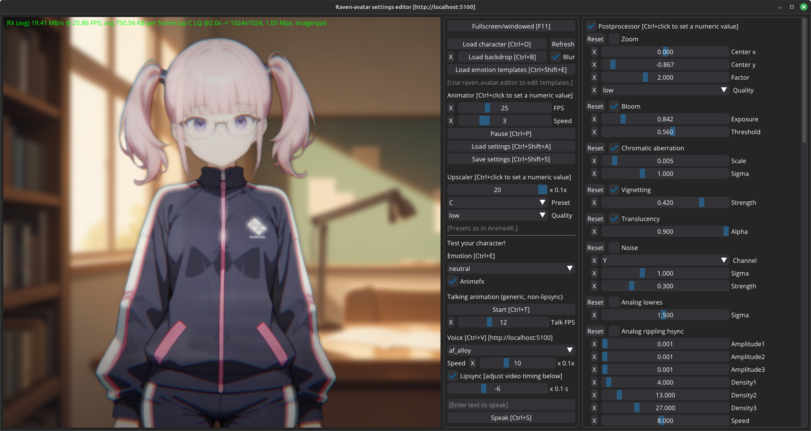

<p align="center">
 <br/>
<i>The upgraded avatar engine provides also <b>animefx</b> effects, such as these notice lines, which appear briefly when she becomes surprised.</i>
</p>

# Raven-avatar

The *Raven-avatar* component renders a live avatar for the AI, using AI animation technology.

Essentially, this uses **GPU** computing (CUDA) to convert a *single static image* of an **anime-style** character into an **animated talking head**. The server can apply realtime video postprocessing effects as well as upscale the video in realtime. The avatar can also lipsync to the speech output of the `tts` module provided by *Raven-server*, providing a more convincing talking head.

We optionally support also cel blending to modify the texture that goes into the poser model (e.g. for sweatdrops or blush), and additional anime-style cel effects, such as floating question marks or anger veins. The additional cels are currently supplied separately for each character.

The resulting video is streamed over HTTP, so it can be easily rendered anywhere. We provide Python bindings to integrate the avatar easily into Python apps, but a JavaScript client for web apps would also be possible (although not currently provided).

The server-side implementation uses PyTorch, including the fragment shaders in the video postprocessor. The AI animation technology is Talking Head Anime 3 (THA3) by @pkhungurn (Pramook Khungurn).


## GUI apps

As of August 2025, the GUI for `raven-llmclient` is under construction. It will support the live mode of `raven-avatar` right from the beginning. Automatic expression changes for the AI character will be powered by **classification** (provided by Raven-server), which determines the AI character's emotional state from a piece of text (or thought) most recently written by the AI.

But until we get there, we provide a postprocessor settings editor GUI app, `raven-avatar-settings-editor`, that you can use to test your characters. This also doubles as a tech demo of the avatar. Make sure that `raven-server` is running first before you start `raven-avatar-settings-editor`.

We also provide a separate pose editor GUI app, `raven-avatar-pose-editor`, which is standalone. With this, you can edit the emotion templates.

<p align="center">
 <br/>
<i>With Raven-avatar-settings-editor, you can configure the postprocessor in the GUI, as well as test new avatar characters.</i>
</p>

<p align="center">
 <br/>
<i>The emotion templates can be edited with Raven-avatar-pose-editor.</i>
</p>

## Why anime?

This visual style was chosen for three main reasons:

- Efficient use of development resources. Being abstracted farther from reality, anime style is not as susceptible to the uncanny valley effect as photorealism is. Hence acceptable quality can be reached with relatively small development resources, making the technology ideal for small teams.
- Historical reasons. The THA3 animator was previously used in the now-discontinued *SillyTavern-extras*, and I happened to have worked on it, so I could quickly port the code here.
- Aesthetics. It looks nice.


## Codebase structure

Where to find the relevant files:

- The server side implementation: `raven.server.modules.avatar`
- The server side web API endpoints: `raven.server.app` (**start here** when developing your own **JavaScript** apps)
- Python bindings for the web API: `raven.client.api` (**start here** when developing your own **Python** apps)
- The GUI apps: `raven.avatar.pose_editor.app`, `raven.avatar.settings_editor.app`
  - The pose editor is standalone, while the settings editor is a client app that needs *Raven-server* to be running.
- Assets: `raven.avatar.assets`

Assets include character images (512x512 PNG RGBA), backdrop images (any resolution and format), emotion templates (JSON), and animator settings (JSON).

Backdrops are applied at the client side in `raven.avatar.settings_editor.app`. If you want to do that in your own client, currently you'll have to implement something similar, i.e. render and optionally postprocess a background texture, then blit the video texture on top of it.


## Quick tips for character creation

AI animation quality depends on the input image. Sometimes the engine can be finicky about its input.

- Glasses, moustaches, and older characters may confuse the face parts detector.
  - Large hats or props are not supported.
  - For details, and many example outputs, refer to the [tech report](https://web.archive.org/web/20220606125507/https://pkhungurn.github.io/talking-head-anime-3/full.html) by the THA3 poser model's original author.
- For best results, there should be nothing between the upper edge of the eyes and the lower edge of the eyebrows. You may need to stylize your character accordingly.
- If the mouth refuses to animate, try copy/pasting a mouth from an existing character.
- If one eye animates properly but the other one does not, try copy/pasting and mirroring the working one.
- Use `raven/avatar/assets/characters/other/example.png` as an alignment template.
- When tweaking is necessary, separate the face parts into layers in your favorite image editing app, and move/edit the parts pixel by pixel until the result works.
- For live-testing, export your work-in-progress image, and load it in `raven.avatar.settings_editor.app`.
  - In the GUI, there is a Refresh button (Ctrl+R; or on Mac: ⌘+R) that reloads the current character from disk, so that you can test your edits quickly.
  - You can quickly cycle through the character's emotions by pressing Ctrl+E (Mac: ⌘+E) and then pressing the up/down arrow keys. The Home/End keys work too, to jump to the first or last emotion, respectively.
- To get an intuitive feel of how the AI animator interprets your image, load the image in `raven.avatar.pose_editor.app`, and play with the individual morph and pose sliders in the GUI.
  - Note that the cel sliders just blend in the additional cels you have supplied, and have nothing to do with the AI posing engine (except insofar the engine interacts with the changes in the image caused by the cels).
- If you provide additional cels (e.g. sweatdrops and blush), test your character with them in the pose editor. Play with the morphs and pose, too. Some edits to the input image may confuse the poser model.
- Finally, consider applying smoke and mirrors. The postprocessor (see `raven.avatar.settings_editor.app`) can add realtime video effects that help hide the remaining artifacts. Especially the bloom, chromatic aberration, vignetting, and scanlines filters are your friends here.


## Troubleshooting

### Low framerate

The THA3 poser is a deep-learning model. Each animation frame requires an inference pass. This requires lots of compute.

If you have a CUDA-capable GPU, enable GPU support in `raven.server.config`, by setting up the desired server modules to run on a CUDA device. Be sure to install the CUDA optional dependencies of Raven (see [main README](../../README.md)).

CPU mode is very slow, and without a redesign of the AI model (or distillation, like in the newer [THA4 paper](https://arxiv.org/abs/2311.17409)), there is not much that can be done. It is already running as fast as PyTorch can go, and the performance impact of everything except the posing engine is almost negligible.

### Low VRAM - what to do?

You can run just `avatar` on the GPU to get acceptable animation performance, while running other Raven-server modules on the CPU. E.g. the `classify` or `embeddings` modules do not require realtime performance, whereas `avatar` does.

### Missing THA3 model at startup

If you get an error message like:

```
FileNotFoundError: Model file /home/xxx/raven-downloadedgitrepo/raven/vendor/tha3/models/separable_float/eyebrow_decomposer.pt not found, please check the path.
```

the solution is to remove (or rename) your `raven/vendor/tha3/models/` directory, and restart `raven.server`. If the model directory does not exist, *raven-avatar* will download the models at the first run.

The model files are shared between the live animator and the standalone pose editor, so it doesn't matter whether that first run is `raven-server` or `raven-avatar-pose-editor`.

### Known missing features

The live animator is not compatible with popular VTuber software, such as Live2D. Rather, this is an independent exploration of somewhat similar functionality in the context of providing a live anime avatar for AI characters.


## Limitations

- AI animation quality is not perfect. The engine can make mistakes that cannot be corrected (short of retraining the neural networks).

- Input resolution of the THA3 engine is 512x512. This size is what the neural networks were trained on, so it cannot be changed.
  - Hence, very small details in the character will be lost. Plan accordingly.
  - The newer [THA4](https://arxiv.org/abs/2311.17409) engine has no publicly available implementation or weights (at least to my knowledge), and is also not fast enough for realtime.
  - You can use the upscaler to increase the output video resolution (in an anime style aware way), but obviously this will not regenerate missing details.

- AI animation is GPU compute hungry. At the default settings, the avatar barely runs at a bit under 25 FPS on an RTX 3070 Ti mobile laptop GPU.

- TTS lipsync may have timing inaccuracies due to limitations of the TTS engine, and the sometimes unpredictable latency of the audio system.
  - Our code does its best, but for cases when that is not enough, we provide a global delay setting for shifting the timing (both in the client API as well as in the `raven-avatar-settings-editor` GUI app).


## License

Those parts of *Raven-avatar* where I (@Technologicat / Juha Jeronen) am the only author are licensed under 2-clause BSD. This includes `raven.common.video.postprocessor` and `raven.avatar.settings_editor`.

Only `raven.server` and `raven.avatar.pose_editor`, which are separate apps, are licensed under AGPL, to comply with the original license of *SillyTavern-extras*.

The module `raven.common.video.upscaler` is licensed under MIT, matching the license of the Anime4K engine it uses.

The image `raven/avatar/assets/characters/example.png` is the example character from the AI animation engine THA3, copyright Pramook Khungurn, and is licensed for non-commercial use.

All other image assets are original to *Raven-avatar*, were made with GenAI, and are licensed under CC-BY-SA 4.0.


## Acknowledgements

*Raven-avatar* began as a fork of the Talkinghead module of the now-discontinued SillyTavern-extras.

It has been since extended; e.g. the TTS lipsync, cel blending, animefx, the realtime video upscaler, and the postprocessor settings GUI editor app are all new.
