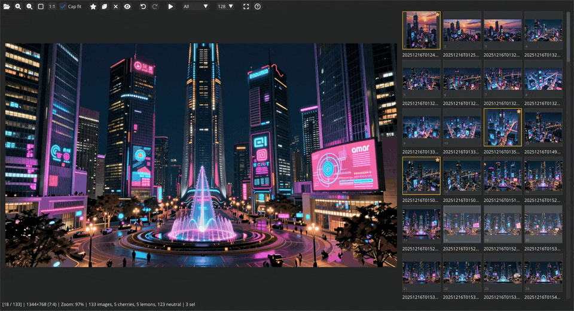
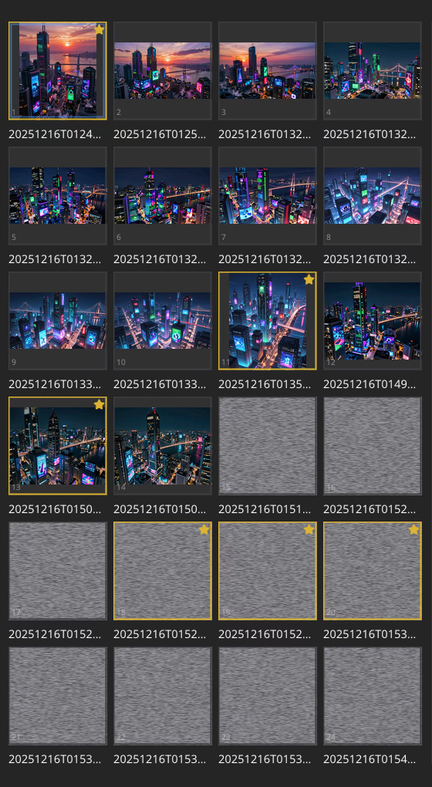
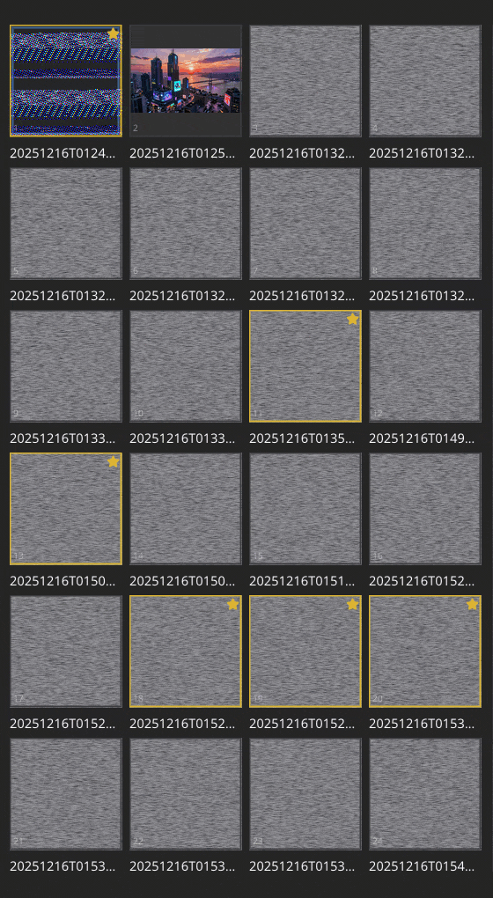

<p align="center">
 <br/>
</p>

-----

<p align="center">
 <br/>
<i>Raven-cherrypick sorts a folder of images into keepers and rejects, by hand and quickly.</i>
</p>

**Table of Contents**

- [Introduction](#introduction)
- [Marks move your files](#marks-move-your-files)
- [One listing, three folders](#one-listing-three-folders)
- [Telling near-identical images apart](#telling-near-identical-images-apart)
    - [Compare mode](#compare-mode)
- [Thumbnails](#thumbnails)
- [Keyboard reference](#keyboard-reference)
    - [While comparing](#while-comparing)
- [Command-line options](#command-line-options)
- [Configuration](#configuration)


# Introduction

*Raven-cherrypick* is a GUI for triaging a folder of images by hand, quickly. Nothing here decides anything
for you: you look, and you sort the images into **cherries** (keepers), **lemons** (rejects) and neutral.

It is built for two-handed operation — one hand navigates, the other marks — and for the case where the
images are nearly the same and the differences are small: which frame of a burst is sharpest, which
generated variant got the hands right, which photo of a conference slide is the one you can actually read.

```bash
raven-cherrypick some/path/to/images/
```

With no path it opens the current directory. **Ctrl+O** opens another folder, in a browser that shows you
the pictures as you walk through it.


# Marks move your files

This is the thing worth knowing before you start. **A mark is not a label held in the app**: a cherry is
*moved* into a `cherries/` folder beneath the one you opened, and a lemon into `lemons/`. Clearing a mark
moves the file back out.

So a triaged folder is sorted on disk by the time you close the app — there is no export step, nothing to
save, and no state that can be lost by closing the window. **Ctrl+Z** undoes a triage move by moving the
file back, and navigates to it so you can see what it did.

There is no thumbnail cache and no metadata file anywhere. The state *is* the directory an image sits in,
which also means anything else you point at those folders — a file manager, a script, a backup — sees the
same answer.


# One listing, three folders

The grid shows `cherries/` and `lemons/` merged with the folder itself, as a single sorted listing. **A
marked image keeps its place in the order rather than vanishing**, which is what makes it safe to mark as
you go: the next image is where you expected it to be, and you can change your mind about the last one
without hunting for it.

- **G** cycles a filter over that listing — *All*, *Cherries*, *Lemons*, *Neutral* — and **Shift+G** cycles
  backward. There is a dropdown for the same thing above the grid.
- **B**, **N** and **M** jump to the next lemon, cherry or neutral image, and with **Shift** to the previous
  one. They work in the unfiltered view, which is where there is something to jump past, and they wrap
  around at the ends.


# Telling near-identical images apart

**Zoom and pan are kept when you move between images of the same dimensions.** So zoom into one corner, then
flick back and forth with the arrow keys: the view stays put and only the picture under it changes. That is
the quickest way to compare a detail across a burst of shots — and it is why the app exists, more than the
sorting is.

For more than two images, compare mode does the flicking for you.

## Compare mode

**Select two or more images and press Enter.** Up to nine are taken, numbered 1 to 9 in the order they
appear in the grid. Compare mode then cycles them *in place*, so the same pixels are shown one after
another in the same spot on screen: differences that are invisible side by side are obvious when they blink.

- **Shift**+a digit picks that image and leaves the mode, which is the point of it. (Bare **1** is
  zoom-to-1:1, here as everywhere else in Raven.)
- **Esc** leaves, restoring whichever image was showing before you started.
- **Space** pauses and resumes, **,** and **.** slow it down and speed it up, and **M** goes back to the
  default speed.
- **Ctrl+Shift+C** afterwards crowns the image you picked: it becomes a cherry and the rest of the compared
  set become lemons, as one undoable action.

<p align="center">
 <br/>
<i>Three images in compare mode, the badge in the corner saying which is showing. <b>Shift+2</b> picks the second, and <b>Ctrl+Shift+C</b> crowns it: a cherry, and the other two lemons.</i>
</p>

Compare mode is an overlay: your triage marks, the selection and the filter are untouched by entering or
leaving it. The triage controls are deliberately unavailable while it runs, since they would act on an image
the cycle chose rather than on one you did.


# Thumbnails

Made as they are needed and kept in memory, never on disk. **A tile shows noise until its thumbnail has been
built** — that is what the noise is, not a damaged image.

<p align="center">

 <br/>
<i>Left: a folder just opened, its thumbnails half built. Right: the same, as it happens.</i>
</p>

Scaling is GPU-accelerated and mipmapped, so a tile is a properly downsampled picture rather than a
point-sampled one, at any size. **Ctrl+1** to **Ctrl+5** set the tile size (32, 64, 128, 256 or 512 pixels).

*Optional*: install `libturbojpeg` (Debian/Ubuntu: `sudo apt install libturbojpeg`) for faster JPEG
decoding. Without it, Raven falls back to PIL, which works and is slower.


# Keyboard reference

The same table is on the app's own **F1** card, which is the copy to trust if these ever disagree.

**Triage**

| Key | Action | |
|---|---|---|
| `Ctrl+O` | Open a folder | |
| `C` | Mark as cherry | |
| `Ctrl+C` | ...all selected | |
| `Ctrl+Shift+C` | ...winner | others → lemon |
| `X` | Mark as lemon | |
| `Ctrl+X` | ...all selected | |
| `V` | Clear the mark | |
| `Ctrl+V` | ...all selected | |
| `T` | Toggle the mark | on the main image |
| `Ctrl+Z` | Undo a triage move | navigates to it |
| `Ctrl+Shift+Z` | Redo a triage move | |

**Jumping and filtering**

| Key | Action | |
|---|---|---|
| `B` / `Shift+B` | Next / prev lemon | all view only; wraps |
| `N` / `Shift+N` | Next / prev cherry | all view only; wraps |
| `M` / `Shift+M` | Next / prev neutral | all view only; wraps |
| `G` | Cycle the filter forward | |
| `Shift+G` | Cycle the filter backward | |

**Navigation and selection**

| Key | Action | |
|---|---|---|
| `Left` / `Right` (`A` / `D`) | Prev / next image | navigate only |
| `Up` / `Down` (`W` / `S`) | Prev / next row | navigate only |
| `Home` / `End` | First / last image | |
| `Page Up` / `Page Down` (`Q` / `E`) | Scroll by page | |
| `Click` | Navigate and select | |
| `Ctrl+Click` | Toggle in the selection | |
| `Shift+Click` | Select a range | |
| `Space` | Toggle this image in the selection | |
| `Ctrl+A` | Select all | |
| `Ctrl+D` | Deselect all | |
| `Ctrl+I` | Invert the selection | |
| `Enter` | Compare selected | needs 2+ selected |

**Zoom, pan and the app**

| Key | Action | |
|---|---|---|
| `+` / `Numpad +` | Zoom in | |
| `-` / `Numpad -` | Zoom out | |
| `Mouse wheel` | Zoom at the cursor | |
| `F` | Zoom to fit | |
| `Shift+F` | Toggle the fit cap | no upscale |
| `1` / `Numpad 1` | Zoom to 1:1 | also while comparing |
| `Mouse drag` | Pan the image | |
| `Tab` | Focus the image pane | |
| `Arrows` / `WASD` | Pan from the keyboard | while focused |
| `Esc` | Leave the image pane | |
| `Ctrl+1..5` | Set the tile size | |
| `F1` | Open this help card | |
| `F11` | Toggle fullscreen | |

## While comparing

| Key | Action | |
|---|---|---|
| `Shift+1–9` | Pick that one and exit | |
| `Esc` | Exit, restoring the image | |
| `Space` | Pause / resume | |
| `,` / `.` | Slower / faster | |
| `M` | Back to the default speed | |
| `1` / `Numpad 1` | Zoom to 1:1 | |


# Command-line options

```bash
raven-cherrypick [folder] [--tile-size N] [--width N] [--height N] [--device DEV] [--debug]
```

- **`folder`** is the directory to open; the current directory if you name none.
- **`--tile-size N`** sets the initial thumbnail size, **`--width`** and **`--height`** the window size.
  All three default to [`raven.cherrypick.config`](config.py).
- **`--device DEV`** overrides the Torch device used for scaling — `cuda:1`, `cpu`. Raven picks one by
  itself otherwise.
- **`--debug`** shows debug overlays: pan and zoom coordinates, click positions. **It is not a logging
  flag** — that is `--log-level`.

`--log`, `--log-level`, `--repl`, `--version` and `--help` work as they do across the constellation; see
[*Options every app takes*](../../README.md#options-every-app-takes) in the main README.


# Configuration

[`raven.cherrypick.config`](config.py), a Python module that exists to be edited — or, better, overridden
from `~/.config/raven/overrides.json`, which keeps your settings out of the repository. See
[*Settings that belong to your machine, not to Raven*](../../README.md#settings-that-belong-to-your-machine-not-to-raven).

Worth knowing about:

- `DEFAULT_TILE_SIZE` and `TILE_SIZES` — the thumbnail size at startup, and the five that `Ctrl+1..5` select.
- `SMOOTH_SCROLLING`, `SMOOTH_SCROLLING_STEP_PARAMETER` and `SCROLL_ENDS_HERE_DURATION` — the grid's glide,
  and the arrow that flashes when you arrive at an end. Set the first to `False` for instant jumps.
