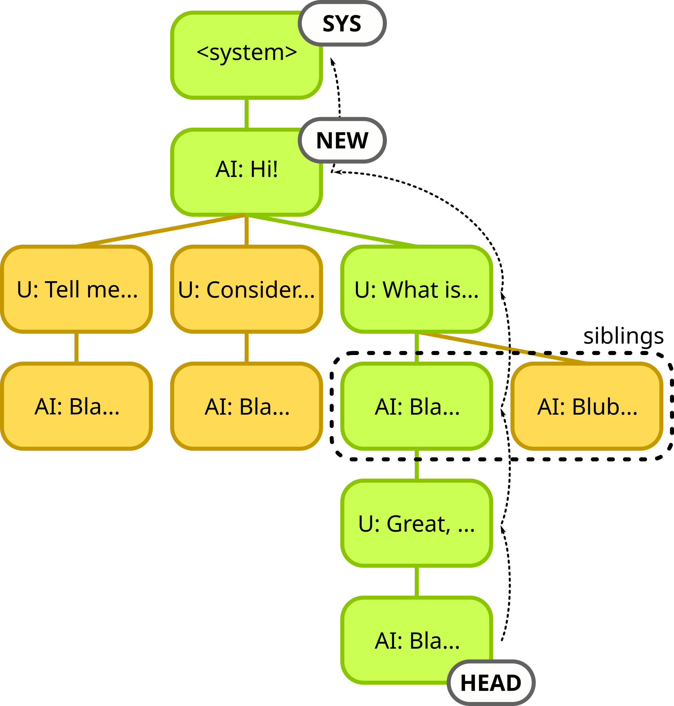
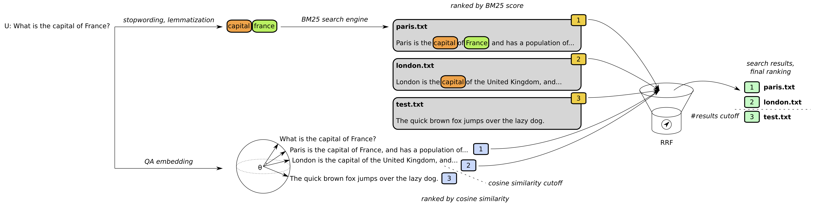
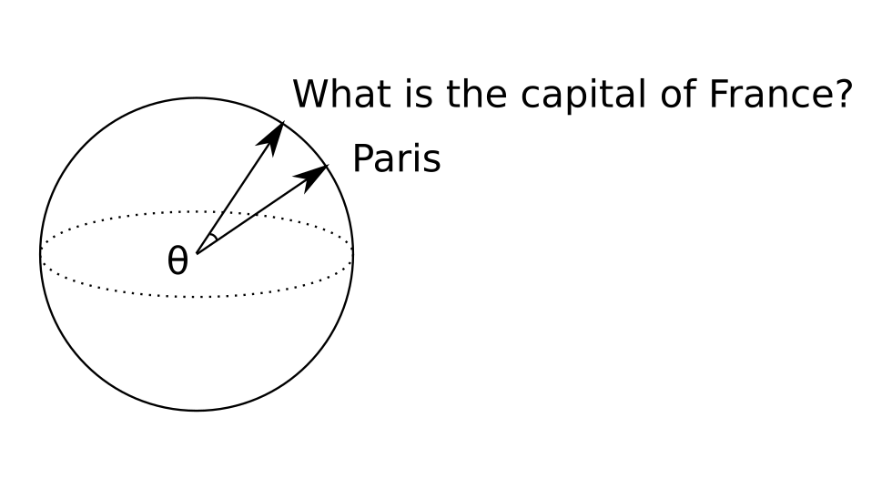
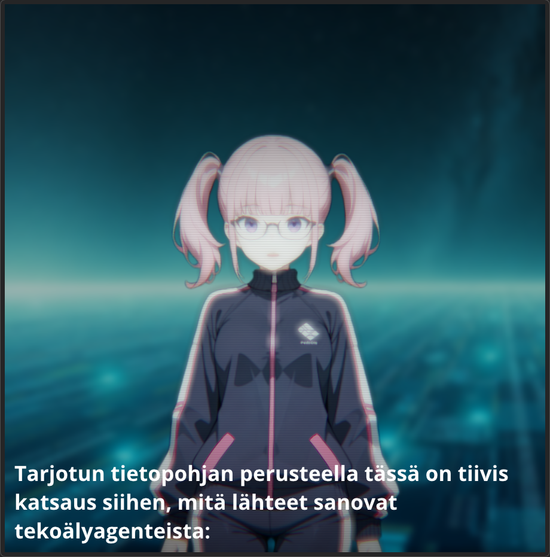

  

-----

  
<i>Raven-librarian is a multiversal LLM frontend with a local-first focus and a talking AI avatar.</i>

<!-- markdown-toc start - Don't edit this section. Run M-x markdown-toc-refresh-toc -->
**Table of Contents**

- [Introduction](#introduction)
- [Features](#features)
    - [Multiversal history](#multiversal-history)
        - [Why?](#why)
        - [Notes](#notes)
    - [Document database](#document-database)
    - [Tools](#tools)
        - [Security warning](#security-warning)
        - [Notes](#notes-1)
- [AI avatar and voice mode](#ai-avatar-and-voice-mode)
    - [100% privacy-first](#100-privacy-first)
    - [Notes](#notes-2)
- [GUI walkthrough](#gui-walkthrough)
    - [Global actions](#global-actions)
    - [Chat message actions](#chat-message-actions)
    - [Mode toggles](#mode-toggles)
- [Configuration](#configuration)
    - [Server connections](#server-connections)
    - [Voice mode](#voice-mode)
    - [System prompt, AI character personality, communication style](#system-prompt-ai-character-personality-communication-style)
    - [AI avatar](#ai-avatar)
- [Future vision](#future-vision)
- [Appendix: Brief notes on how to set up a local LLM](#appendix-brief-notes-on-how-to-set-up-a-local-llm)

<!-- markdown-toc end -->

# Introduction

:exclamation: *This document is a very early WIP, with many placeholders.* :exclamation:

**Raven-librarian** is a multiversal LLM (large language model) frontend, mainly meant for working with local AI.

- **Graphical user interface** (GUI). Easy to use.
- **Fully local** (when used with a local LLM).
- **Multiversal**. The chat history is natively a branching tree structure, respecting the natural shape of conversation between a user and an LLM.
- **Animated AI avatar** with emotional reactions based on LLM text output, lipsynced speech (English), and optional machine-translated subtitles (in a language of your choice).
- **Voice mode**. Talk with the AI using your mic. (English only for now.)
- **Document database** for fact grounding. Talk with the AI about the content of your documents. Powered by a local hybrid semantic and keyword search engine for optimal results.
- **Tool use** (tool-calling) for more fact grounding. The AI has access to tools provided by the *Librarian* software. (Websearch only for now; we plan to extend this later.)
- **Open source**. 2-clause BSD license.

**:exclamation: *Raven-librarian* is currently under development. :exclamation:**

Much (but not all) of the basic functionality is complete, the codebase should be in a semi-maintainable state, and most bugs have been squashed. If you find a bug that is not listed in [TODO.md](../../TODO.md), please [open an issue](https://github.com/Technologicat/raven/issues).

That said, some important features are still missing, and others will be expanded upon, schedule and funding permitting.

# Features

The main features are a multiversal chat history for natural, branching AI conversations; document database and tool use features for fact grounding, especially from locally stored documents; and a real-time animated, talking, lipsynced AI avatar with a voice input mode, for a futuristic touch on the user interface.

## Multiversal history

*Raven-librarian* stores its chat database in a tree format. All chats are part of the same tree. The system prompt forms the root node. The AI's initial greeting, which forms the start point of a new chat, is immediately below the system prompt. The conversations then branch out from there.

Importantly, *there is no linear history*. The concept of "a chat" (as in "recent chats" or "chat files") is not even defined. A *linearized* history is built dynamically whenever needed, by following the parent link chain up the tree, starting from the tip of the current branch.

See the figure for a schematic illustration.

  
<i>Raven-librarian stores chats in a tree format. Here <b>SYS</b> is the system prompt node, <b>NEW</b> is the start node for a new chat, and <b>HEAD</b> is the tip of the current branch. Linearized history (highlighted in green for the <b>HEAD</b> shown) is built dynamically, by following the parent link chain up the tree. Any AI response can be rerolled, creating a new sibling node.</i>

With this storage scheme, a chat branch is just its **HEAD** pointer; roughly, like in `git`. This makes some actions cheap. For example, starting a new chat only resets the **HEAD** pointer to the AI's greeting (labeled **NEW** in the figure).

The nodes are versioned, for an upcoming editing feature for fixing typos and making similar small edits that don't change the flow of the chat (i.e. meant for use in cases where any messages downstream of the edit still make sense as-is). By design, each version is immutable - like the revisions of a GitHub issue comment.

Normally, when you write and send a new message to the AI, it is added below the **HEAD**, and it then becomes the new **HEAD**. The AI then replies. The AI's reply is added below your message, and becomes the new **HEAD**.

It is possible to **reroll** the AI's reply. This replaces the AI's message with a freshly generated one. The old reply is kept in the tree, but not shown to the AI when it writes the new one. It is stored as a sibling node, and it retains any links to nodes that were downstream of it (i.e. the whole subtree is preserved). The new reply becomes the **HEAD**. Rerolling is convenient for quickly generating alternative replies to the same question.

More generally, for changing the direction of the conversation, the chat supports **branching**. You can branch at any node. Branching the chat only sets the **HEAD** pointer to the node where you branch at; it is then up to you as to how to continue the conversation from there.

It is possible to permanently forget a subtree by **deleting** it. This will also delete all messages downstream of the deleted node, and cannot be undone.

The chat tree is stored (by default) in `~/.config/raven/llmclient/data.json`.

The **SYS** node is updated each time *Librarian* starts, using the currently configured system prompt from [`raven.librarian.config`](../librarian/config.py). The node is updated in-place, via the node versioning mechanism: a new revision of the content is created, and the old one is deleted.

When *Librarian* starts, it sets the **NEW** pointer to the appropriate node. First, the **SYS** node's existing child nodes are scanned for a match, by comparing the text content to the currently configured AI greeting from [`raven.librarian.config`](../librarian/config.py). If a match is found, that node is set as the **NEW** node for the session; otherwise, a new node is created with the new greeting text, and that node is set as the **NEW** node for the session.

Note that *Librarian* only supports one-on-one chats (one user, one AI), but the AI character as well as the user's persona name can be changed between sessions (when *Librarian* is not running).

**AI greeting nodes are character-specific.** Different AI characters using the exact same wording for the greeting message will nevertheless cause independent greeting nodes to be created. This both follows from the OpenAI compatible storage format for the message content (which includes the character name at the beginning of each message, like *"Aria: How can I help you today?"*), but is also the Right Thing, as it makes chats started with different AI characters independent of each other.

### Why?

In short, a tree is a better conceptual fit for working with LLMs than a set of linear chats of a traditional (human-to-human) chat app.

An LLM is essentially a stochastic model conditioned on the prefix: the text so far. Used autoregressively, it is a discrete time evolution operator, roughly in the same sense as the (continuous) time evolution operator in quantum mechanics. The LLM sampler collapses the probability distribution for the next token, reifying one possible textual future one token at a time. Thus the sampler plays the role of the observer in the Copenhagen interpretation of QM. (Paraphrased from [Janus, 2021](https://generative.ink/posts/language-models-are-multiverse-generators/).)

From this analogy, the obvious way to think of LLM chat histories is not a linear timeline, but a branching multiverse.

From a practical perspective, keep in mind that an LLM only "remembers" in two ways:

- Static knowledge stored in weights, from training, and
- The text in the context.

Insofar as the LLM's thread of thought can be said to be "at" a place in the model's latent space at any given point of time (more specifically, at a given *token*), that place - and thus also the likely destinations to which the conversation leads - is fully determined by the context.

That context can be rewound, extended, **engineered**.

Retrieval-augmented generation (RAG; [Lewis et al., 2020](https://arxiv.org/abs/2005.11401); see also survey by [Gao et al., 2023](https://arxiv.org/abs/2312.10997)) was an early form of context engineering: injecting search results to the context provides explicit facts to ground the generation on. This technique remains useful and popular.

Sometimes context engineering is performed manually, for example to curate the perfect LLM reply to base further discussion on. Rerolling and *synthesis* (manual editing to combine several LLM replies) help here.

Rerolling and chat branching are forms of rewinding.

Rerolling also comes in useful for **epistemic analysis**. When the AI's reply is rerolled:

- If the LLM states the same thing over and over, it believes in what it said (regardless of whether what it said is actually true or not).
- If the LLM gives a wildly different response each time, then it didn't actually know, didn't notice that it didn't know, and confabulated (a.k.a. "*hallucinated*") something random.

Context extension can be, for example, a *prefill* - writing the start of the AI's response manually, and then letting the LLM take over.

Conversely, the LLM can be made to write on behalf of the user (this is known as *user persona sampling*), to see what the model thinks the user is likely to say next.

Tools (as in *tool use*) also extend the context by writing responses there.

Finally, sometimes it is interesting or useful to **visit alternative branches**, or in sci-fi terminology, alternative timelines in the multiverse of discourse. This allows a discussion to become a [garden of forking paths](https://en.wikipedia.org/wiki/The_Garden_of_Forking_Paths), facilitating a more complex and complete exploration of a topic than one linear chat.

All such curation, analysis and exploration is facilitated by the natural abstraction that fits best here - a tree structure - and a GUI to navigate it.

### Notes

As someone on the internet pointed out, the term *hallucination* is misleading, since in humans, it refers to **inputs** that are not grounded in external reality - or as WordNet puts it, "*a sensory perception of something that does not exist*". However, the common usage of *LLM hallucination* refers to ungrounded **outputs**. A better semantic match here is "*a fabricated memory believed to be true*", hence a *confabulation*.

As of 12/2025, many LLM frontends still operate in the paradigm of a traditional linear chat history. Many support some form of branching, but no AI chat app seems to have taken the idea to its logical conclusion yet. *SillyTavern* offers swipes and arbitrary branching, but uses a linear storage format ([*Timelines*](https://github.com/SillyTavern/SillyTavern-Timelines) is a hack on top of that). Loom ([original](https://github.com/socketteer/loom); [obsidian](https://github.com/cosmicoptima/loom)) is probably still the only natively nonlinear LLM GUI (predating *Raven-librarian*); and it is focused on text completion via base models, not chat.

## Document database

The document database gives the LLM fact grounding via retrieval-augmented generation (RAG). Currently (v0.2.4), the RAG mechanism engineers the context via an automatic search, with the user's latest message as the search query. The search results are injected into the LLM's context before the AI replies.

The number of search results to return can be configured in [`raven.librarian.config`](../librarian/config.py). This allows trading off speed vs. [recall](https://en.wikipedia.org/wiki/Precision_and_recall). Note that a higher number of search results will also take up more space in the LLM's context.

In the search index, the documents are **chunked**. The chunk (not a full document!) is the basic unit of search. To avoid context loss at the chunk seams, *Librarian* uses a sliding window chunker with overlap, thus trading off storage space and retrieval speed for improved recall. If the search results include adjacent chunks from the same document, these are automatically merged into one contiguous search result, with smart removal of the overlap. The merged result is scored with the highest score of any of its component chunks.

The search engine is local, and uses a hybrid algorithm with both semantic embeddings as well as BM25 keyword search. The semantic embedder used by the search engine (by default) is a QA-type model, which has been trained to map questions and their answers near each other in the high-dimensional vector space. For the keyword search, the query is lowercased, [lemmatized](https://en.wikipedia.org/wiki/Lemmatization) (using [spaCy](https://spacy.io/)), and [stopworded](https://en.wikipedia.org/wiki/Stop_word). The results of the two searches are combined via [reciprocal rank fusion (RRF)](https://www.assembled.com/blog/better-rag-results-with-reciprocal-rank-fusion-and-hybrid-search), to yield better results than either algorithm gives alone. See the figures.

  
<i>Overview of Raven's search engine.</i>

  
<i>A QA-type semantic embedding model maps questions and their answers near each other in the high-dimensional space (which usually has roughly 1000 dimensions). Schematic illustration in 3 dimensions.</i>

As of v0.2.4, the document database accepts only **plain text** documents - **no** binaries (so no PDF). Beside classical plain text `.txt`, markup languages that LLMs understand are fine - e.g. `.md`, `.bib`, and `.tex` are acceptable inputs. The full list of recognized file extensions is maintained in the search engine implementation [`raven.librarian.hybridir`](../librarian/hybridir.py), specifically in `HybridIRFileSystemEventHandler`.

Until we get PDF import, you can use `pdftotext` (from `poppler-utils`) and [`ocrmypdf`](https://github.com/ocrmypdf/OCRmyPDF) to extract the plain text from your PDFs. We will likely automate this step later.

**To manage the content of the document database**, use a file manager: just put your document files in the document database directory. By default, *Librarian* looks for documents in `~/.config/raven/llmclient/documents`. The path can be configured in [`raven.librarian.config`](../librarian/config.py).

The document database directory can have subdirectories - so feel free to create them to organize your document collection. This is useful for splitting the DB into broad umbrella topics (AI research, engineering sciences, ...). As of v0.2.4, all documents still live in the same search namespace. We plan to add scoping support later, to allow limiting the search to a given topic.

The search index syncs automatically:

- When *Librarian* is started, the document database directory is scanned for changes made after the last time *Librarian* saw it. If necessary, the index is updated automatically.
  - New documents are indexed.
  - Updated documents are re-indexed. Updates are detected from each document file's mtime (*last-modified* time).
  - Deleted documents are removed from the index.

- While *Librarian* is running, the directory is monitored for changes. Any changes take effect immediately.
  - The same rules apply as for the startup scan: new, updated and deleted documents are detected, and processed accordingly.

- As of v0.2.4, the search index update progress can be viewed in the terminal window from which *Librarian* was started.
  - The update may take some time if there are many (hundreds) of documents.
  - The semantic embedding uses the `embeddings` module of *Raven-server*, so it can benefit from GPU acceleration.

If the search index ever becomes corrupted - or if you need to force a full rebuild for any reason - you can simply delete the search index directory while *Librarian* is not running. A full search index rebuild will then automatically take place when *Librarian* is started. By default, the index is stored in `~/.config/raven/llmclient/rag_index`.

**Tip**: If you have a BibTeX file full of scientific abstracts, and would like to feed those into *Librarian* as separate documents, see the `raven-burstbib` command-line tool. It splits your huge `.bib` file into individual entry `.bib` files. These files can then be copied/moved into *Librarian*'s document database folder, and *Librarian* will then pick them up as individual documents. Better forms of integration with *Visualizer* datasets are planned to be added later.

## Tools

*Tool use* (a.k.a. *tool-calling* or *function-calling*) is a feature of many LLMs published since early 2025. The idea is to give the LLM partial control over engineering its own context. When the LLM notices that in order to respond to the user's request, it needs to use an external tool, the LLM can tell its surrounding scaffold app (such as *Librarian*) to invoke that tool. A tool can be anything that produces text, for example: websearch, calculators, weather services, database access, file access, shell access, or a programming environment. As the last few examples suggest, tools may also trigger actions in the external world, just like any computer software. For example, a tool call could cause a document to be sent to a printer, or a meeting to be scheduled for the user. Effectively, tool use allows the LLM to control a (predefined set of services on a) computer.

Modern approaches to tool use include [MCP](https://modelcontextprotocol.io/docs/getting-started/intro), which allows dynamic tool discovery on external servers; and LLM skills, [pioneered by Anthropic's Claude](https://simonwillison.net/2025/Oct/16/claude-skills/). The latter requires giving the AI access to a full, sandboxed virtual machine, with a software development environment (such as a Python interpreter).

When tool use technology is integrated into a chatbot, this yields a lightweight form of AI agent functionality. The system remains primarily a chatbot, but it can use tools to gather information from external data sources.

  
<i>An LLM-based AI agent <a href="https://simonwillison.net/2025/Sep/18/agents/">runs tools in a loop</a>. (Images created with Qwen-Image.)</i>

How tool use works:

- As part of the system prompt, the LLM receives specifications about available tools, in JSON format.
  - Each tool specification includes the function name, a short human-readable (*LLM-readable!*) docstring of what it does, and a parameter specification (with docstrings), if the function takes arguments (as well as which arguments are required and which are optional).
  - While the tool specifications are provided by the scaffold app, they are typically injected into the system prompt by the LLM backend software (such as [oobabooga/text-generation-webui](https://github.com/oobabooga/text-generation-webui)), so they are not visible in the user-provided system prompt.
- When the LLM thinks it needs to use tools, it requests one or more tool calls by writing a specially formatted chat message.
  - For each tool call, the LLM writes which function to call as well as the parameters (if any) in JSON notation. Modern LLMs have been trained to do this.
  - These tool call requests are detected in, and parsed from, the LLM output by the LLM backend software.
- The parsed tool call request is handed over to the scaffold app.
- The scaffold app performs the actual tool call, and writes a machine-formatted message in JSON notation, containing the tool output (or error message, if any).
- Control then returns to the LLM, so that it can interpret the results returned by the tool, as well as continue writing.
- The LLM may make another round of tool calls if it deems necessary to do so, and the process repeats.
- Once the LLM is satisfied with the information it has, it proceeds to write its reply without making more tool calls.
- Control returns to the user.

### Security warning

To keep tool use safe, there are [certain important considerations](https://simonwillison.net/2025/Jun/16/the-lethal-trifecta/). In short, giving an LLM access to all three of:

1. Private data (your local, non-public documents),
2. Access to untrusted sources of text (e.g. downloading arbitrary webpages), and
3. Ability to communicate with the external world (e.g. sending arbitrary HTTP requests)

is generally a very bad idea.

**As of H2/2025, the level of LLM information security is next to nonexistent.**

PDFs or webpages can be poisoned by an adversary to make an LLM do what the adversary wants when the LLM reads that document or webpage.

The classic invisible white print is a well-known technique, e.g. to make automated LLM reviewers give glowing reviews to a "scientific paper" that is actually AI slop.

One more advanced and harder-to-casually-detect approach is [Unicode poisoning](https://embracethered.com/blog/posts/2025/google-jules-invisible-prompt-injection/); see [ASCII Smuggler](https://embracethered.com/blog/ascii-smuggler.html).

Be aware that private data can be leaked simply via sending an HTTP GET request, because the attacker can just place all your private information in the URL as a query string (e.g. in a base64-encoded form for obfuscation).

These techniques are well known, and even trivial, so spelling them out here is not an infohazard. Real attackers probably have access to many more advanced ones.

### Notes

Currently, *Librarian* only provides a set of hardcoded tools, and does **not** support MCP or skills.

As of v0.2.4, *Librarian* only provides websearch, but we intend to expand this later.

If interested in the details, see `tools` in the `setup` function in [`raven.librarian.llmclient`](../librarian/llmclient.py), the related mechanisms in the `invoke` function in the same module, and the agent loop in [`raven.librarian.scaffold`](scaffold.py).

# AI avatar and voice mode

*Librarian* features an anime-style, **animated, lipsynced, talking AI avatar**, with optional machine-translated **subtitles**, or alternatively, optional **closed-captioning** without translation.

We also provide **speech recognition**, so that at your option, you can use your mic to talk with the AI.

The avatar's expression is updated every few seconds while the LLM is writing. *Librarian* uses a sentiment analysis AI model to detect the most likely emotion from recent text streamed by the LLM, and then sends the resulting emotion label to the avatar subsystem for animation. The avatar's emotion updates while the LLM is thinking as well as while it is writing the final response. This is the same approach as used by SillyTavern for character expressions.

When the **Speech** toggle in the *Librarian* window (below the avatar video panel) is **ON**, the avatar will speak the LLM's response once the message is complete. Only the part the LLM "writes out loud" is spoken; thought blocks are skipped by the speech subsystem. For the whole duration of the speech, the avatar's expression will be the last one from the LLM text analysis.

When both the **Speech** and the **Subtitles** toggles are **ON**, the speech is machine-translated and subtitled one sentence at a time. The subtitle for each sentence is shown while that sentence is being spoken.

For configuring the AI's voice and the subtitles, see [Configuration](#configuration).

The avatar has an optional, configurable timeout, after which the avatar video will turn off if there is no activity (to save GPU and CPU compute resources, as well as to eliminate unnecessary fan noise when running on a laptop). The avatar wakes up immediately when there is activity (e.g. navigating the chat tree, rerolling a message, sending a new message to the AI, or asking the avatar to speak a previous message again).

Currently (v0.2.4), the avatar cannot be completely disabled. *Librarian* expects the `avatar` module of *Raven-server* to be running, and will always display the avatar. We recognize this option would be useful for low-VRAM environments, and intend to add it later, once we have something else to show in the right-side panel (e.g. a list of recent chats, or the chat tree).

  
<i>Screenshot from the live view of the avatar in Librarian, with an auto-blurred backdrop image, realtime video postprocessing, and machine-translated subtitles, here shown in Finnish. The video postprocessing here uses its default configuration, with bloom, chromatic aberration, vignetting, translucency, banding, and scanlines enabled. Some of the effects are rather subtle, and are more easily visible when actually live.</i>

**Voice mode**: If you want to speak to the AI via your mic, click the **mic button** (next to the text entry field at the bottom). The mic icon starts glowing red, and the mini VU meter becomes live, indicating that *Librarian* is listening.

Once you are done talking, click again, or wait until the automatic silence detector ends the recording. The mic icon returns to its original color, and the mini VU meter shuts off, indicating that audio is no longer being recorded.

The audio is transcribed into text and sent to the LLM, just as if you had typed the message in. This is convenient for quick questions and chatting.

Voice input is currently very rudimentary; for example, voice message editing is missing, and the silence detector is hardcoded to 1.5 seconds at a signal level of -40 dBFS or below (shown as a gray line on the mini VU meter). We intend to expand this later.

## 100% privacy-first

Also the voice mode is 100% privacy-first:

- Audio is only recorded when you permit, by clicking the mic button.
- The audio recording is only used for locally hosted STT (speech recognition), then discarded.
  - The speech recognizer is hosted by the `stt` module of your local *Raven-server*.
- The audio recording is never saved to disk.
- The text transcript of the audio is shown, for your own information, in the *Librarian* client log.
  - This is the same text that goes into *Librarian*'s chat view - and like any chat message, is saved in the chat datastore.
  - The log is only shown in the terminal window that started `raven-librarian`, and not saved.
- If you want to verify these claims, see [`raven.server.modules.stt`](../server/modules/stt.py), the function `api_stt_transcribe` in [`raven.server.app`](../server/app.py), and `stt_*` functions in [`raven.client.api`](../client/api.py) (and their use sites).

## Notes

Sentence boundary detection for TTS (text to speech) and subtitling is done with a neural NLP model from [spaCy](https://spacy.io/).

Sentence-based translation misses broader context, and some of the time, results in translations that are silly and/or wrong. Being able to feed in only one sentence at a time is a technical limitation of many currently (12/2025) available machine translation models, particularly ones for English to Finnish. My own informal tests indicate that longer inputs sometimes work correctly, but sometimes the model just silently discards parts of the input. Feeding the model the way it was designed (one sentence at a time) avoids this issue.

The emotion not updating while the avatar is speaking is a compromise to make both text-only and speech modes work acceptably. This could be improved. Furthermore, *Librarian* is tested in and is designed for environments where the LLM generates **at least 30 tokens/s, and preferably upwards of 100 tokens/s**, so that wait times are never long, even with a thinking model. If the LLM is slower, some elements of the UX (such as this one) may need rethinking.

The TTS is [Kokoro-82M](https://github.com/hexgrad/kokoro), which can optionally use GPU acceleration. However, the speed of the TTS compute only matters for the first sentence of the AI message, because *Librarian* runs speech synthesis in the background, one sentence at a time. Even a modern CPU runs Kokoro slightly faster than realtime, so while previous sentences are still being spoken, the rest of the audio has enough time to render into RAM in the background. The only difference between GPU and CPU modes for the TTS is that in CPU mode, the first sentence of a new AI message will take a few seconds before speaking starts - while the CPU TTS is faster than realtime, it's not *that much* faster. The GPU mode eliminates this delay at the cost of a few hundred MB of VRAM.

The TTS-generated speech audio for recently spoken AI messages is cached in RAM, so that speaking the same message again just re-uses the existing audio. As of v0.2.4, the cache keeps the 128 most recent sentences; see `tts_prepare` in [`raven.client.tts`](../client/tts.py).

Beside being an avatar *for* an AI (the LLM), the character is animated *by* an AI, from a single static input image, and the default characters were also drawn *with* an AI. Specifically, the animator is built on top of the AI poser model THA3 (Talking Head Anime 3), which can change the character's expression as well as animate some joints by up to 15 degrees. The figure shows the input image for the default character, Aria:

  
<i>The THA3 anime-style AI poser model uses a single static image as its input.</i>

Raven's animator engine is more than just a wrapper for THA3, though. THA3 was originally designed for [VTubing](https://en.wikipedia.org/wiki/VTuber), where the realtime pose and expression parameter data is typically live-captured and AI-tracked from a video feed of a human user. Thus, to make this technology compatible with a fully virtual AI character, a custom controller was needed for generating the realtime pose and expression parameter data from scratch. *SillyTavern-extras* used to have a rudimentary form of this, with emotion templates that correspond to the output labels of the emotion classifier. Raven still uses this base design, but it has been expanded upon (e.g. with a randomized sway animation that makes the character look less robotic).

Beside the custom controller engine, *Raven-avatar*'s updated version of the animator optionally supports extra cels (RGBA images with a transparent background), which enliven some expressions by alpha-blending the cels onto the avatar texture. Some examples of this are blush, the "intense emotion" anime eye-wavering effect, and a "data eyes" effect that *Librarian* activates while the AI is accessing the document database or calling tools.

The animator also supports anime-style hovering emotional reaction effects (*animefx*) - such as the huge sweatdrops classically used in the comedy genre - that are alpha-blended *around* the character, on top of the posed image. These are briefly auto-activated when the avatar enters a specific emotion. The *animefx* triggers and animations can be set in the animator configuration.

Furthermore, we provide a realtime video postprocessor implemented in Torch, which hopefully adds enough smoke and mirrors to ~hide the AI animation artifacts~ turn the resulting video feed into something actually nice to look at.

*Raven-avatar* also comes with an Anime4K upscaler, and a realtime [QOI](https://qoiformat.org/) encoder that is 30× faster than PNG. These together allow modern output resolutions to work in realtime.

The default character (Aria) comes with a full set of extra cels, for documentation. For more details on the avatar subsystem, see [Raven-avatar user manual](../avatar/README.md).

# GUI walkthrough

The Librarian main window is split in two main parts: the linearized chat view on the left, and the AI avatar (and mode toggles) on the right:

  
<i>The main window of Raven-librarian.</i>

Basic **conversation flow** in *Librarian* works like in many LLM chatbot applications:

- You send a message to the AI. The AI replies.
  - You can write in the message entry field at the bottom and click the **send button**, or click the **mic button** to speak to the AI in voice mode.
    - For voice mode, see [AI avatar and voice mode](#ai-avatar-and-voice-mode).
  - **LLM agent loop**: the AI may call tools to gather information needed for composing its reply. For details, see [Tools](#tools) above.
- You can send an empty message.
  - Just leave the message entry field blank and click the **send button**.
  - Doing so omits the user's turn, asking the AI to take the next turn instead.
    - How the AI behaves in this situation depends on your particular LLM.
- You can interrupt the AI generation, and resume (continue) it later.
    - Continuing can be useful also if the output token limit ran out before the AI was done replying.

## Global actions

The toolbar at the bottom contains **global actions**:

- Start new chat (Ctrl+N)
  - Starting a new chat does not make any changes to the chat datastore - it only sets the **HEAD** pointer.
  - Changes occur only when you then send a message to the AI; that message is saved under the AI's greeting, and the chat continues.
- Chat tree view *(placeholder button; feature to be added later)*
- Copy linearized chatlog to clipboard (F8)
- Stop the AI's text generation, if in progress (Ctrl+G)
- Stop the AI avatar's speaking (Ctrl+S)
- Toggle fullscreen (F11)
- Built-in Help card (F1)

## Chat message actions

In the linearized chat view on the left, there are buttons below each chat message, for **chat message actions**:

- Copy chat message to clipboard
- Reroll (AI messages only) (Ctrl+R)
- Continue generating (Ctrl+U)
  - Last message of linearized view only; and only if it is an AI message.
- Speak (AI messages only) (Ctrl+S)
  - Only works when **Speech** is enabled in the mode toggles. Upon clicking this, the avatar speaks the message through the TTS subsystem.
  - If additionally **Subtitles** is enabled in the mode toggles, the avatar's speech is subtitled (or closed-captioned) in the language set in [`raven.librarian.config`](../librarian/config.py).
  - See [AI avatar and voice mode](#ai-avatar-and-voice-mode).
- Edit *(placeholder button; feature to be added later)*
- Branch
  - Set this message as the current **HEAD**.
    - Branching does not make any changes to the chat datastore - it only sets the **HEAD** pointer.
  - You can use this to roll back the conversation, while preserving the previous content in the chat datastore.
- Delete
  - Permanently destroy the subtree starting at this message (this message and all messages below it, in any branch).
  - Requires two clicks to prevent accidental deletion.
- Navigate chat tree
  - Switch to first sibling
    - Switch to the oldest sibling node at this position (numbered "1")
  - Switch 10 siblings left
  - Switch to previous sibling
  - Show chat continuation (last message of linearized view only)
    - If any messages exist below this one in the chat datastore, descend into the tree.
    - At each level, pick the most recently modified child node. Repeat automatically until a leaf node is reached. Select that leaf node as the current **HEAD**.
    - In a sense, this is opposite of the *branch* action. While *branch* selects a node further up the tree as **HEAD**, this selects a node at the leaf level as **HEAD**.
  - Switch to next sibling
  - Switch 10 siblings right
  - Switch to last sibling
    - Switch to the most recently created sibling node at this position.

For the chat message actions, the **hotkeys affect the most recent message** in the chat.

## Mode toggles

Below the avatar panel at the right, there are **mode toggles**:

- **Tools**
  - Whether to allow tool use. See [Tools](#tools) above.
  - If **ON**, allow the LLM to use the tools provided by *Librarian*.
  - If **OFF**, automatically strip tool specifications before sending the chatlog to the LLM, so that no tools are available for the LLM.
- **Documents**
  - If **ON**, autosearch the document database each time you send a message to the AI, and inject the search results into the LLM's context.
    - As of v0.2.4, this feature is rather rudimentary; the search query is always automatically set to the user's latest message (in the current linearized view, after sending the current message if any).
    - This may make the LLM's prompt processing time much longer, especially if you have set up a high limit for the number of search results.
      - A **SYSTEM** indicator will glow at the upper left corner of the avatar panel while the LLM is processing the prompt.
        - Progress information for this is not available via the OpenAI-compatible web API, so it's a generic glowing indicator only.
        - See the terminal window where your LLM backend is running if you want to see the progress and processing speed.
    - This may also derail your discussion (depending on your particular LLM), if the document database does not cover the topic you are discussing with the AI.
  - If **OFF**, do not autosearch the document database.
    - This is useful when you know your topic doesn't need information from the documents you have fed into *Librarian*'s document database, for shorter processing times and less potential confusion.
- **Speculation**
  - Works together with the **Documents** mode toggle. An element for *defence in depth* in truthfulness.
  - If **Documents** is **OFF**, then **Speculation** has no effect.
  - If **Documents** is **ON**, and **Speculation** is **OFF**:
    - If there is at least one match (whether real or spurious) from the autosearch, automatically remind the LLM to base its answer on the context only. (This reminder is not shown in the GUI.)
    - If the autosearch returns zero matches, bypass the LLM, and instead write a machine-formatted message stating that there were no matches in the document database.
      - Some other AI chatbots with RAG offer a similar feature.
      - Spurious matches are still possible, and may trip up your LLM.
        - E.g. *"What does your knowledge base say about whether cats can jump?"* may find matches in e.g. AI research literature due to the phrase *"knowledge base"*.
        - Whether the AI notices the case where all results are spurious and don't actually contain the requested information, depends on your particular LLM.
          - *Qwen3 30B A3B Thinking 2507* is pretty good at this (and will e.g. tell you that the search results were about AI, not cats), but as of 12/2025, anything smaller than 30B generally isn't.
  - If both **Documents** and **Speculation** are **ON**, the LLM is free to respond as it wants. Anything goes!
    - Most AI chatbots with RAG always operate like this.
- **Speech**
- **Subtitles**
  - The **Speech** and **Subtitles** mode toggles control features of the AI avatar. See [AI avatar and voice mode](#ai-avatar-and-voice-mode).

The toggles persist across sessions. They are stored in the app state file, which by default is saved in `~/.config/raven/llmclient/state.json`. The file is loaded at app startup, and saved at app exit.

# Configuration

As explained in the main README, configuration is currently fed in as several Python modules that exist specifically as configuration files.

## Server connections

- LLM backend URL and API key: [`raven.librarian.config`](../librarian/config.py)
  - Whether you need an API key depends on your LLM.
  - By default, a local installation of [oobabooga/text-generation-webui](https://github.com/oobabooga/text-generation-webui) does **not** use an API key.

- Raven-server URL and API key: [`raven.client.config`](../client/config.py)
  - By default, *Raven-server* does **not** use an API key.
  - If you want to set up an API key for your *Raven-server*, see the `--secure` command line option of `raven-server`.
    - Note that this is a very light form of authentication that only requires providing a shared secret (the API key). The API key is transmitted in plain text.
    - Importantly, the `--secure` mode does **not** encrypt the connection.

## Voice mode

The AI's voice is configured in the AI avatar configuration.

- TTS is part of avatar config in [`raven.librarian.config`](../librarian/config.py)
- STT model is configured in [`raven.server.config`](../server/config.py)
- for subtitles:
  - subtitle language is selected in [`raven.librarian.config`](../librarian/config.py)
  - machine translation model from English to each possible subtitle language is selected in [`raven.server.config`](../server/config.py)
    - CAUTION: Server will load all of them into VRAM! So only set up what you actually need.
- audio devices (both input and output) are selected in [`raven.client.config`](../client/config.py); see also `raven-check-audio-devices` command-line tool to list audio devices present on your system

## System prompt, AI character personality, communication style

- [`raven.librarian.config`](../librarian/config.py)
- technically, just a system prompt - this goes to the beginning of every chat
- but in practice, useful to think of it as *system prompt + AI character card* (the default out-of-the-box configuration does this)

## AI avatar

- character choice in [`raven.librarian.config`](../librarian/config.py)
  - the AI avatar and the AI character name/personality are set up separately
  - to avoid surprises, make sure these match
- AI voice (TTS) is also configured in [`raven.librarian.config`](../librarian/config.py)
- avatar video inactivity timeout is also enabled/disabled/configured in [`raven.librarian.config`](../librarian/config.py)
- Use the GUI app `raven-avatar-settings-editor` to create or edit the `animator.json` configuration file (avatar video postprocessor settings)

# Future vision

Overall targets:

- 100% local, personal co-researcher
- Intelligence amplification (IA) for the user, rather than replacement of humans
- Don't become Skynet

Areas to improve:

- Extend **the AI backend**
  - As of 2025, LLMs are (mostly) [system-1](https://en.wikipedia.org/wiki/Thinking%2C_Fast_and_Slow) thinkers, but intelligence has other components, too.
    - Cattell-Horn-Carroll theory suggests ten core cognitive domains, including e.g. reasoning, memory, and perception ([Hendrycks et al., 2025](https://arxiv.org/abs/2510.18212)).
    - Maybe also useful [[1]](https://ai-frontiers.org/articles/agis-last-bottlenecks), [[2]](https://medium.com/@sevakavakians/the-9-components-of-general-intelligence-to-model-for-agi-aa13526b7b38)
  - Perception: add support for VLMs (vision-language models) and multimodal LLMs
    - E.g. Qwen3-VL, Qwen3-Omni, GLM-4.6V
  - **Long-term memory**
    - Context engineering based implementation
    - Essentially a second document database instance, where a document = a chat message (with its node ID so that we can walk the tree)
      - the DB's local search engine is very useful here as a retrieval mechanism
    - Semiautomatic (autosearch like document DB), but also with explicit tool access for the AI
    - Search all (risk recalling confabulations), or user's messages only (worse recall)?
    - We could also have a third document database instance as an explicit memory storage (read/write) for the LLM
    - Limitations:
      - This yields only [episodic memory](https://en.wikipedia.org/wiki/Episodic_memory)
      - Other types of memory, especially those requiring internalization of knowledge, may require model training
  - [Executive function](https://en.wikipedia.org/wiki/Executive_functions) (in the neuropsychology sense of the word)?
    - See [Seth Herd (2025): System 2 Alignment: Deliberation, Review, and Thought Management](https://www.lesswrong.com/posts/cus5CGmLrjBRgcPSF/system-2-alignment-deliberation-review-and-thought)
    - If implemented in the scaffold (see [`raven.librarian.scaffold`](../librarian/scaffold.py)), could be used to automatically break out of situations where the LLM becomes stuck (retracing the same thoughts over and over, without actually finishing).
  - [Continual learning](https://www.ibm.com/think/topics/continual-learning)?
    - Need to mitigate catastropic forgetting
    - Need to be runnable on a single workstation, at most 24GB VRAM per GPU, usually just one GPU
      - QLoRA tuning ([Dettmers et al., 2023](https://arxiv.org/abs/2305.14314))?
    - For a review of old continual learning techniques, see [Wang et al. (2023)](https://arxiv.org/abs/2302.00487)
  - Context compaction
    - As of v0.2.4, *Librarian* has **no** context management when the LLM's context fills up. The LLM will just fail to generate if the context is already full.
      - This hasn't been an issue in testing *Librarian*, because my own LLM chat sessions tend to be rather short.
    - Standard solution: invoke the LLM itself to summarize the context so far, and then replace the start of the chat with that summary.
      - This yields a "logarithmic time axis" for the context.
        - Recent context is fully available.
        - Previous context (that no longer fits) is summarized first once.
        - Then, the context containing that summary (as well as the next context-ful of new messages) gets summarized...
      - We intend to add this later.
        - Implementation will be slightly complicated due to the tree storage format, if one round of summarization is not enough.
        - Generating summaries is slow, so they should be cached.
          - Maybe store summaries as special nodes in the chat datastore, collected under a new, "summaries" top-level node?
            - Then, during linearized view building, check if a summary is available (and up to date) for the node being processed, and if so, use that and terminate instead of walking further up.
          - Each summary needs to store metadata about which HEAD it was generated for, as well as the IDs of the summarized nodes (so that we can check the timestamps to detect whether the summary needs to be re-generated).
    - *SillyTavern* uses another solution: old chat messages are fed into the RAG document database.
      - The memory feature will provide a form of this.
        - The memory autosearch will need to omit those messages that are currently visible in the context.
- Improve **GUI to access old chats**
  - Add recent chats list
    - As mentioned, "recent chat" is not really defined with the natively nonlinear format; maybe "user's first message" is a good enough splitting point
  - Add tree view
    - N levels around chosen point, to keep rendering relatively fast
    - Currently missing a suitable GUI widget in DPG; seems we'll have to roll our own (let's port [xdottir](https://github.com/Technologicat/xdottir) to DPG)
  - Add search
    - incremental fragment search (like in *Raven-visualizer*)
    - use the local search engine here, too (since we need to search-index chats for the memory feature, anyway)
- Improve **document database**
  - Scopes (AI research, engineering sciences, My Little Pony fanfics, ...)
    - Allows the AI to search the right umbrella topics, actually acting as a *librarian*
  - PDF import
- Add **more tools** for the AI to call
  - Explicit access to document database (not just RAG autosearch as it is now)
  - Explicit access to memory (once the memory feature is added)
  - Web download access to read web pages?
    - Convenient for inputting recent talking points in fast-moving fields such as AI
    - Potentially [dangerous](https://simonwillison.net/2025/Jun/16/the-lethal-trifecta/)
      - Trusted link sources? User's messages only? Websearch results... a careful maybe?
      - Untrusted link: always ask user, do not provide an option to disable the confirmation. (Provide option to auto-disallow all untrusted links, though.)
  - Maybe (not sure if *Librarian* needs these):
    - Calculator with [simpleeval](https://github.com/danthedeckie/simpleeval) sandbox?
    - Weather with [open-meteo](https://open-meteo.com/en/docs)?
  - Keep It Simple Stupid: too many tools → confused LLM
- Add **source attribution** (a.k.a. *citations*) for *Librarian*'s replies
  - For determinism and 100% reliability, handle this in the scaffold, not in the LLM
  - Which documents or links the LLM saw when writing the response (even if the final reply didn't use all of the sources; this is the best this approach can do?)
    - Maybe needs heuristic filtering; there can be e.g. 200 document database autosearch results if configured so
    - We could scan for document IDs in the LLM's reply text, and then auto-cite any matching ones
      - RAG autosearches already store search matches in the chat datastore
- Add **chat tagging**
  - Tag a subtree as work, hobby, etc.
  - Search/filter by tags
    - E.g. filter the memory feature to include/exclude specific tags
- Add **message editing**
  - E.g. to fix typos or to make small editorial changes before exporting a linearized chatlog for external consumption
- Add **chat attachments**
  - Whole-file context injection, to show a complete document to the LLM
    - Contrast the document database, which search-indexes the document and shows only snippets matching the current search
  - E.g. to discuss an individual PDF document (or two) in detail
  - When fed a scientific paper, strip the reference list or not? Maybe an option during uploading?
- Integration with *Raven-visualizer*
  - Integrate the document database with the semantic map visualization
  - Select data points in *Visualizer*, talk about those studies in *Librarian*
  - Ask *Librarian* a free-form question, let it highlight useful studies in *Visualizer* (based on document database search results)

# Appendix: Brief notes on how to set up a local LLM

:exclamation: *This needs a fast GPU, with as much VRAM as possible.* :exclamation:

If you have the hardware, self-hosting a local LLM instance is strongly recommended for privacy. Then the content of your AI conversations never leaves your workstation, or your LAN if you run the LLM backend on another machine.

When self-hosting, two things are done to make the VRAM requirements manageable at all:

- LLMs are quantized. [Unsloth dynamic](https://docs.unsloth.ai/basics/unsloth-dynamic-2.0-ggufs) quants are very good in practice. We recommend the **Q4_K_XL** variant.
- [**Flash-attention**](https://arxiv.org/abs/2205.14135) is used to bring the memory cost of the LLM's context down to *O(n)*, where *n* is the context length. Many LLM backends have an option to do this.

In practice, with flash-attention and a 4-bit quant:

- A **24GB** GPU can fit:
  - A **30B** model with **128k context** (131072 tokens), or a slightly smaller context to leave some VRAM for the avatar.
- A **8GB** GPU can fit:
  - A **4B** model with **64k context** (65536 tokens). Enough VRAM is left over for the avatar too.
  - A **7B** or **8B** model with maybe up to 64k context, but the GPU won't have VRAM left over for the avatar; so as of Raven v0.2.4, *Librarian* won't run.

How much 64k tokens is in pages, depends on the type of text. Some people on the internet claim that it can fit a 300-page novel, but in my own tests, one scientific paper with about 40 A4 pages already takes over 50k tokens.

Be aware that LLM accuracy tends to suffer (the model becomes inattentive) for long contexts. As of H2/2025, models are commonly trained on short-context data, and then extrapolation techniques are used to enable support for longer contexts. Even if the model can find a [needle in a haystack](https://labelbox.com/guides/unlocking-precision-the-needle-in-a-haystack-test-for-llm-evaluation/) in a very long context, that test doesn't really say anything else about the model's abilities. The ability to answer questions accurately as well as to keep up a high-quality chat conversation usually suffer as the context fills up.

Recommendations:

- LLM backend: [oobabooga/text-generation-webui](https://github.com/oobabooga/text-generation-webui).
  - *Librarian* is tested with this backend.
  - It is easy to install; see the instructions on its frontpage.
  - You'll want to start it with the `--api --listen` command-line options, so that it will listen for incoming connections, and serve the OpenAI-compatible API (which *Librarian* uses).
- Model:
  - 24GB: [Qwen3-30B-A3B-Thinking-2507](https://huggingface.co/Qwen/Qwen3-30B-A3B-Thinking-2507)
  - 8GB: [Qwen3-4B-Thinking-2507](https://huggingface.co/Qwen/Qwen3-4B-Thinking-2507)

**Multiple-device** considerations:

- *text-generation-webui* can split the LLM across many devices.
  - Useful if you have multiple GPUs, when the LLM won't fit in the VRAM of one GPU, but will fit in total if split across them.
    - The GPUs are used in series, so this will **not** speed up inference.
  - It can also partially offload a model to GPU, running the rest on CPU, if you have one GPU and there is not enough VRAM for the LLM.
    - This is much slower than running the whole model on GPU, but makes larger models runnable at all when there is not enough VRAM.
- *Raven-server* can use several devices.
  - Most modules that serve an AI model can be configured to run on any GPU, or on CPU.
    - Only the `avatar` module absolutely needs GPU, because it needs realtime speed, and the THA3 AI poser model is too large to run in realtime on CPU.
    - All the rest can run on CPU; they will be slow, but they will work.
    - See [`raven.server.config`](../server/config.py) and [`raven.server.config_lowvram`](../server/config_lowvram.py).
  - However, no splitting - in *Raven-server*, each module must run fully on one device.
  - If you are low on VRAM, you can run most of *Raven-server*'s modules on CPU.
    - To do this, start *Raven-server* as `raven-server --config raven.server.config_lowvram`.
  - If you have two GPUs, it is particularly useful to run *Raven-server*'s AI models on a GPU different from the one the LLM backend is using.
    - E.g. if you have a laptop with an eGPU, you can dedicate the eGPU (with its larger VRAM) to the LLM, and run *Raven-server* on the laptop's internal NVIDIA GPU.
