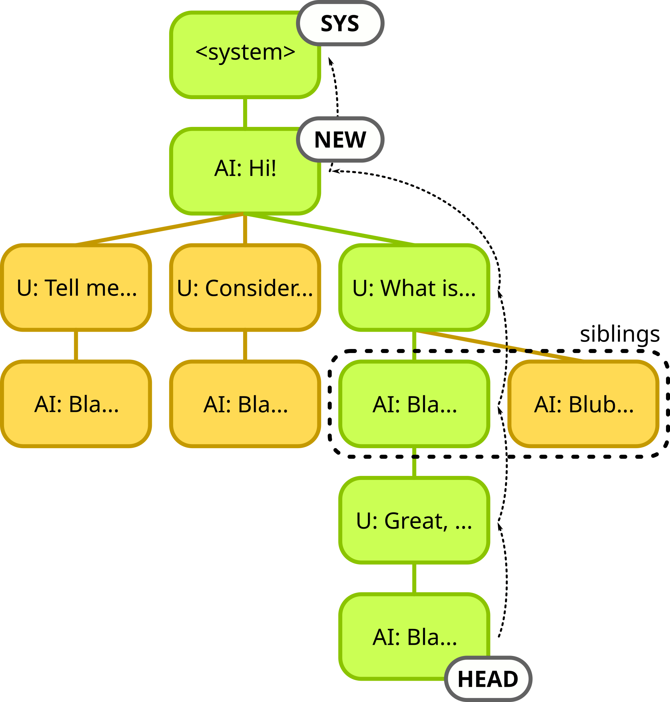
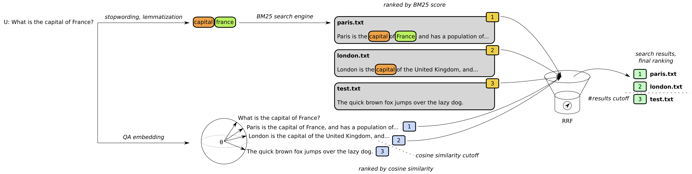
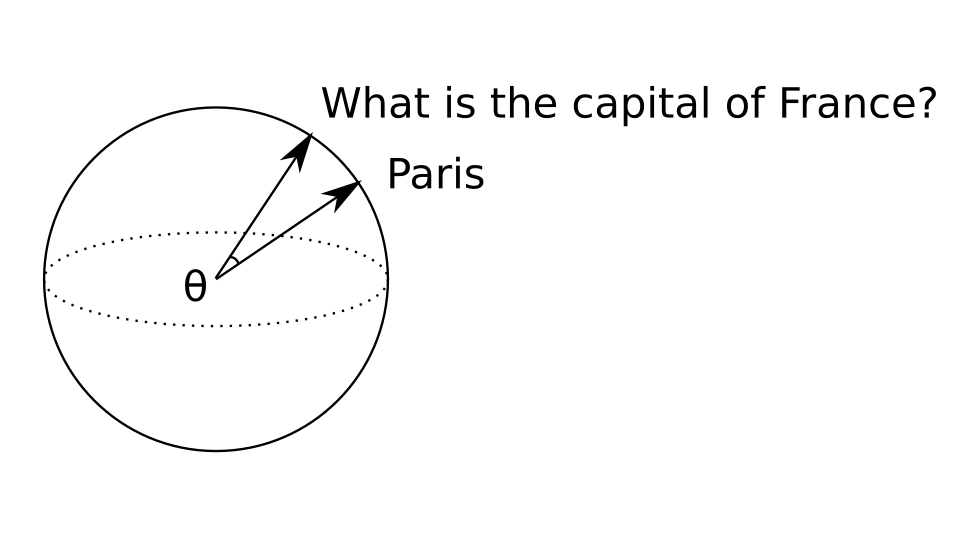
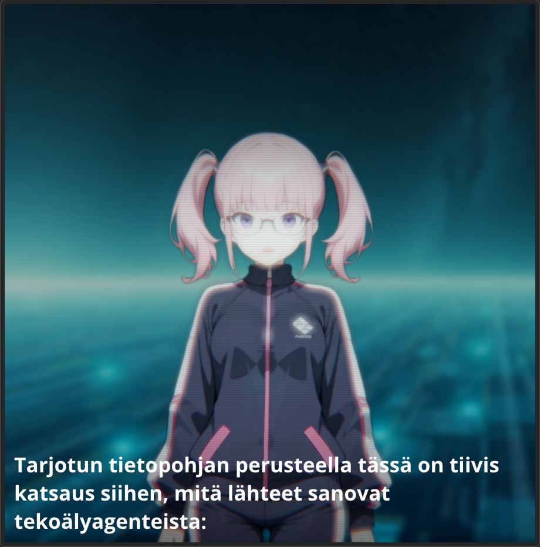

<p align="center">
 <br/>
</p>

-----

<p align="center">
 <br/>
<i>Raven-librarian is a multiversal LLM frontend with a local-first focus and a talking AI avatar.</i>
</p>

<!-- markdown-toc start - Don't edit this section. Run M-x markdown-toc-refresh-toc -->
**Table of Contents**

- [Introduction](#introduction)
- [Features](#features)
    - [Multiversal history](#multiversal-history)
        - [Why?](#why)
        - [Notes](#notes)
    - [Document database](#document-database)
    - [Message attachments](#message-attachments)
    - [Tools](#tools)
        - [Security warning](#security-warning)
        - [Notes](#notes-1)
- [AI avatar and voice mode](#ai-avatar-and-voice-mode)
    - [100% privacy-first](#100-privacy-first)
    - [Notes](#notes-2)
- [GUI walkthrough](#gui-walkthrough)
    - [Global actions](#global-actions)
    - [Chat message actions](#chat-message-actions)
    - [Mode toggles](#mode-toggles)
- [Configuration](#configuration)
    - [Server connections](#server-connections)
    - [Voice mode](#voice-mode)
    - [System prompt, AI character personality, communication style](#system-prompt-ai-character-personality-communication-style)
    - [AI avatar](#ai-avatar)
- [Future vision](#future-vision)
- [Troubleshooting](#troubleshooting)
    - [Start Raven-server *before* the LLM backend](#start-raven-server-before-the-llm-backend)
    - [The LLM backend fails to load a model that used to fit](#the-llm-backend-fails-to-load-a-model-that-used-to-fit)
- [Appendix: Getting started in setting up a local LLM](#appendix-getting-started-in-setting-up-a-local-llm)

<!-- markdown-toc end -->

# Introduction

:exclamation: *This document is a very early WIP, with many placeholders.* :exclamation:

**Raven-librarian** is a multiversal LLM (large language model) frontend, mainly meant for working with local AI.

- **Graphical user interface** (GUI). Easy to use.
- **Fully local** (when used with a local LLM).
- **Multiversal**. The chat history is natively a branching tree structure, respecting the natural shape of conversation between a user and an LLM.
- **Animated AI avatar** with emotional reactions based on LLM text output, lipsynced speech (English), and optional machine-translated subtitles (in a language of your choice).
- **Voice mode**. Talk with the AI using your mic. (English only for now.)
- **Document database** for fact grounding. Talk with the AI about the content of your documents. Powered by a local hybrid semantic and keyword search engine for optimal results.
- **Message attachments**. Hand the AI one specific document or image to read right now, as opposed to searching a database for it. Documents work on any model; images need a vision-capable one.
- **Tool use** (tool-calling) for more fact grounding. The AI has access to tools provided by the *Librarian* software: websearch, web page fetching, and searching your document database itself when the automatic search did not find what it needed.
- **Open source**. 2-clause BSD license.

**:exclamation: *Raven-librarian* is currently under development. :exclamation:**

Much (but not all) of the basic functionality is complete, the codebase should be in a semi-maintainable state, and most bugs have been squashed. If you find a bug that is not listed in [TODO.md](../../TODO.md), please [open an issue](https://github.com/Technologicat/raven/issues).

That said, some important features are still missing, and others will be expanded upon, schedule and funding permitting.

# Features

The main features are a multiversal chat history for natural, branching AI conversations; a document database, message attachments and tool use for fact grounding, especially from locally stored documents; and a real-time animated, talking, lipsynced AI avatar with a voice input mode, for a futuristic touch on the user interface.

## Multiversal history

*Raven-librarian* stores its chat database in a tree format. All chats are part of the same tree. The system prompt forms the root node. The AI's initial greeting, which forms the start point of a new chat, is immediately below the system prompt. The conversations then branch out from there.

Importantly, *there is no linear history*. The concept of "a chat" (as in "recent chats" or "chat files") is not even defined. A *linearized* history is built dynamically whenever needed, by following the parent link chain up the tree, starting from the tip of the current branch.

See the figure for a schematic illustration.

<p align="center">
 <br/>
<i>Raven-librarian stores chats in a tree format. Here <b>SYS</b> is the system prompt node, <b>NEW</b> is the start node for a new chat, and <b>HEAD</b> is the tip of the current branch. Linearized history (highlighted in green for the <b>HEAD</b> shown) is built dynamically, by following the parent link chain up the tree. Any AI response can be rerolled, creating a new sibling node.</i>
</p>

With this storage scheme, a chat branch is just its **HEAD** pointer; roughly, like in `git`. This makes some actions cheap. For example, starting a new chat only resets the **HEAD** pointer to the AI's greeting (labeled **NEW** in the figure).

The nodes are versioned, for an upcoming editing feature for fixing typos and making similar small edits that don't change the flow of the chat (i.e. meant for use in cases where any messages downstream of the edit still make sense as-is). By design, each version is immutable - like the revisions of a GitHub issue comment.

Normally, when you write and send a new message to the AI, it is added below the **HEAD**, and it then becomes the new **HEAD**. The AI then replies. The AI's reply is added below your message, and becomes the new **HEAD**.

It is possible to **reroll** the AI's reply. This replaces the AI's message with a freshly generated one. The old reply is kept in the tree, but not shown to the AI when it writes the new one. It is stored as a sibling node, and it retains any links to nodes that were downstream of it (i.e. the whole subtree is preserved). The new reply becomes the **HEAD**. Rerolling is convenient for quickly generating alternative replies to the same question.

More generally, for changing the direction of the conversation, the chat supports **branching**. You can branch at any node. Branching the chat only sets the **HEAD** pointer to the node where you branch at; it is then up to you as to how to continue the conversation from there.

It is possible to permanently forget a subtree by **deleting** it. This will also delete all messages downstream of the deleted node, and cannot be undone.

The chat tree is stored (by default) in `~/.config/raven/llmclient/chat.json`, with any attachments beside it in `chat.sidecars/`. Upgrading from an older Raven, which called these `data.json` and `data.images/`, renames them on first start.

The **SYS** node is updated each time *Librarian* starts, using the currently configured system prompt from [`raven.librarian.config`](config.py). The node is updated in-place, via the node versioning mechanism: a new revision of the content is created, and the old one is deleted.

When *Librarian* starts, it sets the **NEW** pointer to the appropriate node. First, the **SYS** node's existing child nodes are scanned for a match, by comparing the text content to the currently configured AI greeting from [`raven.librarian.config`](config.py). If a match is found, that node is set as the **NEW** node for the session; otherwise, a new node is created with the new greeting text, and that node is set as the **NEW** node for the session.

Note that *Librarian* only supports one-on-one chats (one user, one AI), but the AI character as well as the user's persona name can be changed between sessions (when *Librarian* is not running).

**AI greeting nodes are character-specific.** Different AI characters using the exact same wording for the greeting message will nevertheless cause independent greeting nodes to be created. This both follows from the OpenAI compatible storage format for the message content (which includes the character name at the beginning of each message, like *"Aria: How can I help you today?"*), but is also the Right Thing, as it makes chats started with different AI characters independent of each other.

### Why?

In short, a tree is a better conceptual fit for working with LLMs than a set of linear chats of a traditional (human-to-human) chat app.

An LLM is essentially a stochastic model conditioned on the prefix: the text so far. Used autoregressively, it is a discrete time evolution operator, roughly in the same sense as the (continuous) time evolution operator in quantum mechanics. The LLM sampler collapses the probability distribution for the next token, reifying one possible textual future one token at a time. Thus the sampler plays the role of the observer in the Copenhagen interpretation of QM. (Paraphrased from [Janus, 2021](https://generative.ink/posts/language-models-are-multiverse-generators/).)

From this analogy, the obvious way to think of LLM chat histories is not a linear timeline, but a branching multiverse.

From a practical perspective, keep in mind that an LLM only "remembers" in two ways:

- Static knowledge stored in weights, from training, and
- The text in the context.

Insofar as the LLM's thread of thought can be said to be "at" a place in the model's latent space at any given point of time (more specifically, at a given *token*), that place - and thus also the likely destinations to which the conversation leads - is fully determined by the context.

That context can be rewound, extended, **engineered**.

Retrieval-augmented generation (RAG; [Lewis et al., 2020](https://arxiv.org/abs/2005.11401); see also survey by [Gao et al., 2023](https://arxiv.org/abs/2312.10997)) was an early form of context engineering: injecting search results to the context provides explicit facts to ground the generation on. This technique remains useful and popular.

Sometimes context engineering is performed manually, for example to curate the perfect LLM reply to base further discussion on. Rerolling and *synthesis* (manual editing to combine several LLM replies) help here.

Rerolling and chat branching are forms of rewinding.

Rerolling also comes in useful for **epistemic analysis**. When the AI's reply is rerolled:

- If the LLM states the same thing over and over, it believes in what it said (regardless of whether what it said is actually true or not).
- If the LLM gives a wildly different response each time, then it didn't actually know, didn't notice that it didn't know, and confabulated (a.k.a. "*hallucinated*") something random.

Context extension can be, for example, a *prefill* - writing the start of the AI's response manually, and then letting the LLM take over.

Conversely, the LLM can be made to write on behalf of the user (this is known as *user persona sampling*), to see what the model thinks the user is likely to say next.

Tools (as in *tool use*) also extend the context by writing responses there.

Finally, sometimes it is interesting or useful to **visit alternative branches**, or in sci-fi terminology, alternative timelines in the multiverse of discourse. This allows a discussion to become a [garden of forking paths](https://en.wikipedia.org/wiki/The_Garden_of_Forking_Paths), facilitating a more complex and complete exploration of a topic than one linear chat.

All such curation, analysis and exploration is facilitated by the natural abstraction that fits best here - a tree structure - and a GUI to navigate it.

### Chat graph

Switch on **Chat graph** in the mode toggles, and the tree is drawn where the avatar was. This is the way to reach a chat that is not the one you are in: the linearized view only ever shows one branch, and the arrow buttons on a message only step between its immediate siblings.

What you see is the branch you are on, drawn as a vertical spine, with a few siblings either side of it at each level. One of those levels is every chat ever started under the current character card, which is as close as this format comes to a list of recent chats. Anything left out is drawn as a clickable **…N more**, so a box with no visible links means the tree really does end there.

Clicking is in two steps, and the first one changes nothing:

- **Click a message** to look at it. If it is on the branch you are on, the chat log scrolls to it. If it is on another branch, the graph redraws around it, bringing its own siblings and continuations into view.
- **Click it again** to switch the conversation to it. The branch button in the graph's toolbar does the same thing.

Colour says where you are rather than what you are looking at: the branch **HEAD** is on stays highlighted even while you browse elsewhere, so the point at which a branch you are considering left the one you are on is visible.

Clicking a **…N more** navigates instead of selecting. A gap between siblings jumps the window to the middle of what it hides, so a wide fan is crossed in a few clicks rather than one at a time; a gap standing for skipped ancestors shows more of the branch; a gap under an off-branch message opens what continues below it.

When the AI calls tools, each result it gets back is a message of its own, and a turn that made several of them would otherwise fill the picture with plumbing. So a round of three or more results is drawn as one **…N more** box hanging between the message that asked and the answer that followed; clicking it draws the results, and each is then an ordinary message you can look at and switch to. Smaller rounds are simply drawn, there being nothing to gain by hiding one message behind one box. To put an opened round away again, press **Backspace** or use the toolbar's fold button — either one, from anywhere inside the round.

The graph can be driven without a pointer. **Tab** moves the keyboard between the message composer, the chat log and the graph, and the pane holding it wears a blue mark. In the graph, the **arrow keys** move a dotted ring from box to box — down and up follow the conversation, left and right step along the siblings at that level — and **Enter** does to the box under the ring exactly what clicking it does: a message switches the chat to it, a **…N more** opens it. **Esc** puts the ring away, and **Backspace** closes an opened tool round. Nothing the ring does changes the conversation; only Enter on a message, or a second click, moves you.

The arrow keys walk what is drawn, and one level of the graph can hold hundreds of chats with only a handful of them on screen. To go further along a level, **Ctrl+Left** and **Ctrl+Right** step between its siblings whether they are drawn or not, sliding the window to follow; **Ctrl+Shift** with either jumps ten at a time, and **Ctrl+Home** and **Ctrl+End** go to the ends. Those are the same keys the chat log uses on a message's siblings — the difference being that in the chat log they switch the conversation, while here they only move the ring.

The ring is the same mark whether you put it there with the mouse or the keys, so the two can be mixed freely: click a box, step off it with the arrows, press Enter.


### Notes

As someone on the internet pointed out, the term *hallucination* is misleading, since in humans, it refers to **inputs** that are not grounded in external reality - or as WordNet puts it, "*a sensory perception of something that does not exist*". However, the common usage of *LLM hallucination* refers to ungrounded **outputs**. A better semantic match here is "*a fabricated memory believed to be true*", hence a *confabulation*.

As of 12/2025, many LLM frontends still operate in the paradigm of a traditional linear chat history. Many support some form of branching, but no AI chat app seems to have taken the idea to its logical conclusion yet. *SillyTavern* offers swipes and arbitrary branching, but uses a linear storage format ([*Timelines*](https://github.com/SillyTavern/SillyTavern-Timelines) is a hack on top of that). Loom ([original](https://github.com/socketteer/loom); [obsidian](https://github.com/cosmicoptima/loom)) is probably still the only natively nonlinear LLM GUI (predating *Raven-librarian*); and it is focused on text completion via base models, not chat.

## Document database

The document database gives the LLM fact grounding via retrieval-augmented generation (RAG). The context is engineered from two directions. An automatic search runs before the AI replies, using your latest message as the search query, and its results are injected into the LLM's context. The LLM can then search the database again itself, as a tool call, once it has seen what that first search returned — which is what lets it recover when your phrasing and the documents' phrasing do not line up.

The number of search results to return can be configured in [`raven.librarian.config`](config.py). This allows trading off speed vs. [recall](https://en.wikipedia.org/wiki/Precision_and_recall). Note that a higher number of search results will also take up more space in the LLM's context.

In the search index, the documents are **chunked**. The chunk (not a full document!) is the basic unit of search. To avoid context loss at the chunk seams, *Librarian* uses a sliding window chunker with overlap, thus trading off storage space and retrieval speed for improved recall. If the search results include adjacent chunks from the same document, these are automatically merged into one contiguous search result, with smart removal of the overlap. The merged result is scored with the highest score of any of its component chunks.

The search engine is local, and uses a hybrid algorithm with both semantic embeddings as well as BM25 keyword search. The semantic embedder used by the search engine (by default) is a QA-type model, which has been trained to map questions and their answers near each other in the high-dimensional vector space. For the keyword search, the query is lowercased, [lemmatized](https://en.wikipedia.org/wiki/Lemmatization) (using [spaCy](https://spacy.io/)), and [stopworded](https://en.wikipedia.org/wiki/Stop_word). The results of the two searches are combined via [reciprocal rank fusion (RRF)](https://www.assembled.com/blog/better-rag-results-with-reciprocal-rank-fusion-and-hybrid-search), to yield better results than either algorithm gives alone. See the figures.

<p align="center">
 <br/>
<i>Overview of Raven's search engine.</i>
</p>

<p align="center">
 <br/>
<i>A QA-type semantic embedding model maps questions and their answers near each other in the high-dimensional space (which usually has roughly 1000 dimensions). Schematic illustration in 3 dimensions.</i>
</p>

The document database accepts **plain text** documents, **PDFs**, and **office documents**:

- **Plain text.** Beside classical plain text `.txt`, markup languages that LLMs understand are fine - e.g. `.md`, `.bib`, and `.tex`.
- **PDF.** Born-digital PDFs, i.e. those with a real text layer, have their text extracted automatically on import.
- **Office documents.** Word (`.docx`), PowerPoint (`.pptx`), and their LibreOffice/OpenDocument counterparts (`.odt`, `.odp`). Tables are read in place, so a value stays next to its label; text inside grouped shapes on a slide is read too, and so are presenter notes - on a lecture deck, the notes are often where the actual argument lives. The legacy binary formats (`.doc`, `.ppt`) are *not* supported, as reading those would mean calling out to a separate converter program.
- **Web pages** (`.html`, `.htm`) saved to disk. Navigation, sidebars and footers are stripped, leaving the article - the same readability extraction the AI's `webfetch` tool uses on live pages, so a saved page reads like a fetched one. The page's `<title>` is kept as a heading, since a filename downloaded off the web often names nothing.

The same list applies to files you **attach to a chat message**, and it is the same code doing the reading in both cases - so anything you can drop into the document database, you can also attach to a message, and vice versa. The full list of recognized file extensions is configured in [`raven.librarian.config`](config.py) as `llm_docs_exts`.

**Source code is deliberately not on that list**, `.py` included, even though it is plain text and the AI reads code perfectly well. The obstacle is the *search*, not the reading: the keyword half of the document database lowercases, lemmatizes and drops English stopwords, which is right for prose and wrong for code in a way that does not announce itself. Identifiers disappear entirely - a token containing an underscore or a digit is not a word, so `compute_flux_residual`, `mesh_nodes` and `jacobian_matrix` are indexed as nothing at all, and a whole `def` line reduces to the word `def`. So do `if`, `for`, `in`, `not`, `while` and `from`, which are English stopwords that happen to be Python keywords. What is left to search is the docstrings, and only the docstrings. That would look like it worked - ask about "the flux residual" and the file comes back - right up until you searched for a function by name and got nothing. Code search needs its own tokenizer, and until it has one, saying no is the honest answer.

For a one-off you can still do it: attach the file to a message, or rename it `.txt` to put it in the database. Both feed the AI the same text; only the search is affected.

Everything above is read for its **text layer only**. Whatever a document says through pictures - a figure, a photograph, a typeset equation that is really an image - does not come across, and a file whose content is entirely such material imports as empty. Two common cases:

- A **scanned or image-only PDF** has no text layer, so nothing is extracted and it is skipped. To import one, run it through OCR first — e.g. [`ocrmypdf`](https://github.com/ocrmypdf/OCRmyPDF) (`ocrmypdf --force-ocr input.pdf output.pdf`) — to add a text layer.
- A **slide deck that is mostly diagrams** imports only its titles and whatever prose it has. Its notes, if it has any, are often the more useful half in this situation.
- A **web page that builds its content with JavaScript** has nothing to read in its markup, so it imports as empty. This covers both the saved shell of a dynamic site (whose content was never in the file - fetch the URL with the AI's `webfetch` tool instead) and a self-contained single-file app that carries its data inline as a script (whose content *is* in the file, but in a form we do not currently read). Nothing here runs a page's scripts: putting a file in the documents folder must never be enough to make it execute.

**To manage the content of the document database**, use a file manager: just put your document files in the document database directory. By default, *Librarian* looks for documents in `~/.config/raven/llmclient/documents`. The path can be configured in [`raven.librarian.config`](config.py).

The document database directory can have subdirectories - so feel free to create them to organize your document collection. This is useful for splitting the DB into broad umbrella topics (AI research, engineering sciences, ...). As of v0.2.4, all documents still live in the same search namespace. We plan to add scoping support later, to allow limiting the search to a given topic.

The search index syncs automatically:

- When *Librarian* is started, the document database directory is scanned for changes made after the last time *Librarian* saw it. If necessary, the index is updated automatically.
  - New documents are indexed.
  - Updated documents are re-indexed. Updates are detected from each document file's mtime (*last-modified* time).
  - Deleted documents are removed from the index.

- While *Librarian* is running, the directory is monitored for changes. Any changes take effect immediately.
  - The same rules apply as for the startup scan: new, updated and deleted documents are detected, and processed accordingly.

- As of v0.2.4, the search index update progress can be viewed in the terminal window from which *Librarian* was started.
  - The update may take some time if there are many (hundreds) of documents.
  - The semantic embedding uses the `embeddings` module of *Raven-server*, so it can benefit from GPU acceleration.

If the search index ever becomes corrupted - or if you need to force a full rebuild for any reason - you can simply delete the search index directory while *Librarian* is not running. A full search index rebuild will then automatically take place when *Librarian* is started. By default, the index is stored in `~/.config/raven/llmclient/rag_index`.

### Indexing from the command line: `raven-indexer`

Everything above happens inside the GUI. If you have just dropped several hundred documents into the folder, you may not want to sit and watch *Librarian* chew through them before you can use it - and on a headless machine, or over SSH, starting the GUI at all is not an option. `raven-indexer` does the same indexing from a terminal and then exits:

```bash
raven-indexer                        # index the configured document database
raven-indexer ~/papers               # index some other directory instead
raven-indexer ~/papers -r            # ...including its subdirectories
raven-indexer -d /tmp/scratch-index  # write the index somewhere else
raven-indexer -q                     # only the final summary, no per-document progress
```

*Raven-server* must be running, since the semantic embedding goes through its `embeddings` module - the same requirement *Librarian* itself has, and for the same reason (GPU acceleration, and one copy of the model rather than one per app).

Things worth knowing:

- **It reconciles; it does not rebuild.** New files are indexed, changed files re-read, deleted files dropped, and files already indexed are left alone. Running it again on an unchanged folder takes a few seconds. To force a genuine rebuild, delete the index directory first, as above.
- **Interrupting it is safe.** Ctrl+C stops after the current document, leaving a valid partial index rather than a corrupt one, and re-running picks up where it left off.
- **It reads exactly what *Librarian* reads** - the same file types, from the same `llm_docs_exts` setting - so the index it builds is the one the chat clients expect. It is the same code underneath; only the front end differs.
- **It is not a separate database.** With no arguments it writes to your configured index, so the next time you start *Librarian*, the work is simply already done.

The progress display adapts to where the output is going: a live single line that rewrites itself in a terminal, one line per update when redirected to a log file.

**What happens to a conversation when you delete a document.** You can add, change and remove documents at any time, including in the middle of a chat that has been reading them, and nothing breaks — but it is worth knowing what survives and what does not.

- **The conversation stays readable.** When the AI reads a document, the passage it read is stored in the chat itself. Deleting the file later does not blank out anything you can already see in the log.
- **Handles go dead, visibly.** A document the chat refers to but which is no longer in the database is still shown, with its identifier and a greyed-out open button, rather than quietly vanishing — the conversation *did* read it, and pretending otherwise would misrepresent where the answers came from. If the AI tries to read it again, it is told the document no longer exists.
- **Putting it back restores everything.** A document is identified by its path relative to the documents folder, so returning the same file to the same place makes every earlier reference live again. Moving it to a different subfolder counts as a *different* document.
- **Identity is the path, not the contents, and that is deliberate.** It is what makes editing a document *work*: correct a typo, extend a section, replace a draft with the final version, and the index updates in place while every reference from every past conversation keeps pointing at it. The consequence to be aware of is the same fact seen from the other side — an old conversation's references now resolve to the *current* text, so a passage the AI quoted back to you last week may no longer be in the file. What the AI actually read is preserved in the chat log itself; the reference is a pointer to the living document.

**Tip**: If you have a BibTeX file full of scientific abstracts, and would like to feed those into *Librarian* as separate documents, see the `raven-burstbib` command-line tool. It splits your huge `.bib` file into individual entry `.bib` files. These files can then be copied/moved into *Librarian*'s document database folder, and *Librarian* will then pick them up as individual documents. Better forms of integration with *Visualizer* datasets are planned to be added later.

### Turning a folder of arXiv PDFs into a searchable database

A common starting point is a directory of papers downloaded from arXiv over the years, with the arXiv identifier somewhere in each filename. Three commands turn that into an indexed document database of abstracts:

```bash
raven-arxiv2id -i ~/papers | raven-arxiv2bib -o papers.bib   # identifiers -> metadata
raven-burstbib papers.bib -o ~/.config/raven/llmclient/documents
raven-indexer                                                 # or just start Librarian
```

- **`raven-arxiv2id`** scans the directory (recursively) for arXiv identifiers in PDF filenames, and prints the unique ones. Where several versions of the same paper are present, only the newest is kept. `--strip-versions` prints them without the version suffix, which is what refreshes a collection — see below.
- **`raven-arxiv2bib`** fetches each paper's metadata from arXiv and writes BibTeX. It waits arXiv's requested three seconds between requests, so a few hundred papers takes a few minutes — leave it running. Identifiers arXiv does not recognize are reported at the end rather than aborting the run. The entry records the version arXiv answered with, so the bibliography says which revision it describes (`--strip-versions` drops the suffix, for a bibliography meant for citing rather than for tracking a collection).
- **`raven-burstbib`** splits the result into one `.bib` file per paper, since the document database works in whole documents — a single large `.bib` would be one document, and a search would return the entire bibliography as one result.

This gives you the *abstracts*, which is usually what you want for retrieval: they are short, self-contained, and one paper is one document. Put the PDFs themselves in the folder instead (or as well) if you want the full text searchable — *Librarian* reads born-digital PDFs directly.

If your papers are not from arXiv, the same shape applies with a different first step: `raven-wos2bib` for a Web of Science export, `raven-csv2bib` for a spreadsheet, `raven-pdf2bib` for conference abstract booklets. All of them produce BibTeX for `raven-burstbib`.

#### Refreshing a collection when papers get new versions

Preprints get revised, sometimes years later, and a collection assembled over time drifts out of date silently — nothing announces that the v2 on your disk is now a v4. `--strip-versions` is what refreshes it:

```bash
raven-arxiv2id -i ~/papers --strip-versions > ids.txt
raven-arxiv-download -o ~/papers --save-bib papers.bib $(cat ids.txt)
```

`--save-bib` writes the bibliography from the metadata the download already fetched in order to name the files, so it costs nothing — no extra requests, no extra waiting. Running `raven-arxiv2bib` over the same identifiers afterwards would ask arXiv for all of it a second time.

The mechanism is arXiv's own: an identifier *with* a version means that version, and an identifier *without* one means whatever is current. So dropping the suffix is precisely the request "give me the latest", and both tools honour it — no separate update mode needed.

Two things to know before running it on a collection you care about:

- **The old versions stay on disk.** The download writes new files rather than replacing the ones already there, so a refreshed paper is present twice. That is harmless for retrieval — `raven-arxiv2id` keeps only the newest, so the next run is not confused, and the indexer treats them as two documents saying nearly the same thing — but it does grow the folder, and opening a paper by hand may land on the stale copy. Delete the superseded files if that matters to you.
- **If you have evaluated retrieval against this collection, the document IDs change.** Filenames carry the version, and a refreshed paper is therefore a *different* document as far as any stored identifier is concerned. Query sets, gold labels and measured baselines that key on filenames need regenerating alongside the refresh, not after it.

## Message attachments

The document database answers *what do my documents say about this*. An attachment answers a different question — *read this one, now* — and the two are governed differently because of it. A search returns the snippets that matched; an attachment is handed over whole.

Two kinds can be attached, and they place different demands on the model:

- **Documents** — the same formats the document database accepts, listed above. The text is extracted and folded into your message when the request is built, so **any** model can read one; no vision capability is required, and a PDF works as well as a `.txt`.
- **Images** — these need a vision-capable model (a VLM). Whether *Librarian* can tell in advance depends on your LLM backend. LM Studio reports the flag, so a confirmed text-only model refuses an image at the point you pick it, with an explanation rather than a silent failure later. oobabooga does not report it, so the image is allowed on faith and the backend errors on send if the model cannot see. Documents are unaffected either way.
  - **A VLM needs its vision half installed separately, and this is the usual reason a vision model appears not to see.** As of mid-2026, GGUF vision models ship the projector (`mmproj`) as a second file alongside the main model file, and without it the backend loads a text-only model that merely *has* a vision-capable name. LM Studio picks the projector up automatically when it sits in the same folder as the model. oobabooga wants it selected in the UI, saved per-model with that model's other settings. If images are rejected or ignored by a model you know can see, check this before suspecting *Librarian*.

Both kinds ride along with the message you attached them to, so they stay put in the branch where you asked about them.

**The AI produces attachments too.** When it fetches a web page and the page is long, the result is stored as an attachment rather than pasted into the conversation: the chat log shows the opening and a chip you can click, while the model reads the document itself. Without that, one fetch buries the conversation it was meant to inform under dozens of screens of text.

A document too large for the room left in the context window is **truncated in the middle**, not at the end — the beginning and the end survive, with a marker stating how many characters were dropped. For a paper that keeps the abstract, the introduction and the conclusions, and spends the omission on the methods; for a web page, the lede and whatever the article was building towards. The marker matters as much as the shape: handed silently truncated text, a model has no way to tell a document that stops mid-thought from one that ends there, and will summarize the fragment as though it were the whole. The chip always opens the full stored copy, whatever the model saw.

A result from the **document database** is shown differently, and never becomes an attachment. The difference is who owns the file: an attachment is copied into *Librarian*'s own store, because the original may be somewhere temporary or may cease to exist, whereas a database document *is* a file you put in your documents folder — copying it would duplicate something already yours, and the chip can just point at the original. So the result stays in the conversation, collapsed to its opening, with a toggle that expands it in place and a button that opens the source document. That collapse is *display only* — nothing is dropped from what you can read, it is one click away. What the model gets is sized like everything else, and middle-truncated the same way if it does not fit.

Attachments are stored beside the chat, **content-addressed** — identical bytes are stored once, however many messages refer to them, and a page fetched twice is one file when it has not changed and two when it has, so a message keeps the version it actually saw. They are sized against the context window along with everything else: several large attachments in one conversation share the room that is left, rather than one of them silently pushing the others out. Anything no longer referenced by any message can be reviewed and cleaned up from the GUI, with the option to rescue a copy first.

**Copying gives you different things depending on what you asked for**, and the difference is exactly this excerpt:

- **Copy one message** (the copy button on it) and you get that message's content in full. Where the log shows the opening of a fetched page, the clipboard gets the whole page — you asked for that message, so you get its data as it stands.
- **Copy the whole log** (F8) and each such message keeps its excerpt, followed by a line naming the attachment and how long the full text is. A conversation with several fetched pages would otherwise be unreadable, and a log is the thing people pass on: a shared document reproducing complete copies of pages that were only quoted is a different proposition from quoting them.

Either way nothing is lost silently — the full text stays in the attachment, and the log says where it went.

## Tools

*Tool use* (a.k.a. *tool-calling* or *function-calling*) is a feature of many LLMs published since early 2025. The idea is to give the LLM partial control over engineering its own context. When the LLM notices that in order to respond to the user's request, it needs to use an external tool, the LLM can tell its surrounding scaffold app (such as *Librarian*) to invoke that tool. A tool can be anything that produces text, for example: websearch, calculators, weather services, database access, file access, shell access, or a programming environment. As the last few examples suggest, tools may also trigger actions in the external world, just like any computer software. For example, a tool call could cause a document to be sent to a printer, or a meeting to be scheduled for the user. Effectively, tool use allows the LLM to control a (predefined set of services on a) computer.

Modern approaches to tool use include [MCP](https://modelcontextprotocol.io/docs/getting-started/intro), which allows dynamic tool discovery on external servers; and LLM skills, [pioneered by Anthropic's Claude](https://simonwillison.net/2025/Oct/16/claude-skills/). The latter requires giving the AI access to a full, sandboxed virtual machine, with a software development environment (such as a Python interpreter).

When tool use technology is integrated into a chatbot, this yields a lightweight form of AI agent functionality. The system remains primarily a chatbot, but it can use tools to gather information from external data sources.

<p align="center">
 <br/>
<i>An LLM-based AI agent <a href="https://simonwillison.net/2025/Sep/18/agents/">runs tools in a loop</a>. (Images created with Qwen-Image.)</i>
</p>

How tool use works:

- As part of the system prompt, the LLM receives specifications about available tools, in JSON format.
  - Each tool specification includes the function name, a short human-readable (*LLM-readable!*) docstring of what it does, and a parameter specification (with docstrings), if the function takes arguments (as well as which arguments are required and which are optional).
  - While the tool specifications are provided by the scaffold app, they are typically injected into the system prompt by the LLM backend software (such as [oobabooga/text-generation-webui](https://github.com/oobabooga/text-generation-webui)), so they are not visible in the user-provided system prompt.
- When the LLM thinks it needs to use tools, it requests one or more tool calls by writing a specially formatted chat message.
  - For each tool call, the LLM writes which function to call as well as the parameters (if any) in JSON notation. Modern LLMs have been trained to do this.
  - These tool call requests are detected in, and parsed from, the LLM output by the LLM backend software.
- The parsed tool call request is handed over to the scaffold app.
- The scaffold app performs the actual tool call, and writes a machine-formatted message in JSON notation, containing the tool output (or error message, if any).
- Control then returns to the LLM, so that it can interpret the results returned by the tool, as well as continue writing.
- The LLM may make another round of tool calls if it deems necessary to do so, and the process repeats.
- Once the LLM is satisfied with the information it has, it proceeds to write its reply without making more tool calls.
- Control returns to the user.

There is a configurable ceiling on how many rounds of tool calls one reply may take (`max_tool_call_rounds` in [`raven.librarian.config`](config.py)). It is a backstop, not a normal limit — an LLM that finds what it needs stops well below it. When the ceiling is reached, the requested calls still run, and only the round after them is told that the budget is spent.

Past that point the tools stay on offer and any further call is answered with an error saying so, rather than being quietly taken away. Two reasons. Changing the set of tools mid-reply invalidates the backend's KV cache from that point on, so the rest of the conversation has to be reprocessed; and a conversation whose earlier messages call a tool the current request no longer declares is a shape models have seen little of in training, whereas a tool that answers "not now" is one they have seen plenty of. A refusal cannot *guarantee* the reply ends, though, so after `max_tool_call_refusal_rounds` of them the tools are withdrawn outright, which does.

*Librarian* provides seven tools: two on the web side, three on the document side, a clock, and a calculator. The web pair needs the **Internet** mode toggle, the document trio needs **Documents**, and the last two need neither — they answer from nothing outside the conversation, so they are always on offer.

`calculate` evaluates an arithmetic expression in a sandbox ([simpleeval](https://github.com/danthedeckie/simpleeval)), which is worth having because arithmetic is the thing an LLM is worst at while looking most confident: a total, a percentage or a square root is produced by the same next-token machinery as prose, and it is right often enough to be trusted and wrong often enough to matter. With the tool on offer the model reaches for it instead — asked for `1234 * 5678`, Qwen 3.6 called the calculator rather than answering from its head.

On the web side, `websearch` returns a list of results, and `webfetch` reads one page — search first, then follow a link, which is the same gesture you would make yourself. A page is fetched by *Raven-server*, which strips navigation, sidebars and footers and hands back the article; if the page builds its content by running scripts, there is nothing in the markup to read and the tool says so rather than returning an empty page as though it were the truth.

Which hosts the AI may fetch from is up to you, via `webfetch_allowlist` in [`raven.librarian.config`](config.py). The default is unrestricted, subject to the network-level checks *Raven-server* enforces regardless (it refuses private-network addresses and non-HTTP(S) schemes, so the AI cannot be talked into fetching your router's admin page). Set the allowlist to a list of hosts and the AI is confined to them — a curated scientific baseline is provided in the same file as `webfetch_default_allowlist`, ready to assign. Whatever the setting, a URL **you** type in your message is fetchable for that turn: the constraint is on the AI's initiative, not on your instructions. A host that merely turned up in a websearch result is *not* auto-allowed by default (`webfetch_trust_search_results`), because a search result is nobody's instruction — a page crafted to rank for a likely query could otherwise talk the AI into fetching it, and whatever it says next arrives inside the AI's context. There is also a per-session approval: when a fetch is refused, the chat log offers a button to allow that host for the rest of the session. See the security warning below before loosening any of this.

On the document side, the database is available to the LLM as a tool (`search_documents`) whenever the **Documents** mode toggle is on, in addition to the automatic search. The two do different jobs: the automatic search costs no extra LLM round trip but has to guess a query from your message, while the tool lets the LLM write a better query *after* reading what the first search returned. This matters most when what you are after is mentioned only in passing — a specific instrument by name, say. The automatic search has your whole message to work with and nothing to tell it which part was the question; the LLM, having read what came back, can go again with just the term that mattered.

Note that **Documents** and **Internet** are independent: with **Internet** off the AI can still search and read your own documents, and with **Documents** off it can still search the web. Neither switch overrides the other.

The LLM also gets `fetch_document`, to read a document in full once a search match looks worth following up, and `list_consulted_documents`, which names the documents this conversation has already looked at. The last one exists because the automatic search's results are shown once and then dropped: without it, a follow-up question arrives with the AI's earlier reply in view and the material behind it gone, with nothing to say so. Raven pushes that list into every turn as well as offering it as a tool, since the AI cannot notice a gap its own transcript hides. Each entry carries a label read from the document itself — a BibTeX record's title, author and year where there is one, otherwise the document's first line — so the AI can tell which one is worth re-reading without fetching all of them to find out.

There is a reason to switch **Documents** off, too. The automatic search injects its best matches whether or not they are any good, so a question the database has nothing to say about still costs the prompt-processing time for a batch of irrelevant matches — noticeable as a delay before the reply begins. When the conversation has moved to a topic your corpus does not cover, turning the toggle off is the cheaper mode.

### Security warning

To keep tool use safe, there are [certain important considerations](https://simonwillison.net/2025/Jun/16/the-lethal-trifecta/). In short, giving an LLM access to all three of:

1. Private data (your local, non-public documents),
2. Access to untrusted sources of text (e.g. downloading arbitrary webpages), and
3. Ability to communicate with the external world (e.g. sending arbitrary HTTP requests)

is generally a very bad idea.


**As of H2/2025, the level of LLM information security is next to nonexistent.**

PDFs or webpages can be poisoned by an adversary to make an LLM do what the adversary wants when the LLM reads that document or webpage.

The classic invisible white print is a well-known technique, e.g. to make automated LLM reviewers give glowing reviews to a "scientific paper" that is actually AI slop.

One more advanced and harder-to-casually-detect approach is [Unicode poisoning](https://embracethered.com/blog/posts/2025/google-jules-invisible-prompt-injection/); see [ASCII Smuggler](https://embracethered.com/blog/ascii-smuggler.html).

Be aware that private data can be leaked simply via sending an HTTP GET request, because the attacker can just place all your private information in the URL as a query string (e.g. in a base64-encoded form for obfuscation).

These techniques are well known, and even trivial, so spelling them out here is not an infohazard. Real attackers probably have access to many more advanced ones.

### Notes

Currently, *Librarian* only provides a set of hardcoded tools, and does **not** support MCP or skills.

As of v0.2.8, *Librarian* provides web search, web fetch, and document database search. We intend to expand this later.

If interested in the details, see `tools` in the `setup` function in [`raven.librarian.llmclient`](llmclient.py), the related mechanisms in the `invoke` function in the same module, and the agent loop in [`raven.librarian.scaffold`](scaffold.py).

## Scripting

The engine behind the GUI is importable. [`raven.librarian.agent`](agent.py) runs one assistant turn — the full agent loop, with your document database and the tools in play — and hands back a record of what it did:

```python
from raven.librarian import agent
record = agent.turn(llm_settings, "What does the corpus say about melt-pool instability?")
print(record.reply)
```

The record carries the reply, the reasoning the model emitted but did not send, how many tool rounds the turn took and which tools it called how often, whether the reply had retrieved material to stand on, and the prompts actually put on the wire. That last one is often the point: it is the same prompt the GUI would have sent, available for inspection without a window.

Four things are worth knowing before scripting against it:

- **Nothing overwrites anything.** The chat is a tree, so a retry, a reroll, or a second phrasing of the same question is a new branch off the same parent — the attempt that failed and the one that worked are both there afterwards, as are all four samples of a turn you sampled four times. A batch's whole record of what it did is therefore a chat in *Librarian*'s own format, with no separate run log to keep.
- **A run against the configured datastore is waiting in the GUI afterwards.** *Librarian* opens the datastore named in [`raven.librarian.config`](config.py) and no other, so a script that points there can be inspected by opening the app; a script that builds its own is readable programmatically and nowhere else.
- **The network is off by default.** `internet_enabled=False`, so `websearch` and `webfetch` are not offered unless you ask for them.
- **The document tools are on by default.** They need a corpus to reach, though: pass a `retriever`, or there is nothing for them to search and no automatic search runs either.

The reference documentation is the module's own docstrings — `agent.turn` carries worked examples, and the executable ones are in [`test_agent.py`](tests/test_agent.py), which drives the real loop against a faked backend. If you use a coding assistant, pointing it at [`agent.py`](agent.py) is enough to get it writing against this surface; the module is written to be read that way.

This is a programming library rather than a product: what it offers is programmatic access to Raven's own corpus, chat tree and provenance machinery, and it is deliberately not a generic agent harness. Note also that it drives the *LLM* over your document database. Building and refreshing the index itself is a separate job, and belongs to [`raven-indexer`](#indexing-from-the-command-line-raven-indexer) above.

# AI avatar and voice mode

*Librarian* features an anime-style, **animated, lipsynced, talking AI avatar**, with optional machine-translated **subtitles**, or alternatively, optional **closed-captioning** without translation.

We also provide **speech recognition**, so that at your option, you can use your mic to talk with the AI.

The avatar's expression is updated every few seconds while the LLM is writing. *Librarian* uses a sentiment analysis AI model to detect the most likely emotion from recent text streamed by the LLM, and then sends the resulting emotion label to the avatar subsystem for animation. The avatar's emotion updates while the LLM is thinking as well as while it is writing the final response. This is the same approach as used by SillyTavern for character expressions.

When the **Speech** toggle in the *Librarian* window (below the avatar video panel) is **ON**, the avatar will speak the LLM's response once the message is complete. Only the part the LLM "writes out loud" is spoken; thought blocks are skipped by the speech subsystem. For the whole duration of the speech, the avatar's expression will be the last one from the LLM text analysis.

When both the **Speech** and the **Subtitles** toggles are **ON**, the speech is machine-translated and subtitled one sentence at a time. The subtitle for each sentence is shown while that sentence is being spoken.

For configuring the AI's voice and the subtitles, see [Configuration](#configuration).

The avatar has an optional, configurable timeout, after which the avatar video will turn off if there is no activity (to save GPU and CPU compute resources, as well as to eliminate unnecessary fan noise when running on a laptop). The avatar wakes up immediately when there is activity (e.g. navigating the chat tree, rerolling a message, sending a new message to the AI, or asking the avatar to speak a previous message again).

Currently, the avatar cannot be completely disabled. *Librarian* expects the `avatar` module of *Raven-server* to be running, and will always load the avatar. We recognize this option would be useful for low-VRAM environments, and intend to add it later. The right-side panel now has something else to show while the avatar is hidden — the [chat graph](#chat-graph) — which was the missing piece; what remains is not loading the avatar at all.

<p align="center">
 <br/>
<i>Screenshot from the live view of the avatar in Librarian, with an auto-blurred backdrop image, realtime video postprocessing, and machine-translated subtitles, here shown in Finnish. The video postprocessing here uses its default configuration, with bloom, chromatic aberration, vignetting, translucency, banding, and scanlines enabled. Some of the effects are rather subtle, and are more easily visible when actually live.</i>
</p>

**Voice mode**: If you want to speak to the AI via your mic, click the **mic button** (next to the text entry field at the bottom). The mic icon starts glowing red, and the mini VU meter becomes live, indicating that *Librarian* is listening.

Once you are done talking, click again, or wait until the automatic silence detector ends the recording. The mic icon returns to its original color, and the mini VU meter shuts off, indicating that audio is no longer being recorded.

The audio is transcribed into text and sent to the LLM, just as if you had typed the message in. This is convenient for quick questions and chatting.

Voice input is still young; voice message editing is missing, for example. We intend to expand this later.

### Setting up the mic

How quiet counts as "finished speaking" depends on the room, so it is a control rather than a setting you are expected to get right in advance. Click the **sliders button** (next to the mic) or press **F9** to open the **Audio input** panel.

Everything in the panel but the sliders can be driven from the keyboard, and the blue mark shows where the keys are going. Opening it puts them on the microphone chooser: **Up**, **Down**, **Home** and **End** step through the microphones, and **D** returns there from anywhere. **M** measures the room, **A** and **S** flip the two checkboxes, **R** resets, and **Esc** closes the panel. The keys apply only while one of the panel's own controls has the focus, so they do not disturb what you are typing in the chat.

While the panel is open, *Librarian* listens to the mic without recording anything and without sending anything to the AI, so you can watch the input level with the room as it actually is. The status line above the meter says which it is doing, and both meters stay live through an actual recording too — the panel is a second view of the same input, not a separate one.

- **Microphone** picks which input to record from. The list is re-read each time you open the panel, so something plugged in while *Librarian* was running is there. Switching takes effect immediately, and the meter follows — which is how you compare two microphones, or tell a noisy room from a noisy mic.
  - Monitoring inputs are left out: those record what is being *played*, so one would transcribe the AI's own voice. If you have named one in the configuration, it stays in the list so you can get back to it.
  - An entry marked `[unavailable]` is one *Librarian* is listing although the system does not currently report it — an unplugged microphone, or one named in your configuration that is not attached today.
- **Meter peak hold** is how long the meters remember a peak. It is also how far back the peak line lets you see, which is what makes it useful when choosing a level.
- **Silence level** is the level under which the input counts as silence. It is the gray line on both VU meters.
- **Measure the room** sets it for you: ask the room to be quiet, then click. It takes the loudest moment of the last few seconds — the figure shown right above the button — and puts the threshold a little above it.
  - That window stops just short of the present, so the sound of clicking the button is not what it measures. On a quiet laptop the click alone reads some 13 dB above the room.
- **Stop when the speaker falls silent**, and how long that silence has to last, is the automatic end-of-recording. Switch it off in a room too loud to separate speech from noise; the mic button then remains the only way to stop, which always works.
  - Dragging a slider whose checkbox is off switches that setting back on at the value you dragged to — setting how long to wait means wanting to wait. The checkboxes are what turn a setting off.

A word on choosing the threshold: a single moment above it is enough to convince *Librarian* that somebody is still speaking. So in a noisy room the threshold has to sit above the occasional bang, not above the average level — which is what **Measure the room** does, and why the reading it uses is a loudest-recently rather than an average.

What you set is remembered between runs, the microphone included. If that microphone is not plugged in next time, *Librarian* falls back to the configured one, and to the first available input if that is missing too — it will not refuse to start over an absent microphone, and the log says which one it settled for. **Reset to configured defaults** puts back what [`raven.client.config`](../client/config.py) says — the microphone included, unless that one is not plugged in, in which case you keep the one you have.

## 100% privacy-first

Also the voice mode is 100% privacy-first:

- Audio is only recorded when you permit, by clicking the mic button.
- The audio recording is only used for locally hosted STT (speech recognition), then discarded.
  - The speech recognizer is hosted by the `stt` module of your local *Raven-server*.
- The audio recording is never saved to disk.
- The text transcript of the audio is shown, for your own information, in the *Librarian* client log.
  - This is the same text that goes into *Librarian*'s chat view - and like any chat message, is saved in the chat datastore.
  - The log is only shown in the terminal window that started `raven-librarian`, and not saved.
- If you want to verify these claims, see [`raven.server.modules.stt`](../server/modules/stt.py), the function `api_stt_transcribe` in [`raven.server.app`](../server/app.py), and `stt_*` functions in [`raven.client.api`](../client/api.py) (and their use sites).

## Notes

Sentence boundary detection for TTS (text to speech) and subtitling is done with a neural NLP model from [spaCy](https://spacy.io/).

Sentence-based translation misses broader context, and some of the time, results in translations that are silly and/or wrong. Being able to feed in only one sentence at a time is a technical limitation of many currently (12/2025) available machine translation models, particularly ones for English to Finnish. My own informal tests indicate that longer inputs sometimes work correctly, but sometimes the model just silently discards parts of the input. Feeding the model the way it was designed (one sentence at a time) avoids this issue.

The emotion not updating while the avatar is speaking is a compromise to make both text-only and speech modes work acceptably. This could be improved. Furthermore, *Librarian* is tested in and is designed for environments where the LLM generates **at least 30 tokens/s, and preferably upwards of 100 tokens/s**, so that wait times are never long, even with a thinking model. If the LLM is slower, some elements of the UX (such as this one) may need rethinking.

The TTS is [Kokoro-82M](https://github.com/hexgrad/kokoro), which can optionally use GPU acceleration. However, the speed of the TTS compute only matters for the first sentence of the AI message, because *Librarian* runs speech synthesis in the background, one sentence at a time. Even a modern CPU runs Kokoro slightly faster than realtime, so while previous sentences are still being spoken, the rest of the audio has enough time to render into RAM in the background. The only difference between GPU and CPU modes for the TTS is that in CPU mode, the first sentence of a new AI message will take a few seconds before speaking starts - while the CPU TTS is faster than realtime, it's not *that much* faster. The GPU mode eliminates this delay at the cost of a few hundred MB of VRAM.

The TTS-generated speech audio for recently spoken AI messages is cached in RAM, so that speaking the same message again just re-uses the existing audio. As of v0.2.4, the cache keeps the 128 most recent sentences; see `tts_prepare` in [`raven.client.tts`](../client/tts.py).

Beside being an avatar *for* an AI (the LLM), the character is animated *by* an AI, from a single static input image, and the default characters were also drawn *with* an AI. Specifically, the animator is built on top of the AI poser model THA3 (Talking Head Anime 3), which can change the character's expression as well as animate some joints by up to 15 degrees. The figure shows the input image for the default character, Aria:

<p align="center">
 <br/>
<i>The THA3 anime-style AI poser model uses a single static image as its input.</i>
</p>

Raven's animator engine is more than just a wrapper for THA3, though. THA3 was originally designed for [VTubing](https://en.wikipedia.org/wiki/VTuber), where the realtime pose and expression parameter data is typically live-captured and AI-tracked from a video feed of a human user. Thus, to make this technology compatible with a fully virtual AI character, a custom controller was needed for generating the realtime pose and expression parameter data from scratch. *SillyTavern-extras* used to have a rudimentary form of this, with emotion templates that correspond to the output labels of the emotion classifier. Raven still uses this base design, but it has been expanded upon (e.g. with a randomized sway animation that makes the character look less robotic).

Beside the custom controller engine, *Raven-avatar*'s updated version of the animator optionally supports extra cels (RGBA images with a transparent background), which enliven some expressions by alpha-blending the cels onto the avatar texture. Some examples of this are blush, the "intense emotion" anime eye-wavering effect, and a "data eyes" effect that *Librarian* activates while the AI is accessing the document database or calling tools.

The animator also supports anime-style hovering emotional reaction effects (*animefx*) - such as the huge sweatdrops classically used in the comedy genre - that are alpha-blended *around* the character, on top of the posed image. These are briefly auto-activated when the avatar enters a specific emotion. The *animefx* triggers and animations can be set in the animator configuration.

Furthermore, we provide a realtime video postprocessor implemented in Torch, which hopefully adds enough smoke and mirrors to ~hide the AI animation artifacts~ turn the resulting video feed into something actually nice to look at.

*Raven-avatar* also comes with an Anime4K upscaler, and a realtime [QOI](https://qoiformat.org/) encoder that is 30× faster than PNG. These together allow modern output resolutions to work in realtime.

The default character (Aria) comes with a full set of extra cels, for documentation. For more details on the avatar subsystem, see [Raven-avatar user manual](../avatar/README.md).


# GUI walkthrough

The Librarian main window is split in two main parts: the linearized chat view on the left, and the AI avatar (and mode toggles) on the right:

<p align="center">
 <br/>
<i>The main window of Raven-librarian.</i>
</p>

Basic **conversation flow** in *Librarian* works like in many LLM chatbot applications:

- You send a message to the AI. The AI replies.
  - You can write in the message entry field at the bottom and click the **send button**, or click the **mic button** to speak to the AI in voice mode.
    - For voice mode, see [AI avatar and voice mode](#ai-avatar-and-voice-mode).
  - **LLM agent loop**: the AI may call tools to gather information needed for composing its reply. For details, see [Tools](#tools) above.
- You can send an empty message.
  - Just leave the message entry field blank and click the **send button**.
  - Doing so omits the user's turn, asking the AI to take the next turn instead.
    - How the AI behaves in this situation depends on your particular LLM.
- You can interrupt the AI generation, and resume (continue) it later.
    - Continuing can be useful also if the output token limit ran out before the AI was done replying.

## Global actions

The toolbar at the bottom contains **global actions**:

- Start new chat (Ctrl+N)
  - Starting a new chat does not make any changes to the chat datastore - it only sets the **HEAD** pointer.
  - Changes occur only when you then send a message to the AI; that message is saved under the AI's greeting, and the chat continues.
- Chat tree view *(placeholder button; feature to be added later)*
- Copy linearized chatlog to clipboard (F8) — long fetched pages stay as excerpts; see [Message attachments](#message-attachments)
- Stop the AI's text generation, if in progress (Ctrl+G)
- Stop the AI avatar's speaking (Ctrl+S)
- Toggle fullscreen (F11)
- Built-in Help card (F1)

Beside the text entry field, next to the mic, the **sliders button** opens the **Audio input** panel (F9) — see [Setting up the mic](#setting-up-the-mic).

## Chat message actions

In the linearized chat view on the left, there are buttons below each chat message, for **chat message actions**:

**The blue dot says which message the keyboard is on.** Every hotkey in this section acts on one message,
and the dot at the left of that message's button row is where it will land — the same blue that marks the
keyboard's position everywhere else in Raven, breathing at the same rate.

- **It follows the scroll position, not the mouse.** The marked message is the *bottommost* one whose whole
  button row is on screen; if a message is tall enough to fill the panel with no row showing, the dot is
  simply absent, because there is nothing on screen it could honestly point at.
- **So scrolling to the end (End) puts it on the last message**, which is the quickest way to aim a hotkey
  at the reply you just received.
- The reason it is the *bottommost* row rather than the topmost: a reroll aimed at a message below the fold
  is an edit nobody can see happening.

Hover the dot and it says so.

- Copy chat message to clipboard — in full, the whole of any fetched page included; see [Message attachments](#message-attachments)
- Reroll (AI messages only) (Ctrl+R)
- Continue generating (Ctrl+U)
  - Last message of linearized view only; and only if it is an AI message.
- Show/hide thinking trace (AI messages only, and only if the model reasoned) (Ctrl+T)
  - Click the cloud icon beside the message, or press Ctrl+T for the message the blue dot is on. Whether traces *arrive* open is the **Show thinking** mode toggle; this acts on the one message regardless.
  - The cloud also carries the numbers for the reasoning alone — tokens, wall time, speed — so a trace you never open still says what it cost. While a reply is being written, it counts up.
- Speak (AI messages only) (Ctrl+S)
  - Only works when **Speech** is enabled in the mode toggles. Upon clicking this, the avatar speaks the message through the TTS subsystem.
  - If additionally **Subtitles** is enabled in the mode toggles, the avatar's speech is subtitled (or closed-captioned) in the language set in [`raven.librarian.config`](config.py).
  - See [AI avatar and voice mode](#ai-avatar-and-voice-mode).
- Edit *(placeholder button; feature to be added later)*
- Branch
  - Set this message as the current **HEAD**.
    - Branching does not make any changes to the chat datastore - it only sets the **HEAD** pointer.
  - You can use this to roll back the conversation, while preserving the previous content in the chat datastore.
- Delete
  - Permanently destroy the subtree starting at this message (this message and all messages below it, in any branch).
  - Requires two clicks to prevent accidental deletion.
- Navigate chat tree
  - Switch to first sibling
    - Switch to the oldest sibling node at this position (numbered "1")
  - Switch 10 siblings left
  - Switch to previous sibling
  - Show chat continuation (last message of linearized view only)
    - If any messages exist below this one in the chat datastore, descend into the tree.
    - At each level, pick the most recently modified child node. Repeat automatically until a leaf node is reached. Select that leaf node as the current **HEAD**.
    - In a sense, this is opposite of the *branch* action. While *branch* selects a node further up the tree as **HEAD**, this selects a node at the leaf level as **HEAD**.
  - Switch to next sibling
  - Switch 10 siblings right
  - Switch to last sibling
    - Switch to the most recently created sibling node at this position.

For the chat message actions, the **hotkeys affect the most recent message** in the chat.

## Mode toggles

Below the avatar panel at the right, there are **mode toggles**, grouped by what they govern: what the AI may reach for, what the AI does when it answers, how the chat log is shown, and what the avatar does.

The first two each govern one group of tools (see [Tools](#tools) above), and neither overrides the other — all four combinations mean something. A tool belonging to neither group answers to no switch and is always offered; `get_current_time` is the one, because the current time is injected into every turn regardless of either switch.

- **Internet**
  - Whether the AI may reach the network: `websearch` and `webfetch`.
  - This is the only switch that lets anything leave your machine on the AI's initiative, so it is the one to turn off when the conversation should stay local. Your messages still go to whichever LLM backend you configured — that is a matter of where the backend runs, not of this toggle.
  - If **OFF**, the two network tools are not offered to the LLM at all, so it cannot reach around the switch.
- **Documents**
  - This one switch governs *everything* to do with the document database: the automatic search, the AI's own document tools, the grounding reminder, and the `[no sources retrieved]` marker. With it **OFF**, the document tools are not offered to the AI at all — so it cannot reach around the switch, and a model that tries anyway gets a refusal rather than a search.
  - If **ON**, autosearch the document database each time you send a message to the AI, and inject the search results into the LLM's context.
    - The *automatic* search is rather rudimentary: the query is always the user's latest message (in the current linearized view, after sending the current message if any). The LLM's own `search_documents` tool is what covers the cases where that guess is poor — it can search again with a query it wrote after reading the first results.
    - This may make the LLM's prompt processing time much longer, especially if you have set up a high limit for the number of search results.
      - A **SYSTEM** indicator will glow at the upper left corner of the avatar panel while the LLM is processing the prompt.
        - Progress information for this is not available via the OpenAI-compatible web API, so it's a generic glowing indicator only.
        - See the terminal window where your LLM backend is running if you want to see the progress and processing speed.
    - This may also derail your discussion (depending on your particular LLM), if the document database does not cover the topic you are discussing with the AI.
  - If **OFF**, do not autosearch the document database, and do not offer the document tools.
    - This is useful when you know your topic doesn't need information from the documents you have fed into *Librarian*'s document database, for shorter processing times and less potential confusion.
  - **Truthfulness, while Documents is ON.** Two things happen, and neither ever withholds an answer — they are *defence in depth*, telling you where a reply came from rather than gating it.
    - When there is material to ground an answer in — document matches, an attachment, a tool result — the AI is reminded to base its claims about that material on that material. (This reminder is not shown in the GUI.)
      - Spurious matches are still possible, and may trip up your LLM.
        - E.g. *"What does your knowledge base say about whether cats can jump?"* may find matches in e.g. AI research literature due to the phrase *"knowledge base"*.
        - Whether the AI notices the case where all results are spurious and don't actually contain the requested information, depends on your particular LLM.
          - *Qwen3 30B A3B Thinking 2507* is pretty good at this (and will e.g. tell you that the search results were about AI, not cats), but as of 12/2025, anything smaller than 30B generally isn't.
    - When **nothing** was retrieved — no document matches, no attachments, no tool results — the reply is marked **[no sources retrieved]** below the message. The AI still answers.
      - The marker reports what was *retrieved*, not whether the reply used it. A search that returns irrelevant matches still counts as retrieval, so the absence of the marker means something came back, not that the answer rests on it. Telling those apart needs either relevance-aware retrieval scores or citations from the AI itself; both are planned, neither is built.
      - Note this is the *expected* state for a general question. Nobody's document database answers *"what is 2+2?"*, so asides get the marker, and that is the marker doing its job rather than reporting a problem.
    - With **Documents OFF** the marker does not appear at all, since it would only be telling you what you just switched off. An **attachment still counts as grounding** either way: attach a PDF with the database off, and the reply is treated as grounded in it.
The next two are about the AI's reasoning: whether it happens at all, and whether you read it. They are separate questions, which is why they are separate switches — a model can think without showing you, and there is nothing to show if it did not think.

- **Thinking**
  - Whether a reasoning model reasons before answering. **ON** by default.
  - Switch it **OFF** and the same model skips the reasoning step: replies arrive sooner and shorter, at the cost of the thinking that was making them good on a hard question. Useful when you want a quick factual answer, or when you are demonstrating something and do not want to wait.
  - It applies from the next reply onward, and to every round of a tool-using turn. **Tools still work with it off** — asked for a product with reasoning switched off, Qwen 3.6 still reached for the calculator rather than answering from its head.
  - Nothing to configure per model: it is sent as `reasoning_effort: "none"`, which the backend serves by rendering the model's *own* non-thinking branch. So a model that spells its thinking differently is covered without *Librarian* knowing how it spells it.
  - Flipping it mid-conversation is free on some model families and costs a full re-prefill on others, since they put the thinking marker at opposite ends of the prompt and only one of them can reuse what the backend already processed. On a long chat that is a second or two of extra wait on the next reply, once.
  - A model with no reasoning mode at all is unaffected either way.
- **Show thinking**
  - Whether a reply's reasoning trace arrives open or collapsed. **OFF** by default, so a thinking model's trace starts folded behind its cloud icon.
  - Collapsed is not silent: the cloud pulsates while the model is reasoning and counts up beside it (`Thinking… 12.4s, ~480t`), so you can see that something is happening and how long it has been going without the reasoning itself scrolling past.
  - It says what is *shown*; whether the AI reasons is **Thinking**, above.
  - It takes effect from the next reply onward. For a reply already on screen, click its cloud or press **Ctrl+T** — and that works whatever the toggle says, so a trace you opened stays open.

- **Speech**
- **Subtitles**
  - The **Speech** and **Subtitles** mode toggles control features of the AI avatar. See [AI avatar and voice mode](#ai-avatar-and-voice-mode).

The toggles persist across sessions. They are stored in the app state file, which by default is saved in `~/.config/raven/llmclient/state.json`. The file is loaded at app startup, and saved at app exit.

# AI transparency

Two disclosures, aimed at two different readers.

**On screen**, a permanent notice below the chat states that you are interacting with an AI system, and that its answers need independent checking. It is always visible and cannot be dismissed or configured away.

**In exported text**, the clipboard copy carries a YAML front-matter block recording where each message came from:

```yaml
---
generator: raven-librarian
generator_version: 0.2.8-dev
exported_at: '2026-07-29T14:23:11+03:00'
ai_generated: true
messages:
- n: 0
  origin: user
- n: 1
  origin: assistant
  model: Qwen3-VL-30B-A3B
  generated_at: '2026-07-29 14:22:58'
- n: 2
  origin: tool
  tool: websearch
  generated_at: '2026-07-29 14:23:04'
---
```

`origin: tool` says the content was retrieved rather than written; `tool` says by what. It is recorded here rather than only in the message's own heading because the heading is optional on a single-message copy, while the manifest is always emitted — so this is the one place both export routes name the tool the same way.

Both export routes emit it — the whole-chatlog copy (F8), and the per-message copy button, which emits a one-message manifest because a lifted fragment travels without the document's. Copying one of *your own* messages emits nothing: there is no AI generation to disclose, and a header would only be something to delete before pasting the question back into the chat field.

Front matter rather than a sentence in the prose, because a mark only a human can read is only half a mark — this one a parser can key on, and Markdown tooling already looks for it in that position.

## What this does not do

- **It is not a watermark.** The robust mark for AI-generated text is applied *while the model samples*, inside the sampling loop. *Raven-librarian* sends prompts to a third-party model through an OpenAI-compatible backend and never sees the logits, so there is nothing for it to add to text it merely received. That mark, if it ever exists, has to come from whoever runs the model. What is recorded here is the origin metadata this side of the boundary actually knows. If a backend ever *does* return marked text, *Raven-librarian* passes it through unaltered.
- **It is not tamper-evident.** Anyone can delete the block. It is a good-faith record for a cooperative reader, not a cryptographic one (contrast [C2PA](https://c2pa.org/) Content Credentials, whose signed manifests are built for the adversarial case).
- **The on-screen notice is not reachable by a screen reader.** This is a property of the whole GUI, not of the notice: Dear PyGui renders immediate-mode, and exposes no operating-system accessibility tree, so *no* part of the interface is visible to assistive technology. The notice is in the same modality as everything around it rather than being singled out. The route worth taking eventually is *self-voicing* — *Raven-librarian* already has speech synthesis, so reading the focused widget aloud needs only focus tracking, not an accessibility tree. Not implemented.

# Configuration

As explained in the main README, configuration is currently fed in as several Python modules that exist specifically as configuration files.

## Server connections

- LLM backend URL and API key: [`raven.librarian.config`](config.py)
  - Whether you need an API key depends on your LLM.
  - By default, a local installation of [oobabooga/text-generation-webui](https://github.com/oobabooga/text-generation-webui) does **not** use an API key.

- Exact context-fill counts: `llm_tokenizer_path` in [`raven.librarian.config`](config.py)
  - The context-fill readout above the message box shows a `~` while it is estimating, because an OpenAI-compatible backend will not count tokens for text it has not been asked to generate from.
  - Point this at the `.gguf` your backend is serving and *Librarian* counts with the model's own vocabulary, in its own process, and drops the `~`. Leave it unset and the estimate is used, which is fine for a rough sense of how full the context is and wrong by a few percent.
  - The file has to be reachable as a **local path** — *Librarian* opens and reads it, so a network share has to be mounted. This is the case worth checking when the LLM backend runs on another machine: the backend has the model, and that says nothing about whether this one can open it.
  - It has to be the file for **the model you are actually running**: a tokenizer from another model builds and runs perfectly while counting wrongly, which is worse than the estimate it replaces. *Librarian* checks the file against the backend before trusting it, and falls back to estimating if they disagree.

- Raven-server URL and API key: [`raven.client.config`](../client/config.py)
  - By default, *Raven-server* does **not** use an API key.
  - If you want to set up an API key for your *Raven-server*, see the `--secure` command line option of `raven-server`.
    - Note that this is a very light form of authentication that only requires providing a shared secret (the API key). The API key is transmitted in plain text.
    - Importantly, the `--secure` mode does **not** encrypt the connection.

## Voice mode

The AI's voice is configured in the AI avatar configuration.

- TTS is part of avatar config in [`raven.librarian.config`](config.py)
- STT model is configured in [`raven.server.config`](../server/config.py)
- for subtitles:
  - subtitle language is selected in [`raven.librarian.config`](config.py)
  - machine translation model from English to each possible subtitle language is selected in [`raven.server.config`](../server/config.py)
    - CAUTION: Server will load all of them into VRAM! So only set up what you actually need.
- audio devices (both input and output) are selected in [`raven.client.config`](../client/config.py); see also `raven-check-audio-devices` command-line tool to list audio devices present on your system
- the mic's silence threshold, its automatic stop, and the VU meters' peak hold start from [`raven.client.config`](../client/config.py) too — but these are meant to be set in the GUI, from the **Audio input** panel (F9), which remembers what you set

## System prompt, AI character personality, communication style

- [`raven.librarian.config`](config.py)
- technically, just a system prompt - this goes to the beginning of every chat
- but in practice, useful to think of it as *system prompt + AI character card* (the default out-of-the-box configuration does this)

## AI avatar

- character choice in [`raven.librarian.config`](config.py)
  - the AI avatar and the AI character name/personality are set up separately
  - to avoid surprises, make sure these match
- AI voice (TTS) is also configured in [`raven.librarian.config`](config.py)
- avatar video inactivity timeout is also enabled/disabled/configured in [`raven.librarian.config`](config.py)
- Use the GUI app `raven-avatar-settings-editor` to create or edit the `animator.json` configuration file (avatar video postprocessor settings)

# Future vision

Overall targets:

- 100% local, personal co-researcher
- Intelligence amplification (IA) for the user, rather than replacement of humans
- Don't become Skynet

Areas to improve:

- Extend **the AI backend**
  - As of 2025, LLMs are (mostly) [system-1](https://en.wikipedia.org/wiki/Thinking%2C_Fast_and_Slow) thinkers, but intelligence has other components, too.
    - Cattell-Horn-Carroll theory suggests ten core cognitive domains, including e.g. reasoning, memory, and perception ([Hendrycks et al., 2025](https://arxiv.org/abs/2510.18212)).
    - Maybe also useful [[1]](https://ai-frontiers.org/articles/agis-last-bottlenecks), [[2]](https://medium.com/@sevakavakians/the-9-components-of-general-intelligence-to-model-for-agi-aa13526b7b38)
    - On building the system-2 half deliberately, in the scaffold rather than in the model: [Seth Herd (2025): System 2 Alignment: Deliberation, Review, and Thought Management](https://www.lesswrong.com/posts/cus5CGmLrjBRgcPSF/system-2-alignment-deliberation-review-and-thought). Cited again under *Executive function* below, which is where it bears on *Librarian* concretely.
  - Perception: vision-language models (VLMs) are supported — attach an image to a message and a VLM sees it. Other modalities are not; e.g. Qwen3-Omni's audio input has no counterpart here yet.
  - **Long-term memory**
    - Context engineering based implementation
    - Essentially a second document database instance, where a document = a chat message (with its node ID so that we can walk the tree)
      - the DB's local search engine is very useful here as a retrieval mechanism
    - Semiautomatic (autosearch like document DB), but also with explicit tool access for the AI
    - Search all (risk recalling confabulations), or user's messages only (worse recall)?
    - We could also have a third document database instance as an explicit memory storage (read/write) for the LLM
    - Limitations:
      - This yields only [episodic memory](https://en.wikipedia.org/wiki/Episodic_memory)
      - Other types of memory, especially those requiring internalization of knowledge, may require model training
  - [Executive function](https://en.wikipedia.org/wiki/Executive_functions) (in the neuropsychology sense of the word)?
    - See [Seth Herd (2025): System 2 Alignment: Deliberation, Review, and Thought Management](https://www.lesswrong.com/posts/cus5CGmLrjBRgcPSF/system-2-alignment-deliberation-review-and-thought)
    - If implemented in the scaffold (see [`raven.librarian.scaffold`](scaffold.py)), could be used to automatically break out of situations where the LLM becomes stuck (retracing the same thoughts over and over, without actually finishing).
  - [Continual learning](https://www.ibm.com/think/topics/continual-learning)?
    - Need to mitigate catastropic forgetting
    - Need to be runnable on a single workstation, at most 24GB VRAM per GPU, usually just one GPU
      - QLoRA tuning ([Dettmers et al., 2023](https://arxiv.org/abs/2305.14314))?
    - For a review of old continual learning techniques, see [Wang et al. (2023)](https://arxiv.org/abs/2302.00487)
  - Context compaction
    - *Librarian* budgets what it *adds* to the context — a fetched page and an attached document are each sized against what the window has left, and the GUI shows how full the context is — but it does not compact the conversation itself. Once the chat proper fills the window, the LLM will just fail to generate.
      - This hasn't been an issue in testing *Librarian*, because my own LLM chat sessions tend to be rather short.
    - Standard solution: invoke the LLM itself to summarize the context so far, and then replace the start of the chat with that summary.
      - This yields a "logarithmic time axis" for the context.
        - Recent context is fully available.
        - Previous context (that no longer fits) is summarized first once.
        - Then, the context containing that summary (as well as the next context-ful of new messages) gets summarized...
      - We intend to add this later.
        - Implementation will be slightly complicated due to the tree storage format, if one round of summarization is not enough.
        - Generating summaries is slow, so they should be cached.
          - Maybe store summaries as special nodes in the chat datastore, collected under a new, "summaries" top-level node?
            - Then, during linearized view building, check if a summary is available (and up to date) for the node being processed, and if so, use that and terminate instead of walking further up.
          - Each summary needs to store metadata about which HEAD it was generated for, as well as the IDs of the summarized nodes (so that we can check the timestamps to detect whether the summary needs to be re-generated).
    - *SillyTavern* uses another solution: old chat messages are fed into the RAG document database.
      - The memory feature will provide a form of this.
        - The memory autosearch will need to omit those messages that are currently visible in the context.
- Improve **GUI to access old chats**
  - The **chat graph** covers the first two of these; see [Chat graph](#chat-graph) above. It draws the branch you are on plus a few siblings at each level, so the level that acts as a list of recent chats is right there, and everything it leaves out is a clickable "…N more".
  - Add search
    - incremental fragment search (like in *Raven-visualizer*)
    - use the local search engine here, too (since we need to search-index chats for the memory feature, anyway)
- Improve **document database**
  - Scopes (AI research, engineering sciences, My Little Pony fanfics, ...)
    - Allows the AI to search the right umbrella topics, actually acting as a *librarian*
- Add **more tools** for the AI to call
  - Explicit access to memory (once the memory feature is added)
  - Maybe (not sure if *Librarian* needs these):
    - Weather with [open-meteo](https://open-meteo.com/en/docs)?
  - Keep It Simple Stupid: too many tools → confused LLM
- Add **source attribution** (a.k.a. *citations*) for *Librarian*'s replies
  - For determinism and 100% reliability, handle this in the scaffold, not in the LLM
  - Which documents or links the LLM saw when writing the response (even if the final reply didn't use all of the sources; this is the best this approach can do?)
    - Maybe needs heuristic filtering; there can be e.g. 200 document database autosearch results if configured so
    - We could scan for document IDs in the LLM's reply text, and then auto-cite any matching ones
      - RAG autosearches already store search matches in the chat datastore
- Add **chat tagging**
  - Tag a subtree as work, hobby, etc.
  - Search/filter by tags
    - E.g. filter the memory feature to include/exclude specific tags
- Add **message editing**
  - E.g. to fix typos or to make small editorial changes before exporting a linearized chatlog for external consumption
- Improve **chat attachments**
  - When fed a scientific paper, strip the reference list or not? Maybe an option during uploading?
  - Let the AI read a *part* of an attachment on demand, the way `fetch_document` reads part of a document-database document. Today an attachment is shown whole, sized to what the context window can carry.
  - Make a chat's attachments searchable, so the AI can look something up in a long attached document instead of re-reading it.
- Integration with *Raven-visualizer*
  - Integrate the document database with the semantic map visualization
  - Select data points in *Visualizer*, talk about those studies in *Librarian*
  - Ask *Librarian* a free-form question, let it highlight useful studies in *Visualizer* (based on document database search results)

# Troubleshooting

## Start Raven-server *before* the LLM backend

When the LLM backend and *Raven-server* share a GPU, **start *Raven-server* first, and load the model in the LLM backend only once *Raven-server* is up.**

*Raven-server* loads its AI models at startup and keeps them resident, so its VRAM usage is stable once running. LLM backends, on the other hand, commonly size their GPU offload automatically against however much VRAM is *free at the moment the model loads*. Load the model first and that measurement is taken against an empty GPU — it will happily claim memory that *Raven-server* is about to need, and you get an out-of-memory failure in whichever program asks second.

In the other order, the backend measures what is actually left over, and its autodetect does the right thing on its own.

## The LLM backend fails to load a model that used to fit

Typical symptom: a model you loaded successfully earlier now fails, and the backend's log shows a CUDA out-of-memory error on a **small** allocation — a few hundred megabytes, after the multi-gigabyte weights have already loaded. Sometimes retrying succeeds, which is the giveaway that you are only just over the limit.

The weights are not the problem; the *compute buffer* is. Two things commonly eat the margin:

- **Raven-server is holding VRAM.** It loads its AI models at startup and keeps them resident, so on a single-GPU machine that VRAM is simply not available to the LLM backend. A model that fit when you tested it with nothing else running will not necessarily fit once *Raven-server* is up. Check who actually holds the memory with `nvidia-smi` — it lists per-process usage.
- **The backend is reserving space for concurrent requests.** Many backends size their compute buffer for several simultaneous generations. *LM Studio* calls this setting **max concurrency** (`--parallel` on its CLI); *llama.cpp*'s server calls the same thing parallel slots. The cost scales with the context length, so at 128k context the difference between 4 slots and 1 is substantial.

  **If you are a single user talking to the model through *Librarian*, set it to 1.** In one measured case this was the whole difference between a 30B-class model failing to load and loading on the first try, with the layer offload left exactly as it was.

If it still does not fit after that, try reducing the context length before you start reducing GPU layer offload. A shorter context shrinks both the KV cache and the compute buffer, whereas moving layers off the GPU costs generation speed directly, for every token, for the rest of the session.

Note that the backend's automatic GPU-offload sizing does not necessarily save you here: it estimates against free VRAM at load time, and an estimate that leaves only a couple of hundred megabytes of headroom will load successfully and then fail *during* a conversation, once the KV cache grows. If a model loads but dies mid-reply, suspect this rather than a bug in the backend.

# Appendix: Getting started in setting up a local LLM

:exclamation: *This needs a fast GPU, with as much VRAM as possible.* :exclamation:

If you have the hardware, self-hosting a local LLM instance is strongly recommended for privacy. Then the content of your AI conversations never leaves your workstation, or your LAN if you run the LLM backend on another machine.

When self-hosting, certain things are done to reduce the LLM's VRAM usage to a level that makes this feasible at all:

- The LLM is quantized. [Unsloth dynamic](https://docs.unsloth.ai/basics/unsloth-dynamic-2.0-ggufs) quants are very good in practice. We recommend the **Q4_K_XL** variant.
  - That is, the LLM's weights are quantized. The result is the `some_model_q4_k_xl.gguf` file you download when you install an LLM.
- [**Flash-attention**](https://arxiv.org/abs/2205.14135) is used to bring the memory cost of the LLM's context down to *O(n)*, where *n* is the context length. Many LLM backends have an option to do this.
- Some backends optionally quantize the attention mechanism's KV cache, thus enabling larger context lengths.
  - This is completely separate from weight quantization, and is done at runtime in the LLM backend software.
    - Some backends have separate quantization settings for K and V, while some use the same quantization for both.
  - On whether to quantize the KV cache and how tightly, [opinions vary](https://www.reddit.com/r/LocalLLaMA/comments/1mhlj69/whats_the_verdict_on_using_quantized_kv_cache/).

In practice, with flash-attention and a 4-bit quant:

- A **24GB** GPU can fit:
  - A **30B** model with **128k context** (131072 tokens), or a slightly smaller context to leave some VRAM for the avatar.
- A **8GB** GPU can fit:
  - A **4B** model with **64k context** (65536 tokens). Enough VRAM is left over for the avatar too.
  - A **7B** or **8B** model with maybe up to 64k context, but the GPU won't have VRAM left over for the avatar; so as of Raven v0.2.4, *Librarian* won't run.

How much 64k tokens is in pages, depends on the type of text. Some people on the internet claim that it can fit a 300-page novel, but in my own tests, one scientific paper with about 40 A4 pages already takes over 50k tokens.

Be aware that LLM accuracy tends to suffer (the model becomes inattentive) for long contexts. As of H2/2025, models are commonly trained on short-context data, and then extrapolation techniques are used to enable support for longer contexts. Even if the model can find a [needle in a haystack](https://labelbox.com/guides/unlocking-precision-the-needle-in-a-haystack-test-for-llm-investigations/) in a very long context, that test doesn't really say anything else about the model's abilities. The ability to answer questions accurately as well as to keep up a high-quality chat conversation usually suffer as the context fills up.

Recommendations:

- LLM backend: [oobabooga/text-generation-webui](https://github.com/oobabooga/text-generation-webui).
  - *Librarian* is tested with this backend.
  - It is easy to install; see the instructions on its frontpage.
  - You'll want to start it with the `--api --listen` command-line options, so that it will listen for incoming connections, and serve the OpenAI-compatible API (which *Librarian* uses).
- Model:
  - 24GB: [Qwen3-30B-A3B-Thinking-2507](https://huggingface.co/Qwen/Qwen3-30B-A3B-Thinking-2507)
  - 8GB: [Qwen3-4B-Thinking-2507](https://huggingface.co/Qwen/Qwen3-4B-Thinking-2507)

**Multiple-device** considerations:

- *text-generation-webui* can split the LLM across many devices.
  - Useful if you have multiple GPUs, when the LLM won't fit in the VRAM of one GPU, but will fit in total if split across them.
    - The GPUs are used in series, so this will **not** speed up inference.
  - It can also partially offload a model to GPU, running the rest on CPU, if you have one GPU and there is not enough VRAM for the LLM.
    - This is much slower than running the whole model on GPU, but makes larger models runnable at all when there is not enough VRAM.
- *Raven-server* can use several devices.
  - Most modules that serve an AI model can be configured to run on any GPU, or on CPU.
    - Only the `avatar` module absolutely needs GPU, because it needs realtime speed, and the THA3 AI poser model is too large to run in realtime on CPU.
    - All the rest can run on CPU; they will be slow, but they will work.
    - See [`raven.server.config`](../server/config.py) and [`raven.server.config_lowvram`](../server/config_lowvram.py).
  - However, no splitting - in *Raven-server*, each module must run fully on one device.
  - If you are low on VRAM, you can run most of *Raven-server*'s modules on CPU.
    - To do this, start *Raven-server* as `raven-server --config raven.server.config_lowvram`.
  - If you have two GPUs, it is particularly useful to run *Raven-server*'s AI models on a GPU different from the one the LLM backend is using.
    - E.g. if you have a laptop with an eGPU, you can dedicate the eGPU (with its larger VRAM) to the LLM, and run *Raven-server* on the laptop's internal NVIDIA GPU.
