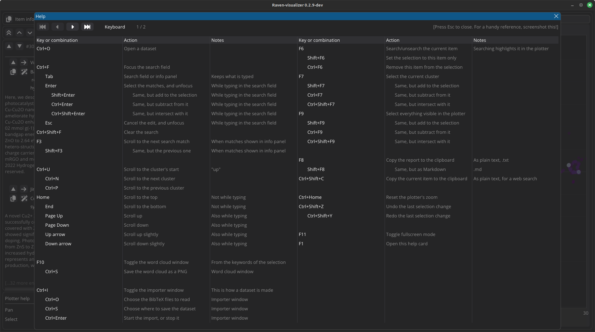
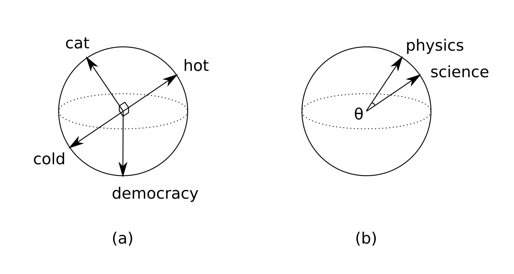
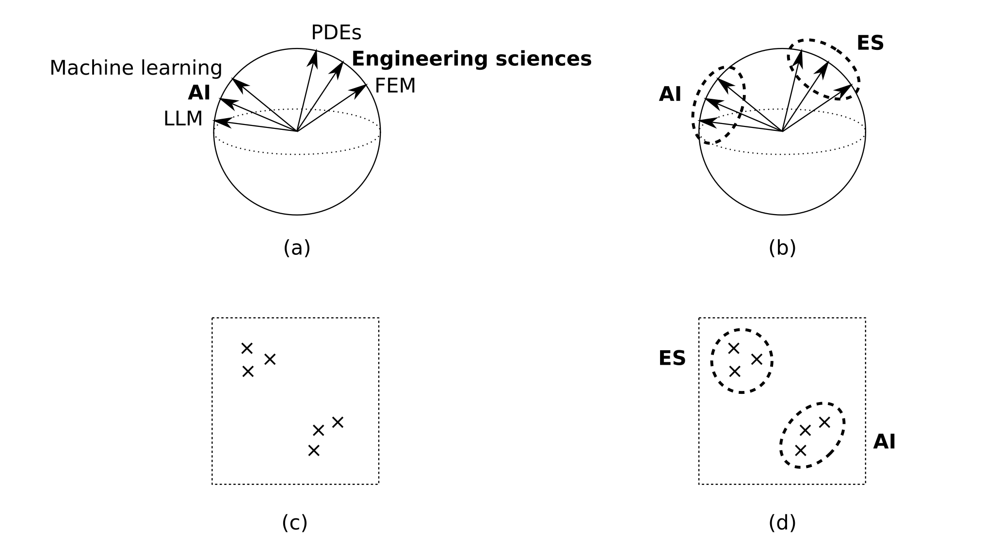
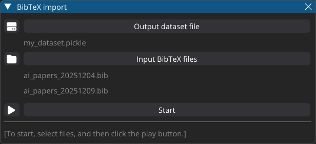
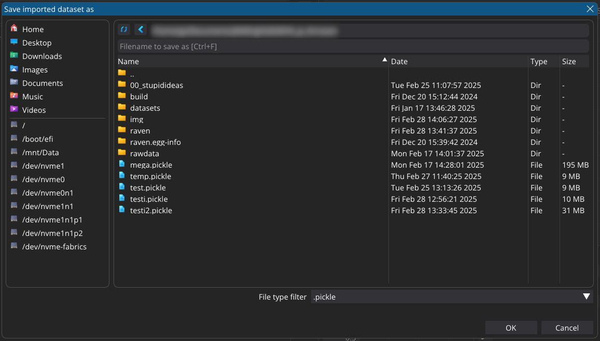
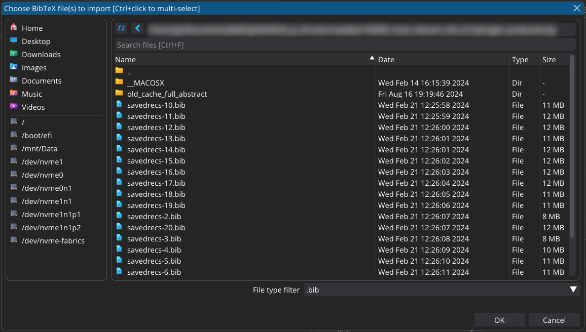
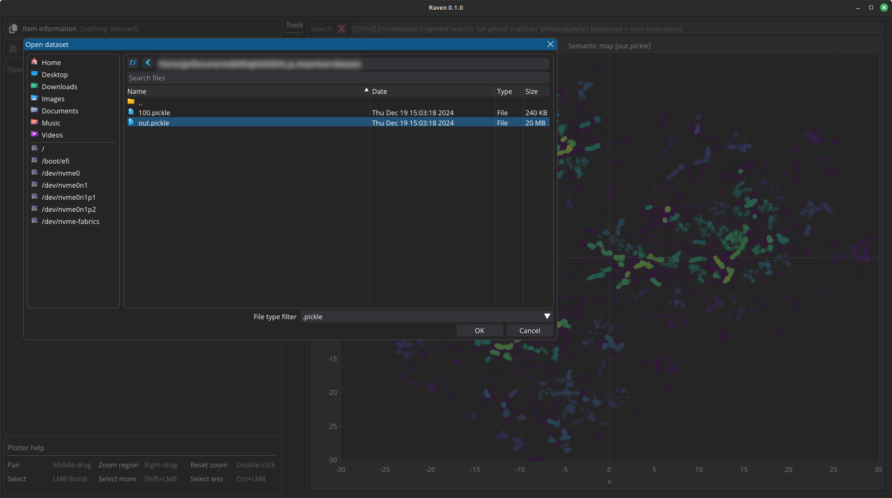

<p align="center">
 <br/>
</p>

-----

<p align="center">
 <br/>
<i>12 000 studies on a semantic map. Items matching your search terms are highlighted as you type.</i>
</p>

<!-- markdown-toc start - Don't edit this section. Run M-x markdown-toc-refresh-toc -->
**Table of Contents**

- [Introduction](#introduction)
- [Import](#import)
    - [What the semantic map is](#what-the-semantic-map-is)
    - [In the GUI](#in-the-gui)
        - [Save imported dataset as](#save-imported-dataset-as)
        - [Select input BibTeX files](#select-input-bibtex-files)
        - [Start the import](#start-the-import)
    - [From the command line](#from-the-command-line)
    - [Good to know](#good-to-know)
    - [Importing from other formats](#importing-from-other-formats)
        - [arXiv](#arxiv)
            - [Converting a list of arXiv IDs into a BibTeX file](#converting-a-list-of-arxiv-ids-into-a-bibtex-file)
            - [Extracting arXiv IDs from PDF filenames](#extracting-arxiv-ids-from-pdf-filenames)
            - [Auto-downloading arXiv fulltexts by IDs](#auto-downloading-arxiv-fulltexts-by-ids)
        - [WOS (Web of Science)](#wos-web-of-science)
        - [PDF (human-readable abstracts)](#pdf-human-readable-abstracts)
- [Visualize](#visualize)
    - [Load a dataset file in the GUI](#load-a-dataset-file-in-the-gui)
    - [Load a dataset file from the command line, when starting the app](#load-a-dataset-file-from-the-command-line-when-starting-the-app)
    - [Create a word cloud](#create-a-word-cloud)
        - [Save the word cloud as PNG](#save-the-word-cloud-as-png)
- [Limitations](#limitations)
- [Other similar tools](#other-similar-tools)

<!-- markdown-toc end -->

# Introduction

**Raven-visualizer** is an easy-to-use research literature visualization tool, powered by AI and [NLP](https://en.wikipedia.org/wiki/Natural_language_processing). It is intended to help a scholar or subject matter expert to stay up to date as well as to learn new topics, by helping to narrow down which texts from a large dataset form the most important background for a given topic or problem.

- **Graphical user interface** (GUI). Easy to use.
- **Fully local**. Your data never leaves your workstation/laptop.
- **Usability-focused**. Modern animated GUI with immediate visual feedback on user actions. Most functions accessible from keyboard.
- **Semantic clustering**. Discover **vertically**: See how a field of science splits into topic groups. Explore similar papers.
- **Fragment search**. Discover **horizontally**: E.g. find studies (across all topics) where some particular method has been used.
- **Info panel**. Read the abstracts (if available) of the studies you discover, right there in the GUI.
- **Open source**. 2-clause BSD license.

*Fragment search* means that e.g. *"cat photo"* matches *"photocatalytic"*. This is the same kind of search provided by the Firefox address bar, or by the `helm-swoop` function in Emacs. Currently the search looks only in the title field of the data; this may change in the future.

**Raven is NOT a search engine.** Rather, for its input, it uses research literature metadata (title, authors, year, abstract) for thousands of papers, as returned by a search engine, and plots that data in an interactive semantic visualization.

*Raven-visualizer* is fully operational, and under active development.

The basic functionality is complete, the codebase should be in a semi-maintainable state, and most bugs have been squashed. If you find a bug that is not listed in [TODO.md](../../TODO.md), please [open an issue](https://github.com/Technologicat/raven/issues).

We still plan to add important features later, such as filtering by time range to help discover trends, and abstractive AI summaries of a user-selected subset of data (based on the author-provided abstracts).

We believe that at the end of 2024, AI- and NLP-powered literature filtering tools are very much in the zeitgeist, and that demand for them is only rising. Thus, we release the version we have right now as a useful tool in its own right, but also as an appetizer for future developments to come.

<p align="center">
 <br/>
<i>The help card. Most functions are accessible from the keyboard.</i>
</p>

# Import

Raven uses the following workflow:

```
+-------+              +--------+             +---------+
|  any  | --convert--> | BibTeX | --import--> | dataset | --> interactive visualization
+-------+              +--------+             +---------+
```

where the `convert` step is optional; BibTeX, widely used in the engineering sciences, is considered the native input format of Raven.

The input does not strictly have to be research literature. Anything that can be defined to have `title`, `authors`, and `year` fields, and optionally an `abstract` field (where *abstract* is any kind of human-readable short text summary), can be used as input. That said, the titles are used for linguistic analysis, so having precise titles (as is common in scientific papers) is likely to produce a more accurate semantic map.

Note that even BibTeX data needs to be imported before it can be visualized.

The import step typically takes some time, so it is performed either offline (in the sense of a batch job) or in the background. All computationally expensive procedures, such as semantic embedding, clustering, keyword analysis, and training the dimension reduction for the dataset, are performed during import. Some of these, particularly the semantic embedding, support GPU acceleration.

The data is clustered automatically, and each cluster of data has its keywords automatically determined by an automated linguistic analysis. It is not possible to edit the clusters or keywords. If something is detected incorrectly, it is more in the spirit of Raven to improve the algorithms rather than hand-edit each dataset. Raven is intended to operate in an environment that has too much data, and where the data updates too quickly, for any kind of manual editing to be feasible at all.

The import step produces a **dataset file**, which can then be opened and explored in the GUI.

You can import BibTeX files into dataset files in Raven's GUI, as well as from the command line. How to do this is described in more detail below.

## What the semantic map is

The technology is roughly explained by the following figures.

<p align="center">
 <br/>
<i>The semantic embedding model is a pretrained AI component that transforms text into high-dimensional vectors (default: Snowflake/snowflake-arctic-embed-l, d = 1024). Normalization brings the vectors onto a d-1 dimensional hypersphere surface. Schematic illustrations shown in 3 dimensions. (a) A concept (here "hot") and its opposite ("cold") map to opposite directions. Other, unrelated concepts ("cat", "democracy") map to orthogonal directions. (b) Concepts that are semantically near each other (e.g. "physics" is a field of "science") map in directions near to each other. For any chosen pair of concepts, semantic similarity can be measured via the <a href="https://en.wikipedia.org/wiki/Cosine_similarity">cosine similarity</a> of the embedding vectors.</i>
</p>

<p align="center">
 <br/>
<i>Raven-visualizer's data processing pipeline. (a) Semantic embedding onto the high-dimensional hypersphere. (b) <a href="https://scikit-learn.org/stable/modules/generated/sklearn.cluster.HDBSCAN.html">HDBSCAN</a> in the high-dimensional space detects initial clusters. (c) The initial clusters are dimension-reduced into 2D via fitting a <a href="https://en.wikipedia.org/wiki/T-distributed_stochastic_neighbor_embedding">t-SNE</a> model. Then the full dataset is mapped through the fitted model. (d) HDBSCAN in 2D produces the final clusters, shown on the <b>semantic map</b> in Raven-visualizer.</i>
</p>

## In the GUI

To import one or more BibTeX databases into a dataset file, click on the *Import BibTeX files* button, or press Ctrl+I. Doing so opens the following **BibTeX import window**:

<p align="center">
 <br/>
<i>The importer. This functionality converts BibTeX files into a Raven dataset.</i>
</p>

Importing several *input BibTeX files* at once combines the data from all of them into the same *output dataset file*.

Note this window is **not** modal, so you can continue working with the app while the window is open, and pressing Esc will not close it.

Pressing the Ctrl+I hotkey again closes the window.

### Save imported dataset as

Click on the hard disk icon (next to the heading "*Output dataset file*") in the *BibTeX import window*, or press Ctrl+S while the *BibTeX import window* is open. A **save-as dialog** opens:

<p align="center">
 <br/>
<i>The save-as dialog for selecting a filename for the dataset to be created.</i>
</p>

Double-clicking a directory in the list goes into that directory. Double-clicking the ".." directory goes one level up.

The buttons at the top of the dialog refresh the view of the current directory, and jump back to the default directory, respectively.

The list can be sorted by clicking on the column headers. The date shown is the mtime (modification time).

The save-as filename field can be focused by pressing Ctrl+F. The field doubles as a search filter, so you can see what existing files in the current directory have names similar to the one you are saving.

The file extension (`.pickle`) is added automatically to the filename you specify. In future versions of Raven, the file extension will likely change, once we move to a more portable data format.

You can also pre-populate the filename by clicking a file in the list. This can be useful if you want to overwrite a file, or if you are saving a series of related files (`dataset1.pickle`, `dataset2.pickle`, ...).

If a file would be overwritten, the OK button flashes red, and the dialog asks to press it again (before the flash ends) to confirm.

Pressing Enter is the same as clicking the OK button. To overwrite a file, press Enter again (before the flash ends).

Pressing Esc cancels the save-as dialog.

**:exclamation: Navigating directories in the save-as dialog currently requires using the mouse. This is a known issue. :exclamation:**

### Select input BibTeX files

To select input files, click the folder icon (next to the heading "*Input BibTeX files*"), or press Ctrl+O while the *BibTeX import window* is open. A **file picker dialog** opens:

<p align="center">
 <br/>
<i>The file picker for input BibTeX files.</i>
</p>

The file picker works similarly to the save-as dialog, but with a **Search files** field replacing the save-as filename field.

You can focus the *Search files* field by pressing Ctrl+F. The search filters the view live, as you type. All files matching the current search can be accepted by pressing Enter, or by clicking the OK button.

So for example, in the situation shown in the screenshot, to open `savedrecs-3.bib`, you can press Ctrl+F, type "-3" (so that only this one file matches the search filter), and press Enter.

On the other hand, if you want to accept *all* files whose name contains `savedrecs`, you can press Ctrl+F, type "savedrecs", and press Enter.

You can also hold down Ctrl and click files in the list to select multiple input files.

Accept the selection (whether one or more files) by clicking OK, or by pressing Enter. Accepting multiple files will import them all into the same dataset.

If you need just one input file, you can also double-click the file in the list to accept that one file.

Pressing Esc cancels the file picker.

**:exclamation: With the exception of the search functionality, the file picker currently requires using the mouse. This is a known issue. :exclamation:**

### Start the import

To start the import, click the play icon in the *BibTeX import window*, or press Ctrl+Enter while the *BibTeX import window* is open. A progress bar will appear. While the import is running, a brief status message at the bottom of the *BibTeX import window* will indicate what the importer is currently doing. More detailed status is printed into the terminal window from which you started Raven.

The import process runs in the background, so you can continue working while your new dataset is being imported.

**:exclamation: Some tools used internally by the importer have no way to report on their ongoing progress. It is normal for the progress bar to seem stuck for several minutes, particularly while the importer is training or applying the dimension reduction. :exclamation:**

**:exclamation: The BibTeX import process may take a very long time, from several minutes to hours, and how the importer has been configured in [`raven.visualizer.config`](config.py). :exclamation:**

## From the command line

You can also run BibTeX imports without opening the Raven GUI (e.g. on a headless server). Raven provides a command-line tool for this task. It uses the exact same mechanism as the GUI importer; only the user interface is different.

To import one or more BibTeX files into a dataset file named `mydata.pickle`:

```bash
$(pdm venv activate)
raven-importer mydata.pickle file1.bib file2.bib ...
```

Status messages are printed into the terminal window.

**:exclamation: The BibTeX import process may take a very long time, from several minutes to hours, depending on how much data you have, and how the importer has been configured in [`raven.visualizer.config`](config.py). :exclamation:**

## What the importer does to your records

A database export is not tidy, and the importer makes a few decisions about it on the way in. They are worth
knowing because they change what you see in the word cloud and in the info panel.

**An incomplete record is imported, not dropped.** A missing title, author or year becomes
`[Title not specified]`, `[Author not specified]` or `[Year not specified]`, and the import log names every
one. Whole conference proceedings arrive without authors, and losing those records would lose the abstracts
that were the part worth reading.

- **The placeholders are shown, never analyzed.** They are Raven's words rather than the record's, and the
  same words on every such record — so feeding them to the keyword extractor and the semantic vector would
  gather those records into a cluster whose members share nothing but a field their database omitted. Both
  stages read the abstract alone instead. (Authors and year never reached those stages anyway.)
- **A record with neither a title nor an abstract is skipped**, with a warning naming it: there is nothing
  to read.
- **A re-export writes the record's own author field back out**, or nothing where it had none — never the
  placeholder, which would put Raven's words into somebody's bibliography as though a database had said
  them.

**Keywords count nouns and proper nouns, and leave the verbs out.** A topic keyword is nearly always a noun,
while the verbs of academic prose — *provide*, *improve*, *develop*, *investigate*, *propose* — describe what
a paper *does*, are the same in every field, and crowd the head of the frequency list without saying
anything. This is also why *learning* and *learn* are counted separately, and should be: as a noun it is the
topic, as a verb it is prose. Affects the word cloud, the per-entry keywords and the frequency-based cluster
keywords, for datasets imported from now on. `nlptools.count_frequencies` takes `accepted_pos=None` for the
older, wider behaviour.

**A publisher's rights notice is stripped off an abstract.** `© 2022 IEEE.` and *This article is distributed
under the terms of the Creative Commons Attribution 4.0 License* stop being treated as part of what a paper
says — which is where publisher names in your word cloud were coming from.

- **A paper *about* copyright keeps every word**, which is the hard case: the phrases a notice is built from
  are also things an abstract on open licensing says. So the copyright sign is trusted on sight, while
  wording that is ordinary English (*All rights reserved*, *copyright held by*, a licence-grant clause)
  counts only where it *opens* a sentence — which is what appended boilerplate does and a clause inside an
  argument does not. A bare *copyright* is never a match, and only the tail of an abstract is examined.
- `publisher_stopwords` in [`raven.visualizer.config`](config.py) still exists and still works; it now has
  much less to do.

**LLM cluster keywords are made comparable across clusters**, if you have set `clusters_keyword_method =
"llm"`. Each cluster is keyworded on its own, so one concept can come back under several spellings — an
acronym in one cluster, its expansion in another — and two clusters sharing a topic then look as if they do
not. A second pass over the whole vocabulary folds the variants together once every cluster has been seen.

- **The model is asked for a mapping, not for a rewritten list, so the result can be checked.** A
  replacement is applied only when it is itself one of the keywords the first pass extracted, so an invented
  or rephrased term cannot reach the dataset — it is dropped instead of trusted.
- The prompt is `clusters_llm_keyword_canonicalization_prompt`, and the log names every replacement applied.
  Word clouds and cluster labels read the same list, so both benefit.

## Good to know

The BibTeX importer caches its intermediate data per input file, so you can include e.g. `file1.bib` into multiple different dataset files, and the expensive computations specific to `file1.bib` will only happen once, unless `file1.bib` itself changes. The caching mechanism checks the timestamps; when e.g. `file1.bib` is processed, computations are re-done if `file1.bib` has changed after the cache was last updated.

Currently, the dimension reduction that produces the 2D semantic map is trained using up to 10k data items, picked at random if the input data contains more.

Currently, it is not possible to add new data into an existing Raven-visualizer dataset (to overlay new data on an existing, already trained dimension reduction). This is currently a major usability drawback, particularly for the use case of following ongoing research trends, so this will likely change in the future.


## Importing from other formats

First convert your data into BibTeX format, then import the BibTeX data into a dataset as explained above.

Available converters are described in more detail below.

We plan to add more converters in the future.


### arXiv

Useful especially for AI/CS topics.

**:exclamation: Raven is third-party software, NOT affiliated with arXiv. The relevant command-line tools have `arxiv` in the command name only for discoverability reasons. :exclamation:**

#### Converting a list of arXiv IDs into a BibTeX file

We provide `raven-arxiv2bib`, which pulls the metadata from arXiv and writes a BibTeX file. For a short help message, run `raven-arxiv2bib -h`.

Usage:

```bash
$(pdm venv activate)
raven-arxiv2bib arxiv_ids.txt -o arxiv_papers.bib
```

where `arxiv_ids.txt` is a text file containing arXiv identifiers, one per line. Identifiers can also be given directly as arguments, or piped in on stdin.

This gives you a BibTeX bibliography (`arxiv_papers.bib`) that can be imported into *Raven-visualizer*.

Identifiers are sent in batches, so a list of hundreds costs a handful of requests rather than one per paper, and the three seconds arXiv asks between requests is paid once per batch. Identifiers arXiv returns nothing for are reported at the end rather than aborting the run.

The version arXiv answered with is recorded, whether or not you asked for one: request the bare `2410.07866` — which means "whatever is current" — and the entry says `2410.07866v5`. So the bibliography states which revision it describes. Pass `--strip-versions` if you want a bibliography for *citing* papers rather than for tracking a collection.

**Earlier versions of this document recommended the external `arxiv2bib` package** and described a workaround for an HTTP 414 (URI too long) error it hit on long identifier lists. Neither is needed now: `raven-arxiv2bib` replaces it, is rate-limited like Raven's other arXiv tools, and batches its requests so the 414 cannot arise. If you installed the external tool on this advice, it is no longer a Raven dependency.

#### Extracting arXiv IDs from PDF filenames

In case you have a directory full of PDFs downloaded from arXiv, with the identifier somewhere in the filename, we provide `raven-arxiv2id`, which extracts arXiv identifiers from filenames.

Only unique identifiers will be returned; where several versions of the same paper are present, only the newest is kept. For a short help message, run `raven-arxiv2id -h`.

Usage:

```bash
$(pdm venv activate)
raven-arxiv2id >arxiv_ids.txt  # run this in a directory that has arXiv PDF files
```

Then pipe that into `raven-arxiv2bib`, in one command or two:

```bash
raven-arxiv2id -i ~/papers | raven-arxiv2bib -o arxiv_papers.bib
```

and import the resulting `.bib` file into *Raven-visualizer*.

##### Refreshing a collection when papers get new versions

Preprints get revised, sometimes years later, and a collection assembled over time drifts out of date without saying so. `--strip-versions` is what refreshes it:

```bash
raven-arxiv2id -i ~/papers --strip-versions > ids.txt
raven-arxiv-download -o ~/papers --save-bib arxiv_papers.bib $(cat ids.txt)
```

The mechanism is arXiv's own: an identifier *with* a version means that version, and one *without* means whatever is current. So dropping the suffix is exactly the request "give me the latest", and both tools honour it.

`--save-bib` writes the bibliography from metadata the download already fetched in order to name the files, so it costs no extra requests and no extra waiting — where running `raven-arxiv2bib` over the same identifiers afterwards would ask arXiv for all of it a second time. Papers already present in the output directory are included in the `.bib` too: it describes the set you asked for, not just the part that had changed.

Note that the old versions stay on disk, and that a refreshed paper's *filename* changes with its version — so if you have measured anything against this collection by filename, those references need regenerating alongside the refresh.

#### Auto-downloading arXiv fulltexts by IDs

If you have a list of arXiv identifiers and you want to download the corresponding fulltexts from arXiv, we provide `raven-arxiv-download`.

This tool takes a list of arXiv IDs on the command line, and downloads and names the corresponding PDFs automatically. For a short help message, run `raven-arxiv-download -h`.

If you have a file of arXiv IDs, one per line (as above), then to download the fulltexts:

```bash
xargs -a arxiv_ids.txt raven-arxiv-download
```

This will save the PDFs into the current working directory. Use the `-o some_output_dir` option to customize the output path (which can be relative or absolute).

If an ID specifies a version, that version of the paper is downloaded; otherwise the latest version is downloaded. Each unique PDF file is downloaded only once.

The PDF files are named automatically using the metadata from the arXiv API. Output filename format for papers with 1, 2, and ≥ 3 authors are:

```
Author (2024) - Paper Title - yymm.xxxxxvx.pdf
Author and Coauthor (2024) - Another Paper Title - yymm.xxxxxvx.pdf
Author and Coauthor et al. (2024, revised 2025) - Yet Another Paper Title - yymm.xxxxxvx.pdf
```

In the filename, *yymm.xxxxxvx* is the arXiv ID, including the version. In old-format (pre-2007) IDs (e.g. `cond-mat/0207270`, `math/0501001v2`), in the filename, the "/" is replaced by "_".

The version included in the filename is always automatically determined from the API metadata, regardless of whether a version was specified for that paper on the command line.


### WOS (Web of Science)

Useful for the engineering sciences. Export plain text from Web of Science, convert it with `raven-wos2bib`, and import the resulting `.bib` here.

See [`raven-wos2bib`](../papers/README.md#raven-wos2bib--web-of-science) in the paper tools manual for how to run it and what it maps.


### PDF (human-readable abstracts)

Abstract submissions to scientific conferences sometimes arrive as free-form, human-readable PDF files. If you are a conference organizer who would like to semantically visualize the set of abstracts sent to you, `raven-pdf2bib` converts them into BibTeX you can import here. It needs an LLM.

**See [`raven-pdf2bib`](../papers/README.md#raven-pdf2bib--conference-abstracts-as-pdfs) in the paper tools manual** for what it expects of a PDF, how to run a directory of them, how it works, why flagged entries are worth checking, and which model to use.


# Visualize

First, if the `raven-visualizer` app is not yet running, start it:

```bash
$(pdm venv activate)  # see Installation below
raven-visualizer
```

**:exclamation: For details on how to use the app (including a list of hotkeys), see the built-in Help card. To show the help, click the "?" button in the toolbar, or press F1. :exclamation:**

## Load a dataset file in the GUI

To load your dataset file, click on the *Open dataset* button in the toolbar, or press Ctrl+O, thus bringing up this dialog:

<p align="center">
 <br/>
<i>Opening an imported dataset for visualization.</i>
</p>

The *Open dataset* dialog is a file picker, which works similarly to the file picker in the *BibTeX import window*.

The only difference is that here multi-select mode is not available, because only one dataset can be opened at a time. Thus, Ctrl+click is not available.

If you use the search feature (Ctrl+F) to open a file by typing a part of its name, and the search has exactly one match in the current directory (i.e. when only one file is shown in the list, not counting the ".."), that file can then be opened by pressing Enter.

**:exclamation: With the exception of the search functionality, the file picker currently requires using the mouse. This is a known issue. :exclamation:**

## Load a dataset file from the command line, when starting the app

Like many GUI apps, Raven also accepts a dataset file from the command line, when the app starts:

```bash
raven-visualizer mydata.pickle
```


## Create a word cloud

Raven can make a word cloud from the auto-detected per-entry keywords of the individual studies in the current selection. The size of each word in the picture represents its relative number of occurrences within the selection:

<p align="center">
 <br/>
<i>Word cloud window.</i>
</p>

The word cloud window hotkey (F10) toggles the window. Note this window is **not** modal, so you can continue working with the app while the window is open, and pressing Esc will not close it.

If the word cloud window is open, it updates automatically whenever the selection changes. Just like in the info panel, the old content remains in the window until the new rendering finishes.

When the word cloud window is opened, Raven checks whether the selection has changed since the last word cloud was rendered. If there are no changes, the latest already rendered word cloud is re-shown.

The rendering algorithm allocates regions and colors randomly, so even re-rendering with the same data (e.g. in another session later), you will get a different-looking result each time.

The word cloud renderer is Python-based, so it can be rather slow for large selections containing very many data points. The render runs in the background, so you can continue working (as long as you don't change the selection) while the word cloud is being rendered.

### Save the word cloud as PNG

Click the "hard disk" button, or press Ctrl+S while the *word cloud window* is open. A *save-as dialog* opens, offering to save the word cloud image as PNG.

This dialog works similarly to the dataset save-as dialog in the *BibTeX import window*.

The file extension (`.png`) is added automatically to the filename you specify.


## Keyboard reference

Every hotkey in one place. What each one *does* is explained in the sections above and on the built-in help
card (**F1**); this says what exists, and **when each key is live**, which is the part that is hard to work
out by trying things.

Two terms the table leans on. The **current item** is the topmost entry *fully* visible in the info panel,
marked with a pulsating blue dot — most of the per-item keys act on it. The **selection** is the set of
entries you have gathered, which the plotter highlights. Several keys offer the usual set operations on it,
and the modifier is the same every time: bare replaces the selection, Shift adds to it, Ctrl subtracts from
it, and Ctrl+Shift intersects with it. The tables below spell each combination out.

### Always live

| Key | Action |
|---|---|
| `F1` | Help card |
| `F11` | Toggle fullscreen |

### Datasets and search

| Key | Action |
|---|---|
| `Ctrl+O` | Open a dataset |
| `Ctrl+I` | Import BibTeX files — this is how a dataset is made |
| `Ctrl+F` | Put the caret in the search field |
| `Ctrl+Shift+F` | Clear the search — works whether or not you are typing in the field |
| `Enter` | Select the search matches and leave the field |
| `Shift+Enter` / `Ctrl+Enter` / `Ctrl+Shift+Enter` | ...adding to / subtracting from / intersecting with the selection |
| `Esc` | Cancel the edit and leave the field |
| `Tab` / `Shift+Tab` | Move the keyboard between the search field and the info panel, keeping what is typed |
| `F3` / `Shift+F3` | Scroll to the next / previous search match |

### Moving around the info panel

`Home` and `End` are live whenever the search field does not hold the caret, since the field uses them itself.
The rest work while typing too — the paging keys and the vertical arrows included, so the results of a search
can be read down without leaving the field.

| Key | Action |
|---|---|
| `Home` / `End` | Top / bottom |
| `Page Up` / `Page Down` | Page up / down |
| `Up arrow` / `Down arrow` | Scroll a little |
| `Ctrl+U` | To the start of the current cluster ("up") |
| `Ctrl+N` / `Ctrl+P` | To the next / previous cluster |
| `Ctrl+Home` | Reset the plotter's zoom |

### The current item, and the selection

| Key | Action |
|---|---|
| `F6` | Search for the current item, which highlights it in the plotter — `Shift+F6` selects only it, `Ctrl+F6` removes it from the selection |
| `F7` | Select the current cluster |
| `Shift+F7` / `Ctrl+F7` / `Ctrl+Shift+F7` | ...adding to / subtracting from / intersecting with the selection |
| `F9` | Select everything currently visible in the plotter |
| `Shift+F9` / `Ctrl+F9` / `Ctrl+Shift+F9` | ...adding to / subtracting from / intersecting with the selection |
| `Ctrl+Shift+C` | Copy the current item to the clipboard, as plain text for a web search |
| `Ctrl+Shift+Z` / `Ctrl+Shift+Y` | Undo / redo the last selection change |
| `F8` | Copy the report to the clipboard as plain text — `Shift+F8` for Markdown |
| `F10` | Toggle the word cloud window, built from the keywords of the selected items |

### Word cloud window

Live only while that window is open, which is what leaves `Ctrl+S` free everywhere else.

| Key | Action |
|---|---|
| `Ctrl+S` | Save the word cloud as a PNG |

### BibTeX importer window

Likewise live only while the importer window is open.

| Key | Action |
|---|---|
| `Ctrl+O` | Choose the input BibTeX files |
| `Ctrl+S` | Choose where to save the dataset |
| `Ctrl+Enter` | Start the import, or stop one in progress |

### Hidden debug keys

`Ctrl+Shift+` **M**, **R**, **T**, **L** — DPG's metrics window, item registry, font manager and style
editor. Mnemonic: *Mr. T Lite*.


# Limitations

- Scalability? Beta version tested up to 12k entries, but datasets can be 100k entries in size.
- Hardware requirements, especially GPU. Tested on a laptop with an NVIDIA RTX 3070 Ti mobile, 8 GB VRAM.
- Clustering in high-dimensional spaces is an open problem in data science. Semantic vectors have upwards of 1k dimensions. This causes many entries to be placed into a catch-all "*Misc*" cluster.
- Hyperparameters of the clustering algorithm in the BibTeX importer may be dataset-dependent, but are not yet configurable. This will change in the future.
- Dataset files are currently **not** portable across different Python versions.
- We attempt to provide keyboard access to GUI features whenever reasonably possible, but the plotter is currently one place where this is not reasonably possible. The *Open dataset* dialog is fully keyboard-operable: arrow keys walk the listing, Enter descends or picks, Tab completes the filename, and there are chords for sorting, filtering, the places panel and the path field. Press F1 inside it for the full list.
- As explained in the main README, configuration is currently fed in as a Python module, [`raven.visualizer.config`](config.py), which exists specifically as a configuration file.


# Other similar tools

[LitStudy](https://nlesc.github.io/litstudy/) is a Jupyter notebook with similar goals. Its analysis methods seem slightly different to what we use. Also, having existed since 2022, it has many more importers than we do at the moment.

[BERTopic](https://maartengr.github.io/BERTopic/index.html) is a library for *topic modeling*, to automatically extract topics from a large dataset of texts. BERTopic uses many of the same ideas and methods that *Raven-visualizer* uses to generate its semantic map (embed semantically, cluster with HDBSCAN, reduce the dimension), although our approach to keyword extraction for the clusters is different. Raven was developed independently, before I became aware of BERTopic. While the library has existed since 2022, for some reason it didn't come up in my initial searches at the beginning of the Raven project. As of H2/2025, BERTopic has become very popular, and has been mentioned several times in various technically flavored AI news outlets. It seems that as of 2025, this kind of overview analysis of large text datasets is in the zeitgeist.
