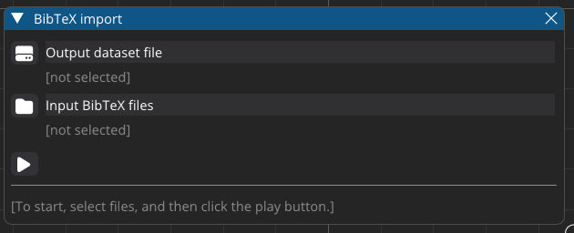
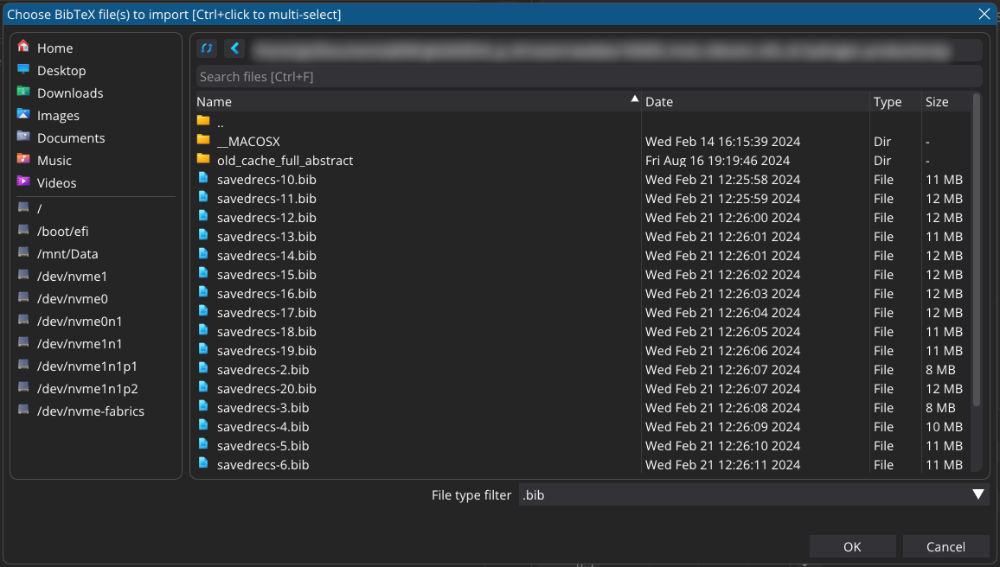

<p align="center">
 <br/>
</p>

-----

<p align="center">
 <br/>
<i>12 000 studies on a semantic map. Items matching your search terms are highlighted as you type.</i>
</p>

<!-- markdown-toc start - Don't edit this section. Run M-x markdown-toc-refresh-toc -->
**Table of Contents**

- [Introduction](#introduction)
- [Import](#import)
    - [What the semantic map is](#what-the-semantic-map-is)
    - [In the GUI](#in-the-gui)
        - [Save imported dataset as](#save-imported-dataset-as)
        - [Select input BibTeX files](#select-input-bibtex-files)
        - [Start the import](#start-the-import)
    - [From the command line](#from-the-command-line)
    - [Good to know](#good-to-know)
    - [Importing from other formats](#importing-from-other-formats)
        - [arXiv](#arxiv)
            - [Converting a list of arXiv IDs into a BibTeX file](#converting-a-list-of-arxiv-ids-into-a-bibtex-file)
            - [Extracting arXiv IDs from PDF filenames](#extracting-arxiv-ids-from-pdf-filenames)
            - [Auto-downloading arXiv fulltexts by IDs](#auto-downloading-arxiv-fulltexts-by-ids)
        - [WOS (Web of Science)](#wos-web-of-science)
        - [PDF (human-readable abstracts)](#pdf-human-readable-abstracts)
            - [How the PDF converter works](#how-the-pdf-converter-works)
            - [LLM requirements for the PDF converter](#llm-requirements-for-the-pdf-converter)
- [Visualize](#visualize)
    - [Load a dataset file in the GUI](#load-a-dataset-file-in-the-gui)
    - [Load a dataset file from the command line, when starting the app](#load-a-dataset-file-from-the-command-line-when-starting-the-app)
    - [Create a word cloud](#create-a-word-cloud)
        - [Save the word cloud as PNG](#save-the-word-cloud-as-png)
- [Limitations](#limitations)
- [Other similar tools](#other-similar-tools)

<!-- markdown-toc end -->

# Introduction

**Raven-visualizer** is an easy-to-use research literature visualization tool, powered by AI and [NLP](https://en.wikipedia.org/wiki/Natural_language_processing). It is intended to help a scholar or subject matter expert to stay up to date as well as to learn new topics, by helping to narrow down which texts from a large dataset form the most important background for a given topic or problem.

- **Graphical user interface** (GUI). Easy to use.
- **Fully local**. Your data never leaves your workstation/laptop.
- **Usability-focused**. Modern animated GUI with immediate visual feedback on user actions. Most functions accessible from keyboard.
- **Semantic clustering**. Discover **vertically**: See how a field of science splits into topic groups. Explore similar papers.
- **Fragment search**. Discover **horizontally**: E.g. find studies (across all topics) where some particular method has been used.
- **Info panel**. Read the abstracts (if available) of the studies you discover, right there in the GUI.
- **Open source**. 2-clause BSD license.

*Fragment search* means that e.g. *"cat photo"* matches *"photocatalytic"*. This is the same kind of search provided by the Firefox address bar, or by the `helm-swoop` function in Emacs. Currently the search looks only in the title field of the data; this may change in the future.

**Raven is NOT a search engine.** Rather, for its input, it uses research literature metadata (title, authors, year, abstract) for thousands of papers, as returned by a search engine, and plots that data in an interactive semantic visualization.

**:exclamation: *Raven-visualizer* is currently in beta. :exclamation:**

The basic functionality is complete, the codebase should be in a semi-maintainable state, and most bugs have been squashed. If you find a bug that is not listed in [TODO.md](../../TODO.md), please [open an issue](https://github.com/Technologicat/raven/issues).

We still plan to add important features later, such as filtering by time range to help discover trends, and abstractive AI summaries of a user-selected subset of data (based on the author-provided abstracts).

We believe that at the end of 2024, AI- and NLP-powered literature filtering tools are very much in the zeitgeist, and that demand for them is only rising. Thus, we release the version we have right now as a useful tool in its own right, but also as an appetizer for future developments to come.

<p align="center">
 <br/>
<i>The help card. Most functions are accessible from the keyboard.</i>
</p>

# Import

Raven uses the following workflow:

```
+-------+              +--------+             +---------+
|  any  | --convert--> | BibTeX | --import--> | dataset | --> interactive visualization
+-------+              +--------+             +---------+
```

where the `convert` step is optional; BibTeX, widely used in the engineering sciences, is considered the native input format of Raven.

The input does not strictly have to be research literature. Anything that can be defined to have `title`, `authors`, and `year` fields, and optionally an `abstract` field (where *abstract* is any kind of human-readable short text summary), can be used as input. That said, the titles are used for linguistic analysis, so having precise titles (as is common in scientific papers) is likely to produce a more accurate semantic map.

Note that even BibTeX data needs to be imported before it can be visualized.

The import step typically takes some time, so it is performed either offline (in the sense of a batch job) or in the background. All computationally expensive procedures, such as semantic embedding, clustering, keyword analysis, and training the dimension reduction for the dataset, are performed during import. Some of these, particularly the semantic embedding, support GPU acceleration.

The data is clustered automatically, and each cluster of data has its keywords automatically determined by an automated linguistic analysis. It is not possible to edit the clusters or keywords. If something is detected incorrectly, it is more in the spirit of Raven to improve the algorithms rather than hand-edit each dataset. Raven is intended to operate in an environment that has too much data, and where the data updates too quickly, for any kind of manual editing to be feasible at all.

The import step produces a **dataset file**, which can then be opened and explored in the GUI.

You can import BibTeX files into dataset files in Raven's GUI, as well as from the command line. How to do this is described in more detail below.

## What the semantic map is

The technology is roughly explained by the following figures.

<p align="center">
 <br/>
<i>The semantic embedding model is a pretrained AI component that transforms text into high-dimensional vectors (default: Snowflake/snowflake-arctic-embed-l, d = 1024). Normalization brings the vectors onto a d-1 dimensional hypersphere surface. Schematic illustrations shown in 3 dimensions. (a) A concept (here "hot") and its opposite ("cold") map to opposite directions. Other, unrelated concepts ("cat", "democracy") map to orthogonal directions. (b) Concepts that are semantically near each other (e.g. "physics" is a field of "science") map in directions near to each other. For any chosen pair of concepts, semantic similarity can be measured via the <a href="https://en.wikipedia.org/wiki/Cosine_similarity">cosine similarity</a> of the embedding vectors.</i>
</p>

<p align="center">
 <br/>
<i>Raven-visualizer's data processing pipeline. (a) Semantic embedding onto the high-dimensional hypersphere. (b) <a href="https://scikit-learn.org/stable/modules/generated/sklearn.cluster.HDBSCAN.html">HDBSCAN</a> in the high-dimensional space detects initial clusters. (c) The initial clusters are dimension-reduced into 2D via fitting a <a href="https://en.wikipedia.org/wiki/T-distributed_stochastic_neighbor_embedding">t-SNE</a> model. Then the full dataset is mapped through the fitted model. (d) HDBSCAN in 2D produces the final clusters, shown on the <b>semantic map</b> in Raven-visualizer.</i>
</p>

## In the GUI

To import one or more BibTeX databases into a dataset file, click on the *Import BibTeX files* button, or press Ctrl+I. Doing so opens the following **BibTeX import window**:

<p align="center">
 <br/>
<i>The importer. This functionality converts BibTeX files into a Raven dataset.</i>
</p>

Importing several *input BibTeX files* at once combines the data from all of them into the same *output dataset file*.

Note this window is **not** modal, so you can continue working with the app while the window is open, and pressing Esc will not close it.

Pressing the Ctrl+I hotkey again closes the window.

### Save imported dataset as

Click on the hard disk icon (next to the heading "*Output dataset file*") in the *BibTeX import window*, or press Ctrl+S while the *BibTeX import window* is open. A **save-as dialog** opens:

<p align="center">
 <br/>
<i>The save-as dialog for selecting a filename for the dataset to be created.</i>
</p>

Double-clicking a directory in the list goes into that directory. Double-clicking the ".." directory goes one level up.

The buttons at the top of the dialog refresh the view of the current directory, and jump back to the default directory, respectively.

The list can be sorted by clicking on the column headers. The date shown is the mtime (modification time).

The save-as filename field can be focused by pressing Ctrl+F. The field doubles as a search filter, so you can see what existing files in the current directory have names similar to the one you are saving.

The file extension (`.pickle`) is added automatically to the filename you specify. In future versions of Raven, the file extension will likely change, once we move to a more portable data format.

You can also pre-populate the filename by clicking a file in the list. This can be useful if you want to overwrite a file, or if you are saving a series of related files (`dataset1.pickle`, `dataset2.pickle`, ...).

If a file would be overwritten, the OK button flashes red, and the dialog asks to press it again (before the flash ends) to confirm.

Pressing Enter is the same as clicking the OK button. To overwrite a file, press Enter again (before the flash ends).

Pressing Esc cancels the save-as dialog.

**:exclamation: Navigating directories in the save-as dialog currently requires using the mouse. This is a known issue. :exclamation:**

### Select input BibTeX files

To select input files, click the folder icon (next to the heading "*Input BibTeX files*"), or press Ctrl+O while the *BibTeX import window* is open. A **file picker dialog** opens:

<p align="center">
 <br/>
<i>The file picker for input BibTeX files.</i>
</p>

The file picker works similarly to the save-as dialog, but with a **Search files** field replacing the save-as filename field.

You can focus the *Search files* field by pressing Ctrl+F. The search filters the view live, as you type. All files matching the current search can be accepted by pressing Enter, or by clicking the OK button.

So for example, in the situation shown in the screenshot, to open `savedrecs-3.bib`, you can press Ctrl+F, type "-3" (so that only this one file matches the search filter), and press Enter.

On the other hand, if you want to accept *all* files whose name contains `savedrecs`, you can press Ctrl+F, type "savedrecs", and press Enter.

You can also hold down Ctrl and click files in the list to select multiple input files.

Accept the selection (whether one or more files) by clicking OK, or by pressing Enter. Accepting multiple files will import them all into the same dataset.

If you need just one input file, you can also double-click the file in the list to accept that one file.

Pressing Esc cancels the file picker.

**:exclamation: With the exception of the search functionality, the file picker currently requires using the mouse. This is a known issue. :exclamation:**

### Start the import

To start the import, click the play icon in the *BibTeX import window*, or press Ctrl+Enter while the *BibTeX import window* is open. A progress bar will appear. While the import is running, a brief status message at the bottom of the *BibTeX import window* will indicate what the importer is currently doing. More detailed status is printed into the terminal window from which you started Raven.

The import process runs in the background, so you can continue working while your new dataset is being imported.

**:exclamation: Some tools used internally by the importer have no way to report on their ongoing progress. It is normal for the progress bar to seem stuck for several minutes, particularly while the importer is training or applying the dimension reduction. :exclamation:**

**:exclamation: The BibTeX import process may take a very long time, from several minutes to hours, and how the importer has been configured in [`raven.visualizer.config`](config.py). :exclamation:**

## From the command line

You can also run BibTeX imports without opening the Raven GUI (e.g. on a headless server). Raven provides a command-line tool for this task. It uses the exact same mechanism as the GUI importer; only the user interface is different.

To import one or more BibTeX files into a dataset file named `mydata.pickle`:

```bash
$(pdm venv activate)
raven-importer mydata.pickle file1.bib file2.bib ...
```

Status messages are printed into the terminal window.

**:exclamation: The BibTeX import process may take a very long time, from several minutes to hours, depending on how much data you have, and how the importer has been configured in [`raven.visualizer.config`](config.py). :exclamation:**

## Good to know

The BibTeX importer caches its intermediate data per input file, so you can include e.g. `file1.bib` into multiple different dataset files, and the expensive computations specific to `file1.bib` will only happen once, unless `file1.bib` itself changes. The caching mechanism checks the timestamps; when e.g. `file1.bib` is processed, computations are re-done if `file1.bib` has changed after the cache was last updated.

Currently, the dimension reduction that produces the 2D semantic map is trained using up to 10k data items, picked at random if the input data contains more.

Currently, it is not possible to add new data into an existing Raven-visualizer dataset (to overlay new data on an existing, already trained dimension reduction). This is currently a major usability drawback, particularly for the use case of following ongoing research trends, so this will likely change in the future.


## Importing from other formats

First convert your data into BibTeX format, then import the BibTeX data into a dataset as explained above.

Available converters are described in more detail below.

We plan to add more converters in the future.


### arXiv

Useful especially for AI/CS topics.

**:exclamation: Raven is third-party software, NOT affiliated with arXiv. The relevant command-line tools have `arxiv` in the command name only for discoverability reasons. :exclamation:**

#### Converting a list of arXiv IDs into a BibTeX file

For this use case, Raven itself does not provide a tool; rather, we recommend the external tool [`arxiv2bib`](https://github.com/nathangrigg/arxiv2bib). It will pull the relevant metadata from arXiv, and write a BibTeX file.

Usage:

```bash
arxiv2bib <arxiv_ids.txt >arxiv_papers.bib
```

where `arxiv_ids.txt` is a text file containing arXiv identifiers, one per line.

This gives you a BibTeX bibliography (`arxiv_papers.bib`) that be imported into *Raven-visualizer*.

**:exclamation: If your list has hundreds of arXiv identifiers, `arxiv2bib` may fail with an HTTP 414 error (URI too long). :exclamation:**

The issue has been fixed in the `arxiv2bib` source code, but the updated package has not been released yet. In the meantime, it is preferred to install the tool from [the `arxiv2bib` GitHub repo](https://github.com/nathangrigg/arxiv2bib).

You can install it e.g. in the same venv as Raven:

```bash
$(pdm venv activate)
python -m pip install git+https://github.com/nathangrigg/arxiv2bib.git@master
```

Alternatively, if you want, you can install it into the same Python environment as PDM, so that using `arxiv2bib` does not require activating Raven's venv.

To do that, make sure that Raven's venv is **not** active, and then run the install command in your Python environment:

```bash
python -m pip install git+https://github.com/nathangrigg/arxiv2bib.git@master
```

#### Extracting arXiv IDs from PDF filenames

In case you have a directory full of PDFs downloaded from arXiv, with the identifier somewhere in the filename, we provide `raven-arxiv2id`, which extracts arXiv identifiers from filenames, in a format suitable for handing over to [`arxiv2bib`](https://github.com/nathangrigg/arxiv2bib).

Only unique identifiers will be returned. For a short help message, run `raven-arxiv2id -h`.

Usage:

```bash
$(pdm venv activate)
raven-arxiv2id >arxiv_ids.txt  # run this in a directory that has arXiv PDF files
```

Then you can proceed as above:

```bash
arxiv2bib <arxiv_ids.txt >arxiv_papers.bib
```

and import the resulting `.bib` file into *Raven-visualizer*.

#### Auto-downloading arXiv fulltexts by IDs

If you have a list of arXiv identifiers and you want to download the corresponding fulltexts from arXiv, we provide `raven-arxiv-download`.

This tool takes a list of arXiv IDs on the command line, and downloads and names the corresponding PDFs automatically. For a short help message, run `raven-arxiv-download -h`.

If you have a file of arXiv IDs, one per line (as above), then to download the fulltexts:

```bash
xargs -a arxiv_ids.txt raven-arxiv-download
```

This will save the PDFs into the current working directory. Use the `-o some_output_dir` option to customize the output path (which can be relative or absolute).

If an ID specifies a version, that version of the paper is downloaded; otherwise the latest version is downloaded. Each unique PDF file is downloaded only once.

The PDF files are named automatically using the metadata from the arXiv API. Output filename format for papers with 1, 2, and ≥ 3 authors are:

```
Author (2024) - Paper Title - yymm.xxxxxvx.pdf
Author and Coauthor (2024) - Another Paper Title - yymm.xxxxxvx.pdf
Author and Coauthor et al. (2024, revised 2025) - Yet Another Paper Title - yymm.xxxxxvx.pdf
```

In the filename, *yymm.xxxxxvx* is the arXiv ID, including the version. In old-format (pre-2007) IDs (e.g. `cond-mat/0207270`, `math/0501001v2`), in the filename, the "/" is replaced by "_".

The version included in the filename is always automatically determined from the API metadata, regardless of whether a version was specified for that paper on the command line.


### WOS (Web of Science)

Useful for the engineering sciences.

To convert WOS into BibTeX, see the `raven-wos2bib` command-line tool provided with Raven. Usage:

```bash
$(pdm venv activate)
raven-wos2bib input1.txt ... inputn.txt 1>output.bib 2>log.txt
```

where the input `.txt` files are WOS files exported from Web of Science.

In the example, the output is written to `output.bib`, and any log messages (such as warnings for broken input data) are written to `log.txt`.

You can then import the resulting `.bib` file into *Raven-visualizer*.


### PDF (human-readable abstracts)

Abstract submissions to scientific conferences sometimes arrive as free-form, human-readable PDF files.

So if you are a conference organizer, and would like to semantically visualize the set of abstracts sent to you, see the `raven-pdf2bib` command-line tool provided with Raven.

- The text content of the PDF is analyzed via an LLM (large language model).
- The PDF must have its text content readable by `pdftotext` (from `poppler-utils`).
- Each PDF should contain one abstract. Multiple abstracts are fed in as separate PDF files.
- The converter does not enforce a length limit, but its intended use case is a typical conference abstract, 1-2 pages in length.
- The abstract should have a human-recognizable title, authors, and main text. Exact formatting does not matter.
- Starting with v0.2.4, the extracted abstract text is sanitized with the dehyphenator before it is written to the "abstract" field of the output BibTeX record.
- If the abstract contains a line beginning with "*keywords:*" or "*key words:*", the converter will attempt to also extract keywords.

**:exclamation: This functionality is currently in beta. :exclamation:**

**:exclamation: This functionality requires an LLM. :exclamation:**

To convert conference abstract PDFs into BibTeX:

```bash
$(pdm venv activate)
raven-pdf2bib http://localhost:5000 -i some_input_directory -s success.bib -f failed.bib -l log.txt -o done_success -of done_failed
```

The "*http://...*" argument is the URL of an LLM serving an OpenAI-compatible API (streaming mode).

The command converts all PDF files in `some_input_directory` (which can be a relative or absolute path), automatically descending into subdirectories. The files are processed one directory at a time, in Unicode lexicographical order by filename. Successful outputs are written to `success.bib`, failed outputs to `failed.bib`, and log messages to `log.txt`.

The input directory (`-i some_input_directory`) is optional; if not provided, the current working directory of the terminal will be used.

The `-s success.bib` writes items that were successfully processed into a BibTeX entry into the BibTeX file `success.bib`.

Similarly, `-f failed.bib` writes failed items, which require manual checking and fixing. Failures are detected from LLM output by heuristics. Failed items are logged into the log file (`-l log.txt`), for troubleshooting. Full LLM traces of the possible error(s) are saved into the *input* directory, into separate files. For example, if `myfile.pdf` triggers errors, the LLM traces will be in `myfile_errors.txt`. This may help figure out where the LLM is going wrong. But note that since LLMs are stochastic, sometimes just running again may fix the error. (Just move the PDF file back from the failed output directory and retry.)

The output buffers for the bib files are flushed to disk after each entry, so if you have a text editor app that autodetects updated files, you can monitor the progress by viewing the bib file there.

The `-o done_success` moves each PDF file into directory named `done_success` after the file has been processed. This allows canceling the job and easily continuing it later, which is useful if there are lots of input files; the LLM analysis can be slow. An input PDF file is moved if and only if it was successfully processed, **after** writing the generated BibTeX entry.

The `-of done_failed` moves failed items similarly.

The directory specified by `-o` (as well as that by `-of`) is ignored while descending into subdirectories of the input directory, so it is possible to use e.g. `-o some_input_directory/done_success`.

To continue a partial conversion (with some files already having been moved into the done-directories, and some remaining), just run the same command again - all the output files (success and failure bibs, and the log) are appended to automatically.

#### How the PDF converter works

The PDF converter analyzes the human-readable text content of the PDF via an LLM. If the text contains a section title *"References"*, anything after that point is discarded before processing. This is done to prevent cross-contamination, which would otherwise be an issue especially when extracting the title and the author list.

To improve reliability, the fields are processed one at a time. Some prompt engineering has gone both into the system prompt as well as each individual data-extracting prompt. The prompts have been engineered manually; we have not looked at automatic prompt optimization.

The extracted data is automatically double-checked via heuristics, for fields for which this is reasonably possible. Any suspicious-looking LLM responses are flagged with a warning. It is **very strongly recommended** to manually double-check any entries that were flagged by comparing the generated BibTeX entry to the human-readable content of the original PDF file, because any flagged entries are **very likely** to be incorrect in one or more ways.

Note that people do actually sometimes submit PDF abstracts with no author list, or even no title. The converter attempts to catch such cases, but is not always successful at doing so.

As is well known, LLMs may make things up (confabulate / "hallucinate"), may respond incorrectly, or may occasionally fail to follow instructions correctly. Hence this functionality is in beta.

#### LLM requirements for the PDF converter

Note that `raven-pdf2bib` has only been tested with a locally hosted LLM. Here "locally hosted" means "on the same LAN as Raven" (can even be on the same machine). A cloud LLM with an OpenAI compatible API *might* work if you put an API key to `~/.config/raven/llmclient/api_key.txt`, and set the URL in `raven.librarian.config`. This is however not a development priority.

For locally hosting an LLM, we recommend [oobabooga/text-generation-webui](https://github.com/oobabooga/text-generation-webui), which Raven is tested with. Other LLM backends such as [AnythingLLM](https://anythingllm.com/) might also work, but have not been tested. We use the OpenAI-compatible API of `text-generation-webui`. However, in general, there are different dialects that consider themselves *OAI compatible*, so it may be that some features do not work with other backends.

In 2024, `raven-pdf2bib` was originally tested on a local Llama 3.1 8B instance running on Oobabooga. This model fits into a laptop's 8 GB VRAM at 4 bits, e.g. in a Q4_K_M quantized format, while leaving enough VRAM for 24576 (24k) tokens of context. Based on our own testing, accuracy with this LLM is ~80%, or in other words, on average, 8 out of 10 abstracts convert without warnings (and also look correct by manual inspection).

In **February 2025**, support for thinking LLMs was added. This was originally tested on a Q4_K_M quant of [DeepSeek-R1-Distill-Qwen-32B](https://huggingface.co/deepseek-ai/DeepSeek-R1-Distill-Qwen-32B), with 65536 (64k) tokens of context, running the model on an eGPU with 24GB of VRAM. This increases the accuracy by a couple of percentage points, but makes the converter much slower. The newer [QwQ 32B](https://huggingface.co/Qwen/QwQ-32B) model (March 2025, Alibaba, *Qwen with Questions*) can run with similar specs.

As of **December 2025**, `raven-pdf2bib` is tested with [Qwen3 2507 30B A3B Thinking](https://huggingface.co/Qwen/Qwen3-30B-A3B-Thinking-2507). This is **the currently recommended LLM**. This can also run on a 24GB eGPU at 4bit, and as it's a MoE (*Mixture of Experts*) with 3B active parameters per token, it's much faster than earlier models. With 24GB, the model loads fine with 131072 (128k) context, and works as expected at least up to ~50k, but I have not tested filling up the whole context. The model itself supports up to 262144 (256k), but then 24GB VRAM is not enough (the model fails to load). This model seems much smarter than earlier ones. In our informal tests, accuracy is ~88%.

If you must run with limited VRAM (8 GB), then [Qwen3 2507 4B Thinking](https://huggingface.co/Qwen/Qwen3-4B-Thinking-2507) is worth a try. Obviously, compared to the 30B of the same model series, it's not nearly as intelligent; but it punches way above its size class. I think this one is strictly better than LLaMa 3.1 8B or DeepSeek-R1-Distill-Qwen-7B, despite half the size.


# Visualize

First, if the `raven-visualizer` app is not yet running, start it:

```bash
$(pdm venv activate)  # see Installation below
raven-visualizer
```

**:exclamation: For details on how to use the app (including a list of hotkeys), see the built-in Help card. To show the help, click the "?" button in the toolbar, or press F1. :exclamation:**

## Load a dataset file in the GUI

To load your dataset file, click on the *Open dataset* button in the toolbar, or press Ctrl+O, thus bringing up this dialog:

<p align="center">
 <br/>
<i>Opening an imported dataset for visualization.</i>
</p>

The *Open dataset* dialog is a file picker, which works similarly to the file picker in the *BibTeX import window*.

The only difference is that here multi-select mode is not available, because only one dataset can be opened at a time. Thus, Ctrl+click is not available.

If you use the search feature (Ctrl+F) to open a file by typing a part of its name, and the search has exactly one match in the current directory (i.e. when only one file is shown in the list, not counting the ".."), that file can then be opened by pressing Enter.

**:exclamation: With the exception of the search functionality, the file picker currently requires using the mouse. This is a known issue. :exclamation:**

## Load a dataset file from the command line, when starting the app

Like many GUI apps, Raven also accepts a dataset file from the command line, when the app starts:

```bash
raven-visualizer mydata.pickle
```


## Create a word cloud

Raven can make a word cloud from the auto-detected per-entry keywords of the individual studies in the current selection. The size of each word in the picture represents its relative number of occurrences within the selection:

<p align="center">
 <br/>
<i>Word cloud window.</i>
</p>

The word cloud window hotkey (F10) toggles the window. Note this window is **not** modal, so you can continue working with the app while the window is open, and pressing Esc will not close it.

If the word cloud window is open, it updates automatically whenever the selection changes. Just like in the info panel, the old content remains in the window until the new rendering finishes.

When the word cloud window is opened, Raven checks whether the selection has changed since the last word cloud was rendered. If there are no changes, the latest already rendered word cloud is re-shown.

The rendering algorithm allocates regions and colors randomly, so even re-rendering with the same data (e.g. in another session later), you will get a different-looking result each time.

The word cloud renderer is Python-based, so it can be rather slow for large selections containing very many data points. The render runs in the background, so you can continue working (as long as you don't change the selection) while the word cloud is being rendered.

### Save the word cloud as PNG

Click the "hard disk" button, or press Ctrl+S while the *word cloud window* is open. A *save-as dialog* opens, offering to save the word cloud image as PNG.

This dialog works similarly to the dataset save-as dialog in the *BibTeX import window*.

The file extension (`.png`) is added automatically to the filename you specify.


# Limitations

- Scalability? Beta version tested up to 12k entries, but datasets can be 100k entries in size.
- Hardware requirements, especially GPU. Tested on a laptop with an NVIDIA RTX 3070 Ti mobile, 8 GB VRAM.
- Clustering in high-dimensional spaces is an open problem in data science. Semantic vectors have upwards of 1k dimensions. This causes many entries to be placed into a catch-all "*Misc*" cluster.
- Hyperparameters of the clustering algorithm in the BibTeX importer may be dataset-dependent, but are not yet configurable. This will change in the future.
- Dataset files are currently **not** portable across different Python versions.
- We attempt to provide keyboard access to GUI features whenever reasonably possible, but there are currently some features where this is not reasonably possible; notably the plotter, and navigation within the *Open dataset* dialog window.
- As explained in the main README, configuration is currently fed in as a Python module, [`raven.visualizer.config`](config.py), which exists specifically as a configuration file.


# Other similar tools

[LitStudy](https://nlesc.github.io/litstudy/) is a Jupyter notebook with similar goals. Its analysis methods seem slightly different to what we use. Also, having existed since 2022, it has many more importers than we do at the moment.

[BERTopic](https://maartengr.github.io/BERTopic/index.html) is a library for *topic modeling*, to automatically extract topics from a large dataset of texts. BERTopic uses many of the same ideas and methods that *Raven-visualizer* uses to generate its semantic map (embed semantically, cluster with HDBSCAN, reduce the dimension), although our approach to keyword extraction for the clusters is different. Raven was developed independently, before I became aware of BERTopic. While the library has existed since 2022, for some reason it didn't come up in my initial searches at the beginning of the Raven project. As of H2/2025, BERTopic has become very popular, and has been mentioned several times in various technically flavored AI news outlets. It seems that as of 2025, this kind of overview analysis of large text datasets is in the zeitgeist.
